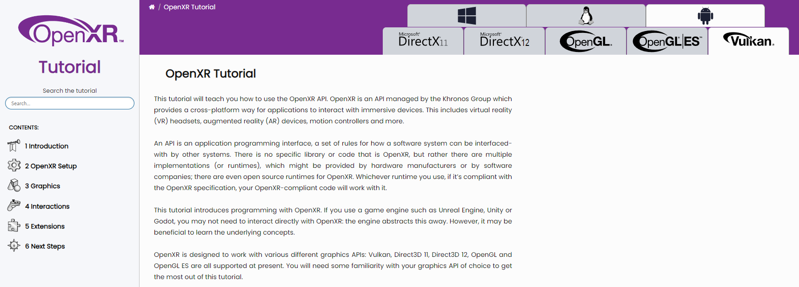

# OpenXR-Tutorial

This OpenXR-Tutorial repository contains both the text and code samples for the OpenXR-Tutorial website (https://openxr-tutorial.com/).


## Table of Contents
- [OpenXR-Tutorial](#openxr-tutorial)
  - [Table of Contents](#table-of-contents)
  - [Chapters](#chapters)
    - [1. Introduction](#1-introduction)
    - [2. OpenXR Setup](#2-openxr-setup)
    - [3. Graphics](#3-graphics)
    - [4. Interactions](#4-interactions)
    - [5. Extensions](#5-extensions)
    - [6. Next Setup](#6-next-setup)
  - [Website](#website)
  - [Setup](#setup)
  - [Build](#build)
    - [Supported Platforms](#supported-platforms)
    - [Building the Tutorial Website](#building-the-tutorial-website)
  - [Contributors](#contributors)
  - [Legal Notice](#legal-notice)
    - [Website](#website-1)
    - [Repository](#repository)
  - [Related resources](#related-resources)


## Chapters

### 1. Introduction
This chapter describes the goals of OpenXR and gives an overview of the core concepts used in the API. It describes how to set up your project as well.

### 2. OpenXR Setup
This chapter explains how to set up an [`XrInstance`](https://registry.khronos.org/OpenXR/specs/1.1/man/html/XrInstance.html) and [`XrSession`](https://registry.khronos.org/OpenXR/specs/1.1/man/html/XrSession.html). It also discusses how to poll events in OpenXR.

### 3. Graphics
[`XrSwapchain`](https://registry.khronos.org/OpenXR/specs/1.1/man/html/XrSwapchain.html) construction is explained in this chapter along with the [`XrEnvironmentBlendMode`](https://registry.khronos.org/OpenXR/specs/1.1/man/html/XrEnvironmentBlendMode.html) and the [`XrReferenceSpaceType`](https://registry.khronos.org/OpenXR/specs/1.1/man/html/XrReferenceSpaceType.html). Finally, it explains how to set up a render loop and draw some simple geometry.

### 4. Interactions
This chapter focuses solely on explaining and demonstrating both the interaction profile and action systems that OpenXR uses. These systems provide a way for developers and users to bind inputs to actions allowing greater cross-vendor compatibility of an application.

### 5. Extensions
This chapter discusses a few extensions for Hand tracking and Composition Layer Depth. Extensions allow greater functionality to be added to an application provided that the hardware and runtime support them.

### 6. Next Steps
This chapter contains a collection of topics to act as a jumping-off point to explore further the diverse and ever-growing world of XR development. Of note are the sections on Multiview rendering, OpenXR API Layers and Multithreaded rendering.


## Website

https://openxr-tutorial.com/



## Setup

Prerequisites: [git](https://git-scm.com/downloads)

Clone the repo with submodules using the following command:
```
git clone https://github.com/KhronosGroup/OpenXR-Tutorials.git
cd OpenXR-Tutorials
```
Follow build instructions for your platform below.

## Build

### Supported Platforms
* Windows - [Build Guide](BUILD.md#windows)

* Linux - [Build Guide](BUILD.md#linux)

* Android - [Build Guide](BUILD.md#android)

### Building the Tutorial Website

The tutorial website is built with [Sphinx](https://www.sphinx-doc.org), a Python-based documentation build tool. To build the website, set the CMake variable `XR_TUTORIAL_BUILD_DOCUMENTATION` to `TRUE`. Set the CMake variable `BUILD_ALL_EXTENSIONS` to `FALSE` if you only intend to build the documentation and might be missing requirements for graphics APIs. Install the following Python modules:

```
pip install sphinx==6.1.3
pip install breathe
pip install myst-parser
pip install sphinxcontrib-jquery
pip install sphinx-copybutton
pip install sphinxcontrib-mermaid
pip install reuse
```

Now build the project `Sphinx` from the command line or your IDE.

## Contributors

The original text of the OpenXR Tutorial is by Roderick Kennedy and Andrew Richards of Simul Software Ltd. The design of the site is by Calland Creative Ltd. The site is overseen by the Khronos OpenXR Working Group. Thanks to all volunteers who tested the site through its development.

## Legal Notice

### Website

© 2023, The Khronos Group. Creative Commons International 4.0 BY Attribution. Code is licensed as Apache 2.0.

"OpenXR" and the OpenXR logo are trademarks owned by The Khronos Group Inc. and are registered as a trademark in China, the European Union, Japan and the United Kingdom. Vulkan and the Vulkan logo are registered trademarks of the Khronos Group Inc.

OpenGL® and the oval logo are trademarks or registered trademarks of Hewlett Packard Enterprise in the United States and/or other countries worldwide. OpenGL is a registered trademark and the OpenGL ES logo is a trademark of Hewlett Packard Enterprise used by permission by Khronos.

Microsoft DirectX, Microsoft DirectX11, and Microsoft DirectX12 are trademarks owned by Microsoft.

The OpenXR Tutorial is owned and operated by The Khronos Group Inc. Khronos Legal Notices, Privacy Policy, and Code of Conduct apply.

### Repository

See [LICENSE](LICENSE).

## Related resources

- [Khronos OpenXR Main page](https://www.khronos.org/openxr/)

- [OpenXR 1.1 Specification](https://registry.khronos.org/OpenXR/specs/1.1/html/xrspec.html)
  - Largely applies to 1.0 as well.

- [OpenXR 1.1 Manual Pages](https://registry.khronos.org/OpenXR/specs/1.1/man/html/openxr.html)
