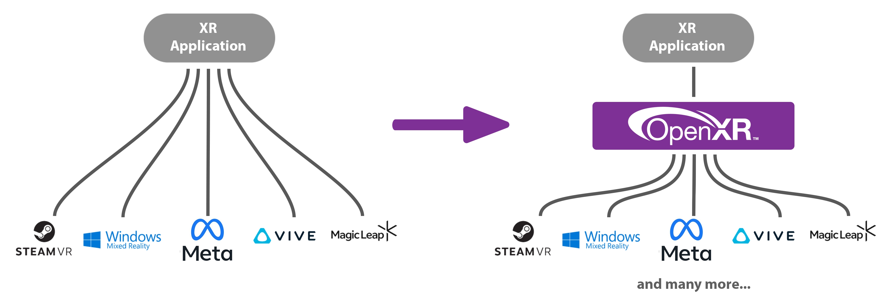

#################
1 Introduction
#################

******************
1.1 Goal of OpenXR
******************

OpenXR aims to help solve the fragmentation of the XR ecosystem. Before the advent of OpenXR, software developers working with multiple
hardware platforms had to write different code for each platform to address the different hardware.
Each platform had its own, often proprietary, API, and deploying an existing app to a new platform required a lot of
adaptation. Developing a new app for a new platform was even more challenging.

In spite of their unique features, the platforms had a great deal in common. For example, most headsets had a main view seen from two
slightly different perspectives. Most had a way to track the user's head and hands or hand-controllers. Most had buttons,
many had analogue controls like triggers or joysticks; many had haptic feedback.

	OpenXR provides a common interface to reduce XR fragmentation.

OpenXR aims to solve this problem by providing a common API to address XR hardware, in reading its inputs
and outputting to its displays and haptic systems. Just as OpenGL and Vulkan provide a common API to access graphics hardware, so OpenXR
allows you to write code that works with multiple XR platforms, with minimal adaptation.

************
1.2 Overview
************

We'll start with the main concepts you'll need to be familiar with around OpenXR.

.. list-table:: OpenXR Concepts
	:widths: 1 5
	:class: longtable
	:header-rows: 1

	* - Concept
	  - Description
	* - API
	  - The OpenXR API is the set of commands, functions and structures that an OpenXR-compliant runtime is required to offer.
	* - Application
	  - The Application is your program, called an "app" for short.
	* - Runtime
	  - A Runtime is a specific implementation of the OpenXR functionality. It might be provided by a hardware vendor, as part of a device's operating system; it might be supplied by a software vendor to enable OpenXR support with a specific range of hardware. The Loader finds the appropriate Runtime	and loads it when OpenXR is initialized.
	* - Loader
	  - The OpenXR loader is a special library that connects your app to whichever OpenXR runtime you're using. The loader's job is to find the Runtime and initialize it, then allow your app to access the Runtime's version of the API. Some devices can have multiple Runtimes available, but only one can be active at any given time.
	* - Layers
	  - API layers are optional components that augment an OpenXR system. A Layer might help with debugging, or filter information between the app and the Runtime. API layers are enabled when the OpenXR Instance is created.
	* - Instance
	  - The Instance is an object that allows your app to communicate with a Runtime. You'll ask OpenXR to create an Instance when initializing XR support in your app.
	* - Graphics
	  - OpenXR usually needs to connect to a graphics API, in order to permit rendering of headset views for example. Which Graphics API's are supported depends on the Runtime.
	* - Input
	  - The OpenXR Input System allows apps to query what inputs are available. These can then be bound to Actions or Poses, so the app knows what the user is doing.

OpenXR's lexicon and API style are based on the Vulkan API, and it provides a clear and precise common language for developers and hardware vendors to use. It was a decision by the OpenXR working group to have APIs similar.

An OpenXR Runtime implements the OpenXR API. There maybe multiple runtime installed on a system, but an OpenXR application can only choose one. The runtime acts to translate the OpenXR function calls into something that the vendor's software/hardware can understand. There is a fully open source OpenXR runtime for Linux in development called `Monado <https://monado.dev/>`_.

The OpenXR Loader finds and loads a suitable OpenXR runtime that is present on the system. The Loader will load in all of the OpenXR function pointers stated in the core specification for the application to use. If you are using an extension, such as `XR_EXT_debug_utils`, any functions associated with that extension will need to be loaded in with `xrGetInstanceProcAddr()`. Some platforms like Android require extra work and information to initialise the loader.

API Layers are additional code layers that are inserted between the application and the runtime. Each of these API layers intercepts the OpenXR function calls from the layer above, does something with that function, and then calls the next layer down. Some simple examples of API Layers would be logging the OpenXR functions to the output or a file, or creating trace file of the OpenXR calls for later replay. A validation layer could be used to check that the function calls made to OpenXR are compatible with the specification and with the current state of OpenXR, which would be very similar the Vulkan Validation layer.

OpenXR supports multiple graphics APIs via its extension functionality. Like in Vulkan, OpenXR can extend its functionality to include debugging layers, vendor hardware and software support and graphics APIs. This idea of absolving the core specification of the graphics API functionality, as bold as it might seem, provides us with the flexibility in choosing the graphics APIs now and in the future. Firstly, OpenXR is targeted at developing XR experiences and isn't concerned with the specifics of any graphics APIs. Secondly, the extensive nature of OpenXR allows revisions of and any new graphics APIs to be integrated with ease. Already, there are two mutually exclusive extensions in OpenXR for interacting with Vulkan.
	
OpenXR recognised that there is vast and ever changing array of hardware and configurations in the XR space. With new headsets and controllers coming to the market, an abstraction of the input system was needed so that same application can target difference and newer hardware. The abstraction is done via the concept of an `XrAction`, which acts as handle to interactive elements of the application. Instead of directly querying the state of any one button, joysticks, trigger, touch pad etc., you create an `XrAction` for a specific action such as a "menu_click". You provide a suggested binding along with an interaction profile so that OpenXR can link that action with the available input hardware at runtime.

*********************
1.3 Environment Setup
*********************

This section will help you set up your development environment. Here your choice of platform really makes a difference. After that, things will be much more consistent. You can change platform at any time by clicking the tabs at the top of the page. Select the platform you want to develop for
by clicking a tab above.

.. container:: windows

	.. rubric:: Visual Studio

	If you'll be building an OpenXR project for Microsoft Windows PC based devices, we'll assume you'll be using Microsoft Visual Studio.
	The free Community edition of Visual Studio is available to download `here <https://visualstudio.microsoft.com/vs/community/>`_.

	.. rubric:: CMake

	Install the latest `CMake <https://cmake.org/download/>`_. This tutorial uses CMake to generate the Visual Studio Solution and Project files.

	Next you'll want to choose which Graphics API you'll be using.
	
	.. container:: d3d11 d3d12

		Direct3D 11 and 12 are built into the Windows SDK's. If you're using Direct3D, D3D12 is recommended, because it supports `View Instancing <https://microsoft.github.io/DirectX-Specs/d3d/ViewInstancing.html>`_. Essentially, it allows you to draw both eye views in one call.

		In both cases, download and install the latest `Windows SDK <https://developer.microsoft.com/en-us/windows/downloads/windows-sdk/>`_.
		
	.. container:: vulkan

		If you're using Vulkan, download and install the latest `Vulkan SDK <https://www.lunarg.com/vulkan-sdk/>`_.

	.. container:: opengl

		For this tutorial, we are using the 'gfxwrapper' for the OpenGL API found as a part of the `OpenXR-SDK-Source <https://github.com/KhronosGroup/OpenXR-SDK-Source>`_ reposity under `src/common/`. It was originally developed by Oculus VR, LLC and The Brenwill Workshop Ltd.; this wrapper is written against the `OpenGL 4.3 <https://registry.khronos.org/OpenGL/specs/gl/glspec43.core.pdf>`_ specification.
		If you want to use OpenGL stand-alone, you will need to use WGL to create a valid OpenGL Context for Microsoft Windows - `Creating an OpenGL Context WGL <https://www.khronos.org/opengl/wiki/Creating_an_OpenGL_Context_(WGL)>`_. You will also need to use a function loader like GLAD to access functions for OpenGL - `GLAD <https://glad.dav1d.de/>`_.

.. container:: linux

	.. rubric:: Install Visual Studio Code

	To install Visual Studio Code, go to `https://code.visualstudio.com/ <https://code.visualstudio.com/>`_ and click the "Download for Linux" button.

	.. rubric:: Install CMake

	Install the latest `CMake <https://cmake.org/download/>`_. This tutorial uses CMake with Visual Studio Code to build the project.

	Now choose which graphics API you want to use, on the second row of tabs at the top of the page. For Linux you can either use OpenGL or Vulkan.

	.. container:: vulkan

		.. rubric:: Install the Vulkan SDK

		If you want to use Vulkan, download and install the latest `Vulkan SDK <https://www.lunarg.com/vulkan-sdk/>`_.

	.. container:: opengl

		For this tutorial, we are using the 'gfxwrapper' for the OpenGL API found as a part of the `OpenXR-SDK-Source <https://github.com/KhronosGroup/OpenXR-SDK-Source>`_ reposity under `src/common/`. It was originally developed by Oculus VR, LLC and The Brenwill Workshop Ltd.; this wrapper is written against the `OpenGL 4.3 <https://registry.khronos.org/OpenGL/specs/gl/glspec43.core.pdf>`_ specification.
		If you want to use OpenGL stand-alone, you will need to use GLX to create a valid OpenGL Context for Linux - `Tutorial: OpenGL 3.0 Context Creation (GLX) <Tutorial:_OpenGL_3.0_Context_Creation_(GLX)>`_. You will also need to use a function loader like GLAD to access functions for OpenGL - `GLAD <https://glad.dav1d.de/>`_.

	.. rubric Install Monado

		XR support for Linux is provided by `Monado <https://monado.freedesktop.org/>`_, an open source runtime. Monado supports a selection of XR devices and can also run in a device emulation mode. Follow the instructions `here <https://monado.freedesktop.org/getting-started.html>`_ to set up the runtime.
	
.. container:: android
	
	.. rubric:: Android Studio

	Install Android studio from this location: `https://developer.android.com/studio <https://developer.android.com/studio>`_.
	
	.. container:: vulkan
		
		.. rubric:: Vulkan

		Vulkan is recommended for Android for its modern, low-level API and extension.
		Vulkan is included as part of the NDK provided by Google and is supported on Android 7.0 (Nougat), API level 24 or higher (see `https://developer.android.com/ndk/guides/graphics <https://developer.android.com/ndk/guides/graphics>`_).
	
	.. container:: opengles
		
		.. rubric:: OpenGL ES
		
		For this tutorial, we are using the 'gfxwrapper' for the OpenGL ES API found as a part of the `OpenXR-SDK-Source <https://github.com/KhronosGroup/OpenXR-SDK-Source>`_ reposity under `src/common/`. 
		If you want to use OpenGL ES stand-alone, you will need to use EGL to create a valid OpenGL ES Context for Android - `EGL Overview <https://www.khronos.org/egl>`_. You will also need to use a function loader like GLAD to access functions for OpenGL ES - `GLAD <https://glad.dav1d.de/>`_.

*****************
1.4 Project Setup
*****************

This section explains how to setup your project ready for :ref:`Chapter 2<2.1 Creating an XrInstance / xrGetSystem>` and will make references to the `/Chapter2` folder. It explains how to include the OpenXR headers, link the `openxr_loader` library, graphics API integration, other boilerplate code and finally create a simple stub application with which will be expanded on in later chapters.

1.4.1 CMake and Project Files
=============================

.. container:: windows

	For the Microsoft Windows OpenXR project, we'll use CMake to create the solution and project files for Visual Studio.
	Create a directory where the code will go, we'll call this the *workspace* directory.

.. container:: linux

	You are free to use any code editor and/or compiler; this tutorial will use Visual Studio Code.
	For the Linux OpenXR project, we'll use CMake alongside Visual Studio Code to build the project.
	Create a directory where the code will go, we'll call this the *workspace* directory. Open Visual Studio Code and from the File menu, select "Open Folder..."

	.. figure:: linux-vscode-open-folder.png
		:alt: The File menu of Visual Studio Code is shown, with the command "Open Folder..." selected.
		:scale: 55%

	Select your *workspace* folder, which is currently empty.
	
	If you haven't previously done so, install the CMake extension for Visual Studio Code: select the "Extensions" tab, and type "CMake" in the search box.
	
	.. figure:: images/VSCodeCMakeLinux.png
		:alt: Selecting the CMake extension in Visual Studio Code.
		:align: left
		:scale: 55%
	
.. container:: windows linux

	Create a folder called `cmake` in the *workspace* directory. Download each of the linked files below and put them in `cmake`. These will be used in our `CMakeLists.txt` to help build our project. Files with `shader` in the name will be used in later chapters.

	.. container:: d3d11 d3d12
		
		:download:`fxc_shader.cmake <../cmake/fxc_shader.cmake>`

	.. container:: opengl

		:download:`gfxwrapper.cmake <../cmake/gfxwrapper.cmake>`
	
	.. container:: vulkan

		:download:`glsl_shader.cmake <../cmake/glsl_shader.cmake>`

	Now, create a text file in the *workspace* folder called `CMakeLists.txt` and in it, put the following code:

	.. literalinclude:: ../CMakeLists.txt
		:language: cmake
		:start-after: XR_DOCS_TAG_BEGIN_CMakeLists
		:end-before: XR_DOCS_TAG_END_CMakeLists

	Here, we specify the CMake version, project name and the configurations types, and provide a CMake variable called `XR_RUNTIME_JSON` which you can use to point to the runtime you will be using (by default, OpenXR will try to find the standard runtime from your hardware vendor). Finally, we specify CMake to continue the build into the Chapter2 directory with `add_subdirectory()`.

	.. literalinclude:: ../CMakeLists.txt
		:language: cmake
		:start-after: XR_DOCS_TAG_BEGIN_AddChapter2
		:end-before: XR_DOCS_TAG_END_AddChapter2
		:dedent: 4

	In the workspace folder, create a folder called `Chapter2`, and in it create another `CMakeLists.txt` file.
	In it, put the following code:

	.. literalinclude:: ../Chapter2/CMakeLists.txt
		:language: cmake
		:start-after: XR_DOCS_TAG_BEGIN_SetProjectName2
		:end-before: XR_DOCS_TAG_END_SetProjectName2

	This sets a minimum CMake version (required for some of the features we use here) and our own CMake variable `PROJECT_NAME` to `OpenXRTutorialChapter2`. Now add:

	.. literalinclude:: ../Chapter2/CMakeLists.txt
		:language: cmake
		:start-after: XR_DOCS_TAG_BEGIN_CMakeModulePath
		:end-before: XR_DOCS_TAG_END_CMakeModulePath

	.. literalinclude:: ../Chapter2/CMakeLists.txt
		:language: cmake
		:start-after: XR_DOCS_TAG_BEGIN_FetchContent
		:end-before: XR_DOCS_TAG_END_FetchContent

	After setting our CMake version, our own CMake variable `PROJECT_NAME` to `OpenXRTutorialChapter2` and with that variable setting the project's name, we append to the `CMAKE_MODULE_PATH` variable an additional path for `find_package()`` to search within and we include `FetchContent` and use it to get the OpenXR-SDK from Khronos's GitHub page.

	Now, we will add to our `CMakeLists.txt` to specify the source and header files by adding the following code. Here, we are including all the files needed for our project.  

	.. container:: d3d11

		.. code-block:: cmake

			# Files
			set(SOURCES 
				"main.cpp"
				"../Common/GraphicsAPI.cpp"
				"../Common/GraphicsAPI_D3D11.cpp"
				"../Common/OpenXRDebugUtils.cpp")
			set(HEADERS 
				"../Common/DebugOutput.h"
				"../Common/GraphicsAPI.h"
				"../Common/GraphicsAPI_D3D11.h"
				"../Common/HelperFunctions.h"
				"../Common/OpenXRDebugUtils.h"
				"../Common/OpenXRHelper.h")
	
	.. container:: d3d12
		
		.. code-block:: cmake

			# Files
			set(SOURCES 
				"main.cpp"
				"../Common/GraphicsAPI.cpp"
				"../Common/GraphicsAPI_D3D12.cpp"
				"../Common/OpenXRDebugUtils.cpp")
			set(HEADERS 
				"../Common/DebugOutput.h"
				"../Common/GraphicsAPI.h"
				"../Common/GraphicsAPI_D3D12.h"
				"../Common/HelperFunctions.h"
				"../Common/OpenXRDebugUtils.h"
				"../Common/OpenXRHelper.h")
	
	.. container:: opengl

		.. code-block:: cmake

			# Files
			set(SOURCES 
				"main.cpp"
				"../Common/GraphicsAPI.cpp"
				"../Common/GraphicsAPI_OpenGL.cpp"
				"../Common/OpenXRDebugUtils.cpp")
			set(HEADERS 
				"../Common/DebugOutput.h"
				"../Common/GraphicsAPI.h"
				"../Common/GraphicsAPI_OpenGL.h"
				"../Common/HelperFunctions.h"
				"../Common/OpenXRDebugUtils.h"
				"../Common/OpenXRHelper.h")

	.. container:: vulkan

		.. code-block:: cmake

			# Files
			set(SOURCES 
				"main.cpp"
				"../Common/GraphicsAPI.cpp"
				"../Common/GraphicsAPI_Vulkan.cpp"
				"../Common/OpenXRDebugUtils.cpp")
			set(HEADERS 
				"../Common/DebugOutput.h"
				"../Common/GraphicsAPI.h"
				"../Common/GraphicsAPI_Vulkan.h"
				"../Common/HelperFunctions.h"
				"../Common/OpenXRDebugUtils.h"
				"../Common/OpenXRHelper.h")

	All the files listed above with `../Common/*.*` are available to download below. In the next section, you will find the links and discussion of their usage. This tutorial includes all the graphics APIs header and cpp files; you only need to download the files for your chosen API.
	
	Add the following code to `CMakeLists.txt`:

	.. literalinclude:: ../Chapter2/CMakeLists.txt
		:language: cmake
		:start-after: XR_DOCS_TAG_BEGIN_WindowsLinux
		:end-before: XR_DOCS_TAG_END_WindowsLinux
		:dedent: 4

	We have used `add_executable()` to create the program we'll be building, and specified its `${SOURCES}` and `${HEADERS}`. We passed the `XR_RUNTIME_JSON` variable on to the debugging environment (Windows only). We've added the `../Common`, `"${openxr_SOURCE_DIR}/src/common"` and `"${openxr_SOURCE_DIR}/external/include"` folders as include directories and linked the `openxr_loader` which we obtained with `FetchContent`. This will also add the include directory for the OpenXR headers.
	
	.. container:: windows

		.. container:: d3d11

			.. literalinclude:: ../Chapter2/CMakeLists.txt
				:language: cmake
				:start-after: XR_DOCS_TAG_BEGIN_D3D11
				:end-before: XR_DOCS_TAG_END_D3D11
				:dedent: 8

		.. container:: d3d12

			.. literalinclude:: ../Chapter2/CMakeLists.txt
				:language: cmake
				:start-after: XR_DOCS_TAG_BEGIN_D3D12
				:end-before: XR_DOCS_TAG_END_D3D12
				:dedent: 8

		.. container:: d3d11 d3d12

			.. literalinclude:: ../Chapter2/CMakeLists.txt
				:language: cmake
				:start-after: XR_DOCS_TAG_BEGIN_D3D11_12
				:end-before: XR_DOCS_TAG_END_D3D11_12
				:dedent: 8
			
		.. container:: d3d11
			
			For Microsoft Windows, we've linked `d3d11.lib` and `dxgi.lib`, so that we can use Direct3D 11 and the DirectX Graphics Infrastructure. The headers for Direct3D are automatically included as part of the Visual Studio project. We've added the `XR_TUTORIAL_USE_D3D11` compiler definition to specify which graphics APIs should be supported and have their headers included in `GraphicsAPI.h`.

		.. container:: d3d12

			For Microsoft Windows, we've linked `d3d12.lib` and `dxgi.lib`, so that we can use Direct3D 12 and the DirectX Graphics Infrastructure. The headers for Direct3D are automatically included as part of the Visual Studio project. We've added the `XR_TUTORIAL_USE_D3D12` compiler definition to specify which graphics APIs should be supported and have their headers included in `GraphicsAPI.h`.

	.. container:: linux

		.. literalinclude:: ../Chapter2/CMakeLists.txt
			:language: cmake
			:start-after: XR_DOCS_TAG_BEGIN_Linux
			:end-before: XR_DOCS_TAG_END_Linux
			:dedent: 8

		For Linux, there are no headers to include or libraries to link against. We've added the `XR_TUTORIAL_USE_LINUX_XLIB` compiler definition to specify which Linux Windowing System should be supported and have their headers included in `GraphicsAPI.h`. Other options are `XR_TUTORIAL_USE_LINUX_XCB` and `XR_TUTORIAL_USE_LINUX_WAYLAND`. Wayland uses *EGL* for its *OpenGL ES* context and not *GLX* with *OpenGL*.

	.. container:: opengl

		.. literalinclude:: ../Chapter2/CMakeLists.txt
			:language: cmake
			:start-after: XR_DOCS_TAG_BEGIN_OpenGL
			:end-before: XR_DOCS_TAG_END_OpenGL
			:dedent: 4
		
		We include the `gfxwrapper.cmake` from our `cmake` folder in the *workspace* directory. This file creates a static library called `openxr-gfxwrapper`, which will allow us to use OpenGL. We link against `openxr-gfxwrapper`, which also provide us with the needed include directories. We've added the `XR_TUTORIAL_USE_OPENGL` compiler definition to specify which graphics APIs should be supported and have their headers included in `GraphicsAPI.h`.

	.. container:: vulkan
		
		.. literalinclude:: ../Chapter2/CMakeLists.txt
			:language: cmake
			:start-after: XR_DOCS_TAG_BEGIN_VulkanSDK
			:end-before: XR_DOCS_TAG_END_VulkanSDK
			:dedent: 4
		
		If you have the Vulkan SDK installed, this CMake code will try to find that package, add the include directories and link the Vulkan libraries. We've added the `XR_TUTORIAL_USE_VULKAN` compiler definition to specify which graphics APIs should be supported and have their headers included in `GraphicsAPI.h`.

	That's all the CMake code that we require for this project. 

.. container:: android

	Here, We'll show how to hand build an Android Studio project that runs a C++ Native Activity.
	First, we will create a *workspace* folder and in that folder create a subdirectory called `/Chapter2`.
	Open Android Studio, select New Project and choose an Empty View Activity (Android Studio 22+) or an Empty Activity (Android Studio up to version 21). Set the Name to 'OpenXR Tutorial Chapter 2', the Package name to 'org.khronos.openxrtutorialchapter2' and save location to that `/Chapter2` folder. The language can be ignored here as we are using C++, and we can set the Minimum SDK to API 24: Android 7.0(Nougat) or higher. Click "Finish" to complete the set up.

	.. figure:: images/android-studio-newproject.png
		:alt: Android Studio - New Project - Empty Activity.
		:scale: 55%

	.. rubric:: CMake

	With the Android Studio project now set up, we need to modify some of the files and folders so as to set up the project to support the C++ Native Activity.

	Then switch to the "Project" view in the "Project" tab (on the top right of the default Android Studio layout).
	Under the `app` folder in `Chapter2`, you can delete the `libs` folder, and under the `app/src` you can also delete the `androidTest` and `test` folders. Finally under `app/src/main`, delete the `java` folder. Under the `app/src/main/res`, delete the `layout`, `values-night` and `xml` folders. Under the `values` folder, delete `colors.xml` and `themes.xml`

	Now sync the project by selecting "File > Sync Project with Gradle" on the menu.

	.. figure:: images/GradleSync.png
		:alt: Gradle Sync
		:scale: 55%

	Create a folder called `cmake` in the *workspace* directory. Download each of the linked files below and put them in `cmake`. These will be used in our `CMakeLists.txt` to help build our project. Files with `shader` in the name will be used in later chapters.

	.. container:: opengles

		:download:`gfxwrapper.cmake <../cmake/gfxwrapper.cmake>`
		:download:`FindEGL.cmake <../cmake/FindEGL.cmake>`
		:download:`FindOpenGLES.cmake <../cmake/FindOpenGLES.cmake>`

	.. container:: vulkan

		:download:`glsl_shader.cmake <../cmake/glsl_shader.cmake>`

	Create a text file called `CMakeLists.txt` in the `Chapter2` directory. We will use this file to specific how our Native C++ code will be built. This `CMakeLists.txt` file will be invoked by Android Studio's Gradle build system and we will point Gradle to this CMake file. 

	.. rubric:: CMakeLists.txt

	Add the following to your new CMakeLists.txt file:

	.. literalinclude:: ../Chapter2/CMakeLists.txt
		:language: cmake
		:start-after: XR_DOCS_TAG_BEGIN_SetProjectName2
		:end-before: XR_DOCS_TAG_END_SetProjectName2

	Here we have declared our tutorial project. At least CMake 3.22.1 is needed to use all the features in the tutorial. Now add:

	.. literalinclude:: ../Chapter2/CMakeLists.txt
		:language: cmake
		:start-after: XR_DOCS_TAG_BEGIN_CMakeModulePath
		:end-before: XR_DOCS_TAG_END_CMakeModulePath

	.. literalinclude:: ../Chapter2/CMakeLists.txt
		:language: cmake
		:start-after: XR_DOCS_TAG_BEGIN_FetchContent
		:end-before: XR_DOCS_TAG_END_FetchContent

	After setting our CMake version, our own CMake variable `PROJECT_NAME` to `OpenXRTutorialChapter2` and with that variable setting the project's name, we append to the `CMAKE_MODULE_PATH` variable an additional path for `find_package()`` to search within and we include `FetchContent` and use it to get the OpenXR-SDK from Khronos's GitHub page.

	.. container:: opengles

		.. code-block:: cmake

			# Files
			set(SOURCES 
				"main.cpp"
				"../Common/GraphicsAPI.cpp"
				"../Common/GraphicsAPI_OpenGL_ES.cpp"
				"../Common/OpenXRDebugUtils.cpp")
			set(HEADERS 
				"../Common/DebugOutput.h"
				"../Common/GraphicsAPI.h"
				"../Common/GraphicsAPI_OpenGL_ES.h"
				"../Common/HelperFunctions.h"
				"../Common/OpenXRDebugUtils.h"
				"../Common/OpenXRHelper.h")
			
	.. container:: vulkan

		.. code-block:: cmake

			# Files
			set(SOURCES 
				"main.cpp"
				"../Common/GraphicsAPI.cpp"
				"../Common/GraphicsAPI_Vulkan.cpp"
				"../Common/OpenXRDebugUtils.cpp")
			set(HEADERS 
				"../Common/DebugOutput.h"
				"../Common/GraphicsAPI.h"
				"../Common/GraphicsAPI_Vulkan.h"
				"../Common/HelperFunctions.h"
				"../Common/OpenXRDebugUtils.h"
				"../Common/OpenXRHelper.h")

	Here, we include all the files needed for our project. All files with `../Common/*.*` are available to download from this tutorial website. Below are the links and discussion of their usage within this tutorial and with OpenXR. This tutorial includes all the graphics APIs header and cpp files; you only need to download the files pertaining to your graphics API choice.

	Add the following to CMakeLists.txt:

	.. literalinclude:: ../Chapter2/CMakeLists.txt
		:language: cmake
		:start-after: XR_DOCS_TAG_BEGIN_Android
		:end-before: XR_DOCS_TAG_END_Android
		:dedent: 4
	
	We have added a library with the `${SOURCES}` and `${HEADERS}` and have added the `../Common`, `"${openxr_SOURCE_DIR}/src/common"` and `"${openxr_SOURCE_DIR}/external/include"` folders as include directories. We have set the `LINK_FLAGS` for our `OpenXRTutorialChapter2` project with the flag `-u ANativeActivity_onCreate()` to support C++ native code. This is used by a static library called `native_app_glue`, which connects the Java Virtual Machine and our C++ code. Ultimately, it allows us to use the `void android_main(struct android_app*)` entry point.  We add `native_app_glue` to our project by including `AndroidNdkModules` and calling `android_ndk_import_module_native_app_glue()`. 

	Now, we link the `android`, `native_app_glue` and `openxr_loader` libraries to our `OpenXRTutorialChapter2` library. Our `libOpenXRTutorialChapter2 .so` will be packaged inside our .apk along with any shared libraries that we have linked. We also add `-Wno-cast-calling-convention` to the compiler option to allow the casting of calling conversions for function pointers.

	.. container:: opengles
	
		Now, add:

		.. literalinclude:: ../Chapter2/CMakeLists.txt
			:language: cmake
			:start-after: XR_DOCS_TAG_BEGIN_Gfxwrapper
			:end-before: XR_DOCS_TAG_END_Gfxwrapper
			:dedent: 4
	
		We include the `gfxwrapper.cmake` from our `cmake` folder in the *workspace* directory. This file creates a static library called `openxr-gfxwrapper`, which will allow us to use OpenGL ES. We link against `openxr-gfxwrapper`, which also provides us with the needed include directories. We've added the `XR_TUTORIAL_USE_OPENGL_ES` compiler definition to specify which graphics APIs should be supported and have their headers included in `GraphicsAPI.h`.

	.. container:: vulkan

		Now, add:

		.. literalinclude:: ../Chapter2/CMakeLists.txt
			:language: cmake
			:start-after: XR_DOCS_TAG_BEGIN_VulkanNDK
			:end-before: XR_DOCS_TAG_END_VulkanNDK
			:dedent: 4

		Here we find the Vulkan library in the NDK. We include the directory to the Android Vulkan headers and link against the `libvulkan.so` library. We've added the `XR_TUTORIAL_USE_VULKAN` compiler definition to specify which graphics APIs should be supported and have their headers included in `GraphicsAPI.h`.

	.. rubric:: AndroidManifest.xml

	Replace the file 'app/src/main/AndroidManifest.xml' with the following:

	Download :download:`AndroidManifest.xml <../Chapter2/app/src/main/AndroidManifest.xml>`

	Thing to note are:

	* We added a `<uses-feature>` to require OpenGL ES 3.2 and Vulkan 1.0.3 support.
	* Next, we added `<uses-feature android:name="android.hardware.vr.headtracking" android:required="false" />` to specify that the application works with 3DOF or 6DOF and on devices that are not all-in-ones. It's set to false so as to allow greater compatibility across devices.
	* Finally, we updated the `<intent-filter>` to tell the application that it should take over rendering when active, rather than appearing in a window. Set `<category android:name="org.khronos.openxr.intent.category.IMMERSIVE_HMD" />`. Note: not all devices yet support this `<category>`. For example, for Meta Quest devices you will need `<category android:name="com.oculus.intent.category.VR" />` for the same purpose. The code shows both the 'Standard Khronos OpenXR' and 'Meta Quest-specific non-standard' ways of setting the `<intent-filter>`.

	.. rubric:: Gradle

	Now we will replace the file `app/build.gradle`. Download :download:`app/build.gradle <../Chapter2/app/build.gradle>` and copy it over the existing file in `app`.

	In the `dependencies {}` section we have added `implementation 'org.khronos.openxr:openxr_loader_for_android:...'`. This provides an `AndroidManifest.xml` that will be merged into our own, setting some required properties for the package and application. We are still required to add to our own `AndroidManifest.xml` file the relevant intent filters, such as `<category android:name="org.khronos.openxr.intent.category.IMMERSIVE_HMD" />`. It also provides the OpenXR headers and library binaries in a format that the Android Gradle Plugin will expose to CMake.

	Now download :download:`build.gradle <../Chapter2/build.gradle>` and place it in your "Chapter2" folder.

1.4.2 Common Files
==================

Create a folder called `Common` in the *workspace* directory. Download each of the linked files below and put them in `Common`:

* :download:`Common/DebugOutput.h <../Common/DebugOutput.h>`
* :download:`Common/HelperFunctions.h <../Common/HelperFunctions.h>`
* :download:`Common/OpenXRDebugUtils.h <../Common/OpenXRDebugUtils.h>`
* :download:`Common/OpenXRDebugUtils.cpp <../Common/OpenXRDebugUtils.cpp>`
* :download:`Common/OpenXRHelper.h <../Common/OpenXRHelper.h>`
* :download:`Common/GraphicsAPI.h <../Common/GraphicsAPI.h>`
* :download:`Common/GraphicsAPI.cpp <../Common/GraphicsAPI.cpp>`

.. container:: d3d11

	* :download:`Common/GraphicsAPI_D3D11.h <../Common/GraphicsAPI_D3D11.h>`
	* :download:`Common/GraphicsAPI_D3D11.cpp <../Common/GraphicsAPI_D3D11.cpp>`

.. container:: d3d12

	* :download:`Common/GraphicsAPI_D3D12.h <../Common/GraphicsAPI_D3D12.h>`
	* :download:`Common/GraphicsAPI_D3D12.cpp <../Common/GraphicsAPI_D3D12.cpp>`

.. container:: opengl

	* :download:`Common/GraphicsAPI_OpenGL.h <../Common/GraphicsAPI_OpenGL.h>`
	* :download:`Common/GraphicsAPI_OpenGL.cpp <../Common/GraphicsAPI_OpenGL.cpp>`

.. container:: opengles

	* :download:`Common/GraphicsAPI_OpenGL_ES.h <../Common/GraphicsAPI_OpenGL_ES.h>`
	* :download:`Common/GraphicsAPI_OpenGL_ES.cpp <../Common/GraphicsAPI_OpenGL_ES.cpp>`

.. container:: vulkan

	* :download:`Common/GraphicsAPI_Vulkan.h <../Common/GraphicsAPI_Vulkan.h>`
	* :download:`Common/GraphicsAPI_Vulkan.cpp <../Common/GraphicsAPI_Vulkan.cpp>`

.. rubric::  DebugOutput

`DebugOutput` is a class that redirects `std::cout` and `std::cerr` to the output window in your IDE.

.. container:: windows linux

	`DebugOutput` inherits from `vsBufferedStringStreamBuf`, which inherits from `std::streambuf`. `vsBufferedStringStreamBuf` queues the data from the redirected `std::streambuf` and calls `virtual void writeString(const std::string &)`, which `DebugOutput` inplements as a call to `OutputDebugStringA()`.

.. container:: android

	`DebugOutput` inherits from `AndroidStreambuf`, which inherits from `std::streambuf`. `vsBufferedStringStreamBuf` queues the data from the redirected `std::streambuf` and calls `__android_log_write()` to log the message to Android Logcat.

.. rubric::  HelperFunctions

This is a simple header file for boilerplate code for the various platforms. It includes various C/C++ standard header, and the code that defines the macro `DEBUG_BREAK`, according to which platform we're building for. This macro will stop execution of your program when an error occurs, so you can see where it happened and fix it. We use this macro in the `OpenXRMessageCallbackFunction()` function, which is discussed in detail in :ref:`Chapter 2.1<2.1.2 XR_EXT_debug_utils>`.
`IsStringInVector()` and `BitwiseCheck()` are just simple wrappers over commonly used code. `IsStringInVector()` checks if a `const char *` is in a `std::vector<const char *>` by using `strcmp()`, and `BitwiseCheck()` checks if a bit is set in a bitfield.

.. rubric::  OpenXRDebugUtils

A header and cpp file pair helps in setting up the DebugUtilsMessenger. `XR_EXT_debug_utils` in an OpenXR instance extension that can intercept call made to OpenXR and provide extra information or report warning and errors, if the usage of the API or the current state of OpenXR is not valid. As you go through this tutorial it is highly recommended to have this enable to help with debugging. This is discussed in detail in :ref:`Chapter 2.1<2.1.2 XR_EXT_debug_utils>`, but in general `CreateOpenXRDebugUtilsMessenger()` creates and `DestroyOpenXRDebugUtilsMessenger()` destroys an `XrDebugUtilsMessengerEXT`. `OpenXRMessageCallbackFunction()` is a called function specified at object creation, which is used to call when OpenXR raises an issue. The header declares the functions and the cpp defines them.

.. rubric::  OpenXRHelper

A header for including all the needed header files and helper functions. Looking inside this file, we can see:

.. literalinclude:: ../Common/OpenXRHelper.h
	:language: cpp
	:start-at: // Define any
	:end-at: #include <openxr/openxr_platform.h>
	:emphasize-lines: 5

Here, we include the main OpenXR header file `openxr.h` and the OpenXR platform header file `openxr_platform.h`.
For the OpenXR platform header file, note the comment about using the preceding `XR_USE_PLATFORM_...` and `XR_USE_GRAPHICS_API_...` macros. When enabled, we gain access to functionality that interact with the chosen graphics API and/or platform. These macros are automatically set by `GraphicsAPI.h`

This header also defines the macro `OPENXR_CHECK`. Many OpenXR functions return an `XrResult`. This macro will check if the call has failed and logs a message to `std::cerr`. This can be modified to suit your needs. There are two additional functions `GetXRErrorString()` and `OpenXRDebugBreak()`, which are used to convert the `XrResult` to a string and as a breakpoint function respectively.

1.4.3 Main.cpp and the OpenXRTutorial Class
====================================================

Now, create a text file called `main.cpp` in the `Chapter2` folder. Open `main.cpp` and add the following:

.. literalinclude:: ../Chapter2/main.cpp
	:language: cpp
	:start-at: #include <DebugOutput
	:end-at: .h>

Next, we add the `GraphicsAPI_....h` header to include the Graphics API code of your chosen graphics API. This will in turn include `GraphicsAPI.h`, `HelperFunctions.h`  and `OpenXRHelper.h`.

.. container:: d3d11

	.. literalinclude:: ../Chapter2/main.cpp
		:language: cpp
		:start-after: XR_DOCS_TAG_BEGIN_include_GraphicsAPI_D3D11
		:end-before: XR_DOCS_TAG_END_include_GraphicsAPI_D3D11

.. container:: d3d12
	
	.. literalinclude:: ../Chapter2/main.cpp
		:language: cpp
		:start-after: XR_DOCS_TAG_BEGIN_include_GraphicsAPI_D3D12
		:end-before: XR_DOCS_TAG_END_include_GraphicsAPI_D3D12

.. container:: opengl

	.. literalinclude:: ../Chapter2/main.cpp
		:language: cpp
		:start-after: XR_DOCS_TAG_BEGIN_include_GraphicsAPI_OpenGL
		:end-before: XR_DOCS_TAG_END_include_GraphicsAPI_OpenGL

.. container:: opengles
	
	.. literalinclude:: ../Chapter2/main.cpp
		:language: cpp
		:start-after: XR_DOCS_TAG_BEGIN_include_GraphicsAPI_OpenGL_ES
		:end-before: XR_DOCS_TAG_END_include_GraphicsAPI_OpenGL_ES

.. container:: vulkan
	
	.. literalinclude:: ../Chapter2/main.cpp
		:language: cpp
		:start-after: XR_DOCS_TAG_BEGIN_include_GraphicsAPI_Vulkan
		:end-before: XR_DOCS_TAG_END_include_GraphicsAPI_Vulkan

You can also include `OpenXRDebugUtils.h` to help with set up of `XrDebugUtilsMessengerEXT`.

.. literalinclude:: ../Chapter2/main.cpp
	:language: cpp
	:start-after: XR_DOCS_TAG_BEGIN_include_OpenXRDebugUtils
	:end-before: XR_DOCS_TAG_END_include_OpenXRDebugUtils

Now we will define the main class `OpenXRTutorial` of the application. It's just a stub for now, with an empty `Run()` method:

.. code-block:: cpp

	class OpenXRTutorial {
	public:
		OpenXRTutorial(GraphicsAPI_Type apiType) 
		{
		}
		~OpenXRTutorial() = default;

		void Run()
		{
		}
		bool m_applicationRunning = true;
		bool m_sessionRunning = false;
	};

We'll add the main function for the application. It will look slightly different, depending on your
chosen platform. We first create a 'pseudo-main function' called `OpenXRTutorial_Main()`, in which we create an instance of our `OpenXRTutorial` class, taking a `GraphicsAPI_Type` parameter, and call the `Run()` method. `GraphicsAPI_Type` can be changed to suit the graphics API that you have chosen.

.. literalinclude:: ../Chapter2/main.cpp
	:language: cpp
	:start-at: void OpenXRTutorial_Main(GraphicsAPI_Type api) {
	:end-at: }

Then, we create the actual platform specific main function (our entry point to the application), which will call `OpenXRTutorial_Main()` with our `GraphicsAPI_Type` parameter. By default, this tutorial uses `OPENGL` as the parameter to `OpenXRTutorial_Main()`. This must be changed to match on your chosen graphics API, one of: `D3D11`,     `D3D12`,     `OPENGL`,    `OPENGL_ES`, or   `VULKAN`.

.. container:: windows linux

	.. literalinclude:: ../Chapter2/main.cpp
		:language: cpp
		:start-after: XR_DOCS_TAG_BEGIN_main_WIN32___linux__
		:end-before: XR_DOCS_TAG_END_main_WIN32___linux__

.. container:: android
	
	.. literalinclude:: ../Chapter2/main.cpp
		:language: cpp
		:start-after: XR_DOCS_TAG_BEGIN_android_main___ANDROID__
		:end-before: XR_DOCS_TAG_END_android_main___ANDROID__
	
	Before we can use OpenXR for Android, we need to initialise the loader based the application's context and virtual machine. We retrieve the function pointer to `xrInitializeLoaderKHR`, and with the `XrLoaderInitInfoAndroidKHR` filled out call that function to initialise OpenXR for our use. At this point, we also attach the current thread to the Java Virtual Machine. We assign our `AndroidAppState` static member and our `AndroidAppHandleCmd()` static method to the `android_app *` and save it to a static member in the class.

	Android requires a few extra additions to the OpenXRTutorial class. Namely, `android_app *`, `AndroidAppState` and `AndroidAppHandleCmd`, which are used in getting updates from the Android Operating System and keep our application functioning. Add the following after the definition of `Run()` in your OpenXRTutorial class declaration:

	.. literalinclude:: ../Chapter2/main.cpp
		:language: cpp
		:start-after: XR_DOCS_TAG_BEGIN_Android_System_Functionality
		:end-before: XR_DOCS_TAG_END_Android_System_Functionality

1.4.4 Build and Run
===================

.. container:: windows

	In the *workspace* directory, create a `build/` folder, which will contain our project, solution and output binary files. Now launch the CMake GUI, and point the "Where is the source code" box to the *workspace* directory, where your original `CMakeLists.txt` is located. Point the "Where to build the binaries" box to a subdirectory called `build`, that we have just created. Click "Configure" and "OK" to accept the default Generator, then click "Generate" to create the Visual Studio solution and project. Finally click "Open Project" to open that solution with Visual Studio.

	You can now build and run your program. It should compile and link with no errors or warnings.

.. container:: linux

	You now have the files and folders, laid out as follows:

	.. figure:: images/linux-vscode-initial-files.png
		:alt: Initial files in VS Code 
		:scale: 100%

	Having installed the CMake extension for VS Code, you can now right-click on the main `CMakeLists.txt` file (the one in the root *workspace* folder). We can select “Configure and Build All” from the right-click menu of the main `CMakeLists.txt` file.

	.. figure:: linux-vscode-cmake-configure.png
		:alt: Select
		:scale: 55%
		
	If you haven't previously done so, install the gdb extension for VS Code: select the "Extensions" tab, and type "gdb" in the search box. To enable debugging, select the Run/Debug panel in Visual Studio Code. You will now need to create a debugging configuration.
	Click the link "create a launch.json file" to and enter the following in launch.json:

	.. code-block:: json

		{
			"version": "0.2.0",
			"configurations": [
				{
					"type": "cppdbg",
					"request": "launch",
					"name": "Chapter2",
					"program": "${workspaceFolder}/build/Chapter2/OpenXRTutorialChapter2",
					"cwd":"${workspaceFolder}/OpenXRTutorialChapter2"
				}
			]
		}

.. container:: android

	With all the source and build systems set up, we can now build the Android project. In upper right of Android Studio, you should find the toolbar below. Click the green hammer icon to build the project, if all is successful you should see "BUILD SUCCESSFUL in [...]s" in the Build Output window.
	It is also recommended to sync the gradle files too.

	Next to the green hammer icon is the Run/Debug configuration dropdown menu. If that isn't populated, create a configuration called app.

	Turn on and connect your Android device. Set up any requirements for USB debugging and adb. You device should appear in the dropdown. Here, I am using a Oculus Quest 2.

	.. figure:: images/android-studio-build-run-toolbar.png
		:alt: Build/Run Toolbar
		:scale: 55%
	
	To debug/run the application click the green bug icon.

***********
1.5 Summary
***********
In this chapter, you learned about the fundamental concepts of OpenXR, and created a project you will use to build your OpenXR application. Now that we have this basic application up and running, we will start to set up OpenXR.