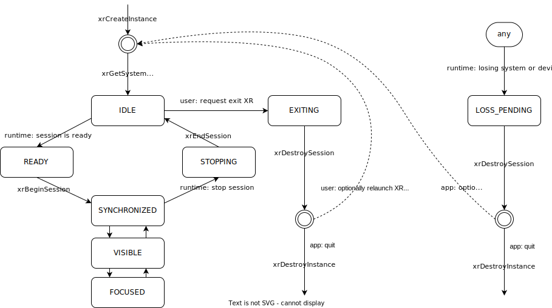

##########
⚙️ 2 Setup
##########

Select your platform, as the instructions are different depending on your selection.

.. raw:: html
	:file: platforms.html

With your project setup and your application building and running, we can start to use OpenXR to create our application.
The goal of this chapter is to create an ``XrInstance`` and an ``XrSession``, and setup the OpenXR event loop. This OpenXR code is needed to setup the core functionality of an OpenXR application to have that application interact with the OpenXR runtime and your graphics API correctly.

****************************************
2.1 Creating an XrInstance / xrGetSystem
****************************************

We will continue to use the ``OpenXRTutorial`` class in ``Chapter2/main.cpp`` that we created in :ref:`Chapter 1.4 <1.4 Project Setup>`.

Here, we will add the following highlighted text to the ``OpenXRTutorial`` class:

.. code-block:: cpp
	:emphasize-lines: 4-9, 14-19 , 22-47
	
	class OpenXRTutorial {
	public:
		OpenXRTutorial(GraphicsAPI_Type api)
			: m_apiType(api) {
			if (!CheckGraphicsAPI_TypeIsValidForPlatform(m_apiType)) {
				std::cout << "ERROR: The provided Graphics API is not valid for this platform." << std::endl;
				DEBUG_BREAK;
			}
		}
		~OpenXRTutorial() = default;
	
		void Run()
		{
			CreateInstance();

			GetInstanceProperties();
			GetSystemID();

			DestroyInstance();
		}

	private:
		void CreateInstance() 
		{
		}
		
		void DestroyInstance()
		{
		}
	
		void GetInstanceProperties()
		{
		}

		void GetSystemID()
		{
		}
	
	private:
		XrInstance m_xrInstance = {};
		std::vector<const char *> m_activeAPILayers = {};
		std::vector<const char *> m_activeInstanceExtensions = {};
		std::vector<std::string> m_apiLayers = {};
		std::vector<std::string> m_instanceExtensions = {};

		XrFormFactor m_formFactor = XR_FORM_FACTOR_HEAD_MOUNTED_DISPLAY;
		XrSystemId m_systemID = {};
	};

First, we updated the constructor to initialize ``OpenXRTutorial::m_apiType`` and check that the provided ``GraphicsAPI_Type`` is valid for the platform. Next, we updated ``OpenXRTutorial::Run()`` to call the new methods ``CreateInstance()``, ``GetInstanceProperties()``, ``GetSystemID()``and ``DestroyInstance()`` in that order. Finally, we added those methods and the following members to the class within thier separate private sections.

2.1.1 XrInstance
================

The ``XrInstance`` is the foundational object that we need to create first. The ``XrInstance`` encompasses the application setup state, OpenXR API version and any layers and extensions. So inside the ``CreateInstance()`` method, we will first look at the ``XrApplicationInfo``.

.. literalinclude:: ../Chapter2/main.cpp
	:language: cpp
	:start-after: XR_DOCS_TAG_BEGIN_XrApplicationInfo
	:end-before: XR_DOCS_TAG_END_XrApplicationInfo
	:dedent: 8

This structure allows you specify both the name and the version for your application and engine. These members are solely for your use as the application developer. The main member here is the ``XrApplicationInfo::apiVersion``. Here we use the ``XR_CURRENT_API_VERSION`` macro to specific the OpenXR version that we want to run. Also note here the use of ``strncpy()`` to set the applicationName and engineName. If you look at ``XrApplicationInfo::applicationName`` and ``XrApplicationInfo::engineName`` members, they are of type ``char[]``, hence you must copy your string into that ``char[]`` and you must also by aware of the allowable length.

Similar to Vulkan, OpenXR allows applications to extend functionality past what is provided by the core specification. The functionality could be hardware/vendor specific. Most vital of course is which Graphics API to use with OpenXR. OpenXR supports D3D11, D3D12, Vulkan, OpenGL and OpenGL ES. Due the extensible nature of specification, it allows newer Graphics APIs and hardware functionality to be added with ease.

.. literalinclude:: ../Chapter2/main.cpp
	:language: cpp
	:start-after: XR_DOCS_TAG_BEGIN_instanceExtensions
	:end-before: XR_DOCS_TAG_END_instanceExtensions
	:dedent: 12

Here, we store in a ``std::vector<std::string>`` the extension names that we would like to use. ``XR_EXT_DEBUG_UTILS_EXTENSION_NAME`` is a macro of a string defined in ``openxr.h``. The XR_EXT_debug_utils is extension that checks the validity of calls made to OpenXR, and can use a call back function to handle any raised errors. We will explore this extension more in :ref:`Chapter 5.2<5.2 Using xrCreateDebugUtilsMessengerEXT>`. Depending on which ``XR_USE_GRAPHICS_API_...`` macro that you have defined, this code will add the relevant extension.

Not all API layers and extensions are available to use, so we much check which ones can use. We will use ``xrEnumerateApiLayerProperties()`` and ``xrEnumerateInstanceExtensionProperties()`` to check which ones the runtime can provide.

.. literalinclude:: ../Chapter2/main.cpp
	:language: cpp
	:start-after: XR_DOCS_TAG_BEGIN_find_apiLayer_extension
	:end-before: XR_DOCS_TAG_END_find_apiLayer_extension
	:dedent: 8

These functions are called twice. The first time is to get the count of the API layers or extensions and the second is to fill out the array of structures. Before the second call, we need set ``XrApiLayerProperties::type`` or ``XrExtensionProperties::type`` to the correct value, so that the second call can correctly fill out the data. After we have enumerated the API layers and extensions, we use a nested loop to check to see whether an API layers or extensions is available and add it to the activeAPILayers and/or activeInstanceExtensions respectively. Note the activeAPILayers and activeInstanceExtensions are of type ``std::vector<const char *>``. This will help us when fill out the next structure ``XrInstanceCreateInfo``.

.. literalinclude:: ../Chapter2/main.cpp
	:language: cpp
	:start-after: XR_DOCS_TAG_BEGIN_XrInstanceCreateInfo
	:end-before: XR_DOCS_TAG_END_XrInstanceCreateInfo
	:dedent: 8

This section is fairly simple, as we now just collect data from before and assign them to members in the ``XrInstanceCreateInfo`` structure. Finally, we get to call ``xrCreateInstance()`` where we take pointers to the stack ``XrInstanceCreateInfo`` and ``XrInstance`` objects. If the function succeeded, the result will be ``XR_SUCCESS`` and ``XrInstance`` will be non-null.

At the end of the application, we should destroy the ``XrInstance``. This is simple done with the function ``xrDestroyInstance()``.

.. literalinclude:: ../Chapter2/main.cpp
	:language: cpp
	:start-at: void DestroyInstance()
	:end-at: }
	:dedent: 4

Whilst we have an ``XrInstance``, let's check its properties. We fill out the type and next members of the structure ``XrInstanceProperties`` and pass it along with the ``XrInstance`` to ``xrGetInstanceProperties()``. This function will fill out the rest of that structure for us to use. Here, we simply log to stdout the runtime's name, and with the use of the ``XR_VERSION_MAJOR``, ``XR_VERSION_MINOR`` and ``XR_VERSION_PATCH`` macros, we parse and log the runtime version.

.. literalinclude:: ../Chapter2/main.cpp
	:language: cpp
	:start-after: XR_DOCS_TAG_BEGIN_GetInstanceProperties
	:end-before: XR_DOCS_TAG_END_GetInstanceProperties
	:dedent: 4

2.1.2 XrSystemId
================

The next object that we want to get is the ``XrSystemId``. OpenXR 'separates the concept of physical systems of XR devices from the logical objects that applications interact with directly. A system represents a collection of related devices in the runtime, often made up of several individual hardware components working together to enable XR experiences'. 
`OpenXR Specification 5. System <https://registry.khronos.org/OpenXR/specs/1.0/html/xrspec.html#system>`_. 

So, a ``XrSystemId`` could represent VR headset and a pair of controllers, or perhaps mobile device with video pass-through for AR. So we need to decide what type of ``XrFormFactor`` we are wanting to use, as some runtimes support multiple form factors. Here, we are selecting ``XR_FORM_FACTOR_HEAD_MOUNTED_DISPLAY``, which is initialised in the class, for a Meta Quest or Pico Neo. OpenXR currently offers two option for the ``XrFormFactor``.

.. literalinclude:: ../build/openxr/include/openxr/openxr.h
	:language: cpp
	:start-at: typedef enum XrFormFactor {
	:end-at: } XrFormFactor;

We fill out the ``XrSystemGetInfo`` structure as desired and pass it as a pointer along with the ``XrInstance`` and a pointer to the ``XrSystemId`` to ``xrGetSystem()``. If successful, we should now have a non-null ``XrSystemId``.

.. literalinclude:: ../Chapter2/main.cpp
	:language: cpp
	:start-after: XR_DOCS_TAG_BEGIN_GetSystemID
	:end-before: XR_DOCS_TAG_END_GetSystemID
	:dedent: 4

We can now also get the system's properties. We partially fill out a ``XrSystemProperties`` structure and pass it as a pointer along with the ``XrInstance`` and the ``XrSystemId`` to ``xrGetSystemProperties()``. This function will fill out the rest of the ``XrSystemProperties`` structure; detailing the vendor's ID, system's name and the system's graphics and tracking properties.

.. literalinclude:: ../build/openxr/include/openxr/openxr.h
	:language: cpp
	:start-at: typedef struct XrSystemGraphicsProperties {
	:end-at: } XrSystemProperties;

*************************
2.2 Creating an XrSession
*************************

The next major component of OpenXR that needs to be created in an ``XrSession``. An ``XrSession`` encapulates the state of application from the perspective of OpenXR. When an ``XrSession`` is created, it starts in the ``XR_SESSION_STATE_IDLE``. It is upto the runtime to provide any updates to the ``XrSessionState`` and for the application to query them and react to them. We will explore this in :ref:`Chapter 2.3<2.3 Polling the Event Loop>`.

For now, we are just going to create an ``XrSession``. At this point, you'll need to select which Graphics API you wish to use. Only one Graphics API can be used with an ``XrSession``. This tutorial demonstrates how to use D3D11, D3D12, OpenGL, OpenGL ES and Vulkan in conjunction with OpenXR for the purpose of rendering graphics to the provided views. Ultimately, you will most likely be bringing your own rendering solution to this tutorial, therefore the code examples provided for the Graphics APIs are `placeholders` for you own code base; demonstrating in this sub-chapter what objects are needed from your Graphics API in order to create an ``XrSession``. This tutorial uses polymorphic classes; ``GraphicsAPI_...`` derives from the base ``GraphicsAPI`` class. There are both compile and runtime checks to select the requested Graphics API, and we construct an appropriate derived classes through the use of ``std::unique_ptr<>``. 

Update the Constructor and ``Run()`` method as shown and add the following members:
``CheckGraphicsAPI_TypeIsValidForPlatform()`` is declared in ``GraphicsAPI.h``.

.. code-block:: cpp

	class OpenXRTutorial {
	public:
		OpenXRTutorial(GraphicsAPI_Type api)
			: apiType(api) {
			if(!CheckGraphicsAPI_TypeIsValidForPlatform(apiType)) {
				std::cout << "ERROR: The provided Graphics API is not valid for this platform." << std::endl;
				DEBUG_BREAK;
			}
		}
		
		// [...]

		void Run() {
			CreateInstance();
			CreateDebugMessenger();
		
			GetInstanceProperties();
			GetSystemID();
		
			CreateSession();
			DestroySession();
		
			DestroyDebugMessenger();
			DestroyInstance();
		}

		// [...]

	private:
		// [...]

		GraphicsAPI_Type m_apiType = UNKNOWN;
		std::unique_ptr<GraphicsAPI> m_graphicsAPI = nullptr;

		XrSession m_session = {};
	}

2.2.1 XrSession
===============

.. literalinclude:: ../Chapter2/main.cpp
	:language: cpp
	:start-after: XR_DOCS_TAG_BEGIN_CreateDestroySession
	:end-before: XR_DOCS_TAG_END_CreateDestroySession

Above is the code for creating and destroying an ``XrSession``. ``xrDestroySession()`` will destroy the ``XrSession`` when we have finished and shutting down the application. ``xrCreateSession()`` takes the ``XrInstance``, ``XrSessionCreateInfo`` and ``XrSession`` return object. If the function call was successful, ``xrCreateSession()`` will return ``XR_SUCCESS`` and ``XrSession`` will be non-null. The ``XrSessionCreateInfo`` structure is deceptively simple. ``XrSessionCreateInfo::createFlags`` and ``XrSessionCreateInfo::systemId`` are easily filled in, but we need to specify which Graphics APIs we wish to use. This is achieved via the use of the ``XrSessionCreateInfo::next`` void pointer. Following the Vulkan API's style of extensibility, structures for creating objects can be extended to enable extra functionality. In our case, the extension is required and thus ``XrSessionCreateInfo::next`` can not be a nullptr. That pointer must point to 'exactly one graphics API binding structure (a structure whose name begins with "XrGraphicsBinding")' (`XrSessionCreateInfo(3) Manual Page <https://registry.khronos.org/OpenXR/specs/1.0/man/html/XrSessionCreateInfo.html>`_).

2.2.2 GraphicsAPI
=================

.. container:: d3d11
	:name: d3d11-id-1

	.. rubric:: DirectX 11
	
	.. literalinclude:: ../Common/GraphicsAPI_D3D11.cpp
		:language: cpp
		:start-after: XR_DOCS_TAG_BEGIN_GraphicsAPI_D3D11
		:end-before: XR_DOCS_TAG_END_GraphicsAPI_D3D11

	Above is the minimum code needed to create a suitable ``ID3D11Device *``. First, we need to get the function pointer for ``xrGetD3D11GraphicsRequirementsKHR``, which went called fills out the ``XrGraphicsRequirementsD3D11KHR`` structure.
	
	.. literalinclude:: ../build/openxr/include/openxr/openxr_platform.h
		:language: cpp
		:start-at: typedef struct XrGraphicsRequirementsD3D11KHR {
		:end-at: } XrGraphicsRequirementsD3D11KHR;

	From this structure, we use the ``adapterLuid`` to find the appropriate ``IDXGIAdapter *``. We create a ``IDXGIFactory1 *`` and then call ``IDXGIFactory1::EnumAdapters()`` and ``IDXGIAdapter::GetDesc()`` to get the ``DXGI_ADAPTER_DESC``, so that we can compare the ``adapterLuid`` values.

	Finally, we call ``D3D11CreateDevice`` with found adapter and the ``minFeatureLevel`` from ``XrGraphicsRequirementsD3D11KHR``, if successful the function will return ``S_OK`` and ``ID3D11Device *`` is non-null.

	We also create ``ID3D11Debug`` and ``ID3D11InfoQueue`` for debugging.

	.. literalinclude:: ../Common/GraphicsAPI_D3D11.cpp
		:language: cpp
		:start-after: XR_DOCS_TAG_BEGIN_GraphicsAPI_D3D11_GetGraphicsBinding
		:end-before: XR_DOCS_TAG_END_GraphicsAPI_D3D11_GetGraphicsBinding

	Here, we simply fill out the ``XrGraphicsBindingD3D11KHR`` structure and return a pointer to the class member, which will be assigned to ``XrSessionCreateInfo::next``.

.. container:: d3d12
	:name: d3d12-id-1
	
	.. rubric:: DirectX 12

	.. literalinclude:: ../Common/GraphicsAPI_D3D12.cpp
		:language: cpp
		:start-after: XR_DOCS_TAG_BEGIN_GraphicsAPI_D3D12
		:end-before: XR_DOCS_TAG_END_GraphicsAPI_D3D12

	Above is the minimum code needed to create a suitable ``ID3D12Device *``  and ``ID3D12CommandQueue *``. First, we need to get the function pointer for ``xrGetD3D12GraphicsRequirementsKHR``, which went called fills out the ``XrGraphicsRequirementsD3D12KHR`` structure.

	.. literalinclude:: ../build/openxr/include/openxr/openxr_platform.h
		:language: cpp
		:start-at: typedef struct XrGraphicsRequirementsD3D12KHR {
		:end-at: } XrGraphicsRequirementsD3D12KHR;

	From this structure, we use the ``adapterLuid`` to find the appropriate ``IDXGIAdapter1 *``. We create a ``IDXGIFactory4 *`` and then call ``IDXGIFactory4::EnumAdapters1()`` and ``IDXGIAdapter1::GetDesc()`` to get the ``DXGI_ADAPTER_DESC``, so that we can compare the ``adapterLuid`` values.

	Finally, we call ``D3D12CreateDevice`` with found adapter and the ``minFeatureLevel`` from ``XrGraphicsRequirementsD3D12KHR``, if successful the function will return ``S_OK`` and ``ID3D12Device *`` is non-null. Next, we create a simple a ``ID3D12CommandQueue *`` of type ``D3D12_COMMAND_LIST_TYPE_DIRECT``.

	We also query the maximum number of descriptors and set up ``ID3D12DescriptorHeap *`` s for use in rendering. There's also commented out code to enable D3D12 debugging and GPU Based Validation.

	.. literalinclude:: ../Common/GraphicsAPI_D3D12.cpp
		:language: cpp
		:start-after: XR_DOCS_TAG_BEGIN_GraphicsAPI_D3D12_GetGraphicsBinding
		:end-before: XR_DOCS_TAG_END_GraphicsAPI_D3D12_GetGraphicsBinding

	Here, we simply fill out the ``XrGraphicsBindingD3D12KHR`` structure and return a pointer to the class member, which will be assigned to ``XrSessionCreateInfo::next``.
	
.. container:: opengl
	:name: opengl-id-1

	.. rubric:: OpenGL
	
	.. literalinclude:: ../Common/GraphicsAPI_OpenGL.cpp
		:language: cpp
		:start-after: XR_DOCS_TAG_BEGIN_GraphicsAPI_OpenGL
		:end-before: XR_DOCS_TAG_END_GraphicsAPI_OpenGL

	Above is the minimum code needed to create a suitable OpenGL context. First, we need to get the function pointer for ``xrGetOpenGLGraphicsRequirementsKHR``, which went called fills out the ``XrGraphicsRequirementsOpenGLKHR`` structure. 

	.. literalinclude:: ../build/openxr/include/openxr/openxr_platform.h
		:language: cpp
		:start-at: typedef struct XrGraphicsRequirementsOpenGLKHR {
		:end-at: } XrGraphicsRequirementsOpenGLKHR;
	
	In this tutorial, we are using the 'gfxwrapper' for the OpenGL API found as a part of the `OpenXR-SDK-Source <https://github.com/KhronosGroup/OpenXR-SDK-Source>`_ reposity under ``src/common/``. Originally developed by Oculus VR, LLC and The Brenwill Workshop Ltd.; this wrapper is written against the `OpenGL 4.3 <https://registry.khronos.org/OpenGL/specs/gl/glspec43.core.pdf>`_ and `OpenGL ES 3.1 <https://registry.khronos.org/OpenGL/specs/es/3.1/es_spec_3.1.withchanges.pdf>`_ specifications.

	Here, we call ``ksGpuWindow_Create()`` and pass the required parameters to setup the OpenGL context. Next, we query the OpenGL version with ``glGetIntegerv()`` with ``GL_MAJOR_VERSION`` and ``GL_MINOR_VERSION``. With these values, we can construct a ``XrVersion`` value to compare with ``XrGraphicsRequirementsOpenGLKHR::minApiVersionSupported``.

	We also setup ``glDebugMessageCallback`` to help with debugging.

	.. literalinclude:: ../Common/GraphicsAPI_OpenGL.cpp
		:language: cpp
		:start-after: XR_DOCS_TAG_BEGIN_GraphicsAPI_OpenGL_GetGraphicsBinding
		:end-before: XR_DOCS_TAG_END_GraphicsAPI_OpenGL_GetGraphicsBinding

	Because OpenGL is very closely integrated with the platform's windowing system. We have different ``XrGraphicsBindingOpenGL[...]KHR`` structures - one per platform. At present, there are four: ``XrGraphicsBindingOpenGLXcbKHR``, ``XrGraphicsBindingOpenGLXlibKHR``, ``XrGraphicsBindingOpenGLWaylandKHR`` and ``XrGraphicsBindingOpenGLWin32KHR``. Depending on the platform, we fill out the relevant structure and return a pointer to that class member, which will be assigned to ``XrSessionCreateInfo::next``.
	
.. container:: opengles
	:name: opengles-id-1

	.. rubric:: OpenGL ES

	.. literalinclude:: ../Common/GraphicsAPI_OpenGL_ES.cpp
		:language: cpp
		:start-after: XR_DOCS_TAG_BEGIN_GraphicsAPI_OpenGL_ES
		:end-before: XR_DOCS_TAG_END_GraphicsAPI_OpenGL_ES

	Above is the minimum code needed to create a suitable OpenGL ES context. First, we need to get the function pointer for ``xrGetOpenGLESGraphicsRequirementsKHR``, which went called fills out the ``XrGraphicsRequirementsOpenGLESKHR`` structure. 

	.. literalinclude:: ../build/openxr/include/openxr/openxr_platform.h
		:language: cpp
		:start-at: typedef struct XrGraphicsRequirementsOpenGLESKHR {
		:end-at: } XrGraphicsRequirementsOpenGLESKHR;

	In this tutorial, we are using the 'gfxwrapper' for the OpenGL ES API found as a part of the `OpenXR-SDK-Source <https://github.com/KhronosGroup/OpenXR-SDK-Source>`_ reposity under ``src/common/``. Originally developed by Oculus VR, LLC and The Brenwill Workshop Ltd.; this wrapper is written against the `OpenGL 4.3 <https://registry.khronos.org/OpenGL/specs/gl/glspec43.core.pdf>`_ and `OpenGL ES 3.1 <https://registry.khronos.org/OpenGL/specs/es/3.1/es_spec_3.1.withchanges.pdf>`_ specifications.

	Here, we call ``ksGpuWindow_Create()`` and pass the required parameters to setup the OpenGL ES context. Next, we query the OpenGL ES version with ``glGetIntegerv()`` with ``GL_MAJOR_VERSION`` and ``GL_MINOR_VERSION``. With these values, we can construct a ``XrVersion`` value to compare with ``XrGraphicsRequirementsOpenGLESKHR::minApiVersionSupported``.

	We also setup ``glDebugMessageCallback`` to help with debugging.

	.. literalinclude:: ../Common/GraphicsAPI_OpenGL_ES.cpp
		:language: cpp
		:start-after: XR_DOCS_TAG_BEGIN_GraphicsAPI_OpenGL_ES_GetGraphicsBinding
		:end-before: XR_DOCS_TAG_END_GraphicsAPI_OpenGL_ES_GetGraphicsBinding

	Here, we simply fill out the ``XrGraphicsBindingOpenGLESAndroidKHR`` structure and return a pointer to the class member, which will be assigned to ``XrSessionCreateInfo::next``. Note: This ``XrGraphicsBinding...`` structure differs from the others as it specifically tailored to the Android platform.
	
.. container:: vulkan
	:name: vulkan-id-1

	.. rubric:: Vulkan
	
	.. literalinclude:: ../Common/GraphicsAPI_Vulkan.cpp
		:language: cpp
		:start-after: XR_DOCS_TAG_BEGIN_GraphicsAPI_Vulkan
		:end-before: XR_DOCS_TAG_END_GraphicsAPI_Vulkan

	Above is the minimum code needed to create a suitable Vulkan Instance and Device. First, we call helper method that loads in the pointers for the following functions:

		* ``xrGetVulkanGraphicsRequirementsKHR``: Used to fill out a ``XrGraphicsRequirementsVulkanKHR`` structure containing the minimum and maximum supported API version.
		* ``xrGetVulkanInstanceExtensionsKHR``: To retrieve a list of required ``VkInstance`` extensions.
		* ``xrGetVulkanDeviceExtensionsKHR``: To retrieve a list of required ``VkDevice`` extensions.
		* ``xrGetVulkanGraphicsDeviceKHR``:  To get the ``VkPhysicalDevice`` requested by OpenXR.

	.. literalinclude:: ../Common/GraphicsAPI_Vulkan.cpp
		:language: cpp
		:start-after: XR_DOCS_TAG_BEGIN_GraphicsAPI_Vulkan_LoadPFN_XrFunctions
		:end-before: XR_DOCS_TAG_END_GraphicsAPI_Vulkan_LoadPFN_XrFunctions

	We can now call ``xrGetVulkanGraphicsRequirementsKHR()`` and fill out the ``XrGraphicsRequirementsVulkanKHR`` structure. 
	
	.. literalinclude:: ../build/openxr/include/openxr/openxr_platform.h
		:language: cpp
		:start-at: typedef struct XrGraphicsRequirementsVulkanKHR {
		:end-at: } XrGraphicsRequirementsVulkanKHR;

	Next, we fill out a ``VkApplicationInfo`` where we assign ``VkApplicationInfo::apiVersion`` the value in ``XrGraphicsRequirementsVulkanKHR::minApiVersionSupported``. We can now enumerate the Instance extensions and fill out array of structures. We use nested for-loops to find all the requested extensions push them back into a ``std::vector<const char *>`` called ``activeInstanceExtensions``.
	``GetInstanceExtensionsForOpenXR()`` is another helper method.

	.. literalinclude:: ../Common/GraphicsAPI_Vulkan.cpp
		:language: cpp
		:start-after: XR_DOCS_TAG_BEGIN_GraphicsAPI_Vulkan_GetInstanceExtensionsForOpenXR
		:end-before: XR_DOCS_TAG_END_GraphicsAPI_Vulkan_GetInstanceExtensionsForOpenXR

	``xrGetVulkanInstanceExtensionsKHR()`` is called twice, first to get the size of the ``char`` buffer and the second to fill in the data. We use ``std::stringstream`` and ``std::getline()`` with a deliminator of ``' '`` to break up the string and copy that subcontexts to an element in a ``std::vector<std::string>``, which we use when setting the instance extensions.

	We fill out the ``VkInstanceCreateInfo`` structure and call ``vkCreateInstance()``, which if successful will return ``VK_SUCCESS`` and the ``VkInstance`` will be non-null.

	Next, we enumerate the ``VkPhysicalDevice`` s. Once we have array of all the physical devices in the system, we can call ``xrGetVulkanGraphicsDeviceKHR()`` to get the ``VkPhysicalDevice`` that OpenXR has requested. We can check the requested physical device against the array of physical devices to select the correct one.

	With a ``VkPhysicalDevice`` selected, we can now create a ``VkDevice``. We get the ``VkQueueFamilyProperties`` from the ``VkPhysicalDevice`` and fill an array of ``VkDeviceQueueCreateInfo``. We find the first queue family that supports graphics operations and select its index as the ``queueFamilyIndex`` and we also select the first queue in that family too. We can now enumerate the Device extensions and fill out array of structures. We use nested for-loops to find all the requested extensions push them back into a ``std::vector<const char *>`` called ``activeDeviceExtensions``.
	``GetDeviceExtensionsForOpenXR()`` is another helper method.

	.. literalinclude:: ../Common/GraphicsAPI_Vulkan.cpp
		:language: cpp
		:start-after: XR_DOCS_TAG_BEGIN_GraphicsAPI_Vulkan_GetDeviceExtensionsForOpenXR
		:end-before: XR_DOCS_TAG_END_GraphicsAPI_Vulkan_GetDeviceExtensionsForOpenXR

	Like with ``xrGetVulkanInstanceExtensionsKHR()``, ``xrGetVulkanDeviceExtensionsKHR()`` is called twice, first to get the size of the ``char`` buffer and the second to fill in the data. We use ``std::stringstream`` and ``std::getline()`` with a deliminator of ``' '`` to break up the string and copy that subcontexts into an element in a ``std::vector<std::string>``, which we use when setting the device extensions.

	Finally, we get the ``VkPhysicalDeviceFeatures`` by calling ``vkGetPhysicalDeviceFeatures()`` and we can fill in the ``VkDeviceCreateInfo``. We call ``vkCreateDevice()``, which if successful will return ``VK_SUCCESS`` and the ``VkDevice`` will be non-null. 

	.. literalinclude:: ../Common/GraphicsAPI_Vulkan.cpp
		:language: cpp
		:start-after: XR_DOCS_TAG_BEGIN_GraphicsAPI_Vulkan_GetGraphicsBinding
		:end-before: XR_DOCS_TAG_END_GraphicsAPI_Vulkan_GetGraphicsBinding

	Here, we simply fill out the ``XrGraphicsBindingVulkanKHR`` structure and return a pointer to the class member, which will be assigned to ``XrSessionCreateInfo::next``.

**************************
2.3 Polling the Event Loop
**************************

OpenXR uses an event based system to describes changes with the XR system. It's the application's responsibility to poll these events and react to them. The polling of events is done by the function ``xrPollEvent()``. The application should continually call this function throughout its lifetime. Within a single XR frame, the application should continuously call ``xrPollEvent()`` until the internal event queue is 'drained'; multiple events can occurs across the XR frame and the application needs to handle and respond to each accordingly.

Firstly, we will update the class to add the new methods and members.

.. code-block:: cpp

	class OpenXRTutorial {
	public:
		// [...]

		void Run() {
			CreateInstance();
			CreateDebugMessenger();
		
			GetInstanceProperties();
			GetSystemID();
			CreateSession();
		
			while (applicationRunning) {
				PollSystemEvents();
				PollEvents();
				if (sessionRunning) {
					// Draw Frame.
				}
			}
		
			DestroySession();
			DestroyDebugMessenger();
			DestroyInstance();
		}
		// [...]

	private:
		// [...]

		XrViewConfigurationType m_viewConfiguration = XR_VIEW_CONFIGURATION_TYPE_PRIMARY_STEREO;
		// [...]

		XrSessionState m_sessionState = XR_SESSION_STATE_UNKNOWN;
		bool m_applicationRunning = true;
		bool m_sessionRunning = false;
	}

2.3.1 xrPollEvent
=================

Next, we will define the ``PollEvents()`` method. Here, we use a do-while loop to the check the result of ``xrPollEvent()`` - whilst that function returns ``XR_SUCCESS``, there are events for us to process. ``xrPollEvent()`` will fill in the ``XrEventDataBuffer`` structure that we pass to the function call. ``xrPollEvent()`` will update the member variable ``type`` and from this we can use a switch statement to select the appropriate code path. Depending on the updated type, we can use a ``reinterpret_cast<>()`` to get the actual data that ``xrPollEvent()`` returned.

.. literalinclude:: ../Chapter2/main.cpp
	:language: cpp
	:start-after: XR_DOCS_TAG_BEGIN_PollEvents
	:end-before: XR_DOCS_TAG_END_PollEvents
	:dedent: 4

The description of the events come from `2.22.1. Event Polling of the OpenXR specification <https://registry.khronos.org/OpenXR/specs/1.0/html/xrspec.html#_xrpollevent>`_.

+---------------------------------------------------+----------------------------------------+--------------------------------------------------------------------------------+
| Event Type                                        | Event Structure Type                   | Description                                                                    |
+---------------------------------------------------+----------------------------------------+--------------------------------------------------------------------------------+
| XR_TYPE_EVENT_DATA_EVENTS_LOST                    | XrEventDataEventsLost                  | The event queue has overflowed and some events were lost.                      |
+---------------------------------------------------+----------------------------------------+--------------------------------------------------------------------------------+
| XR_TYPE_EVENT_DATA_INSTANCE_LOSS_PENDING          | XrEventDataInstanceLossPending         | The application is about to lose the instance.                                 |
+---------------------------------------------------+----------------------------------------+--------------------------------------------------------------------------------+
| XR_TYPE_EVENT_DATA_INTERACTION_PROFILE_CHANGED    | XrEventDataInteractionProfileChanged   | The active input form factor for one or more top level user paths has changed. |
+---------------------------------------------------+----------------------------------------+--------------------------------------------------------------------------------+
| XR_TYPE_EVENT_DATA_REFERENCE_SPACE_CHANGE_PENDING | XrEventDataReferenceSpaceChangePending | The runtime will begin operating with updated space bounds.                    |
+---------------------------------------------------+----------------------------------------+--------------------------------------------------------------------------------+
| XR_TYPE_EVENT_DATA_SESSION_STATE_CHANGED          | XrEventDataSessionStateChanged         | The application has changed its lifecycle state.                               |
+---------------------------------------------------+----------------------------------------+--------------------------------------------------------------------------------+

As described in the table above, most event are transparent in their intensions and how the application should react to them. For the ``XR_TYPE_EVENT_DATA_INSTANCE_LOSS_PENDING`` state, the application may want to try re-creating the ``XrInstance`` in a loop, after the specified ``lossTime``, until it can create a new instance successfully. ``XR_TYPE_EVENT_DATA_INTERACTION_PROFILE_CHANGED`` and ``XR_TYPE_EVENT_DATA_REFERENCE_SPACE_CHANGE_PENDING`` are used for updating how the user interacts with the application and whether a new space change has been detected respectively.

2.3.2 XrSessionState
====================

The final one, ``XR_TYPE_EVENT_DATA_SESSION_STATE_CHANGED``, is what we will focus on for the rest of this chapter. There are currently nine valid ``XrSessionState`` s described:

.. literalinclude:: ../build/openxr/include/openxr/openxr.h
		:language: cpp
		:start-at: typedef enum XrSessionState {
		:end-at: } XrSessionState;

+-------------------------------+-------------------------------------------------------------------------------------------------------------------------+
| Event Type                    | Description                                                                                                             |
+-------------------------------+-------------------------------------------------------------------------------------------------------------------------+
| XR_SESSION_STATE_UNKNOWN      | This is an unknown, pseudo-default state and should not be returned by the runtime.                                     |
+-------------------------------+-------------------------------------------------------------------------------------------------------------------------+
| XR_SESSION_STATE_IDLE         | This is an initial state after creating or after ending the session.                                                    |
+-------------------------------+-------------------------------------------------------------------------------------------------------------------------+
| XR_SESSION_STATE_READY        | This state, raised from the runtime, indicates that the session is ready to begin.                                      |
+-------------------------------+-------------------------------------------------------------------------------------------------------------------------+
| XR_SESSION_STATE_SYNCHRONIZED | The application has synced its frame loop with the runtime, but isn't displaying its contents.                          |
+-------------------------------+-------------------------------------------------------------------------------------------------------------------------+
| XR_SESSION_STATE_VISIBLE      | The application has synced its frame loop with the runtime and it is displaying its contents.                           |
+-------------------------------+-------------------------------------------------------------------------------------------------------------------------+
| XR_SESSION_STATE_FOCUSED      | The application has synced its frame loop with the runtime and it is displaying its contents and can receive XR inputs. |
+-------------------------------+-------------------------------------------------------------------------------------------------------------------------+
| XR_SESSION_STATE_STOPPING     | The runtime is requesting that the application stop it frame loop rendering and end the session.                        |
+-------------------------------+-------------------------------------------------------------------------------------------------------------------------+
| XR_SESSION_STATE_LOSS_PENDING | The runtime is indicating that current session is no longer valid and should be destroyed. (*)                          |
+-------------------------------+-------------------------------------------------------------------------------------------------------------------------+
| XR_SESSION_STATE_EXITING      | The runtime is requesting that the application to destroy the session, usually from the user's request.                 |
+-------------------------------+-------------------------------------------------------------------------------------------------------------------------+

(*) Applications may wish to re-create objects like ``XrSystemId`` and ``XrSession``, if hardware changes were detected.

2.3.3 xrBeginSession and xrEndSession
=====================================

If the ``XrSessionState`` is ``XR_SESSION_STATE_READY``, the application can call ``xrBeginSession()``.
In the ``XrSessionBeginInfo`` structure, we assign to ``XrSessionBeginInfo::primaryViewConfigurationType`` the ``m_viewConfiguration`` from the class, which in our case is ``XR_VIEW_CONFIGURATION_TYPE_PRIMARY_STEREO``. This specifies the view configuration of the form factor's primary display - For Head Mounted Displays, it is two views (one per eye).

.. literalinclude:: ../Chapter2/main.cpp
	:language: cpp
	:start-at: if (sessionStateChanged->state == XR_SESSION_STATE_READY) {
	:end-before: if (sessionStateChanged->state == XR_SESSION_STATE_STOPPING) {
	:dedent: 16

If the ``XrSessionState`` is ``XR_SESSION_STATE_STOPPING``, the application should call ``xrEndSession()``.

.. literalinclude:: ../Chapter2/main.cpp
	:language: cpp
	:start-at: if (sessionStateChanged->state == XR_SESSION_STATE_STOPPING) {
	:end-before: if (sessionStateChanged->state == XR_SESSION_STATE_EXITING) {
	:dedent: 16