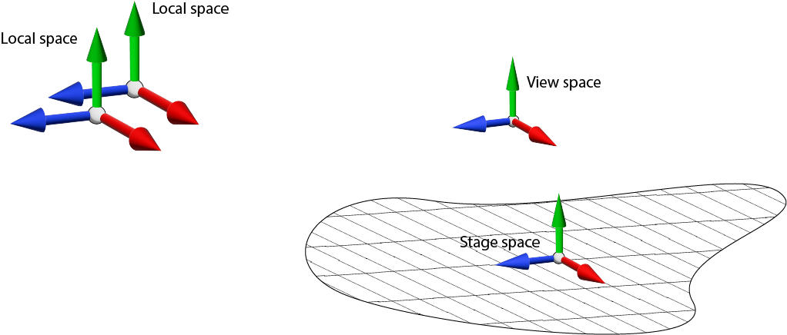

##########
3 Graphics
##########

The goal of this chapter is to build an application that creates and clears color and depth buffers and draws some geometry to the views within the scope of OpenXR render loop and to demonstrate its interaction with the Graphics APIs.

.. container:: windows linux

	In the *workspace* directory, update the ``CMakeLists.txt`` by adding the following CMake code to the end of the file:

	.. literalinclude:: ../CMakeLists.txt
			:language: cmake
			:start-after: XR_DOCS_TAG_BEGIN_AddChapter3
			:end-before: XR_DOCS_TAG_END_AddChapter3

	Now, create a ``Chapter3`` folder in the *workspace* directory and into that folder copy the ``main.cpp`` from ``Chapter2``. For the ``CMakeLists.txt``, copy the from ``Chapter2`` and update this line:

.. container:: android

	Add a `Chapter3` folder in the *workspace* directory and into that folder copy the whole contents of `Chapter2` to it. In CMakeLists.txt, update this line:

.. literalinclude:: ../Chapter3/CMakeLists.txt
	:language: cmake
	:start-after: XR_DOCS_TAG_BEGIN_SetProjectName3
	:end-before: XR_DOCS_TAG_END_SetProjectName3

Create a ``Shaders`` folder next to your project folder, download and put these files in it:

.. container:: d3d11 d3d12

	* :download:`Shaders/VertexShader.hlsl <../Shaders/VertexShader.hlsl>`
	* :download:`Shaders/PixelShader.hlsl <../Shaders/PixelShader.hlsl>`

.. container:: vulkan opengl

	* :download:`Shaders/VertexShader.glsl <../Shaders/VertexShader.glsl>`
	* :download:`Shaders/PixelShader.glsl <../Shaders/PixelShader.glsl>`

.. container:: opengles

	* :download:`Shaders/VertexShader_GLES.glsl <../Shaders/VertexShader_GLES.glsl>`
	* :download:`Shaders/PixelShader_GLES.glsl <../Shaders/PixelShader_GLES.glsl>`

Underneath ``SOURCES`` ``HEADERS`` section, add the following CMake code specifying the location of the shaders:

.. container:: d3d11 d3d12

	.. literalinclude:: ../Chapter3/CMakeLists.txt
		:language: cmake
		:start-after: XR_DOCS_TAG_BEGIN_HLSLShaders
		:end-before: XR_DOCS_TAG_END_HLSLShaders

.. container:: opengl vulkan

	.. literalinclude:: ../Chapter3/CMakeLists.txt
		:language: cmake
		:start-after: XR_DOCS_TAG_BEGIN_GLSLShaders
		:end-before: XR_DOCS_TAG_END_GLSLShaders

.. container:: opengles

	.. literalinclude:: ../Chapter3/CMakeLists.txt
		:language: cmake
		:start-after: XR_DOCS_TAG_BEGIN_GLESShaders
		:end-before: XR_DOCS_TAG_END_GLESShaders

Underneath section where specify your Graphics API, add the following CMake code:

.. container:: window

	.. container:: d3d11 d3d12

		.. literalinclude:: ../Chapter3/CMakeLists.txt
			:language: cmake
			:start-after: XR_DOCS_TAG_BEGIN_BuildShadersWindows
			:end-before: XR_DOCS_TAG_END_BuildShadersWindows

.. container:: window linux

	.. container:: vulkan

		.. literalinclude:: ../Chapter3/CMakeLists.txt
			:language: cmake
			:start-after: XR_DOCS_TAG_BEGIN_BuildShadersVulkanWindowsLinux
			:end-before: XR_DOCS_TAG_END_BuildShadersVulkanWindowsLinux

	.. container:: opengl

		.. literalinclude:: ../Chapter3/CMakeLists.txt
			:language: cmake
			:start-after: XR_DOCS_TAG_BEGIN_BuildShadersOpenGLWindowsLinux
			:end-before: XR_DOCS_TAG_END_BuildShadersOpenGLWindowsLinux

.. container:: android

	.. container:: vulkan

		.. literalinclude:: ../Chapter3/CMakeLists.txt
				:language: cmake
				:start-after: XR_DOCS_TAG_BEGIN_CompileAndroidGLSLShaders
				:end-before: XR_DOCS_TAG_END_CompileAndroidGLSLShaders

	.. container:: opengles

		.. literalinclude:: ../Chapter3/CMakeLists.txt
			:language: cmake
			:start-after: XR_DOCS_TAG_BEGIN_CompileAndroidGLESShaders
			:end-before: XR_DOCS_TAG_END_CompileAndroidGLESShaders

.. container:: android

	For Android, you will also need to change all references to ``OpenXRTutorialChapter2`` to ``OpenXRTutorialChapter3`` in app/build.gradle, settings.gradle and app/src/main/AndroidManifest.xml. Refer to :ref:`Chapter 1.4.1<1.4.1 CMake and Project Files>` for a refresher on the Android build files.

	Load your new project in Android Studio.

***********************
3.1 Creating Swapchains
***********************

As with rendering graphics to a 2D display, OpenXR uses the concept of swapchains. It's a series of images that are used to present the rendered graphics to display/window/view. There are usually 2 or 3 images in the swapchain to allow the platform to present them smoothly to the user in order to create the illusion of motion within the image.

All graphics APIs have the concept of a swapchain with varying levels of exposure in the API. For OpenXR development, you will not create the API-specific swapchain. Instead, we use OpenXR to create swapchains and the OpenXR compositor to present rendered graphics to the views. XR applications are unique in that often have multiple views that need to be rendered to create the XR experience. Listed below are a couple scenarios with differing view counts:

	* 1 view  - Viewer on a phone, tablet or monitor.
	* 2 views - Stereoscopic headset.

Orthogonal to multiple views is the layering of multiple images. You could, for a example, have a background that is a pass-through of your environment, a stereoscopic view of rendered graphics and a quadrilateral overlay of a HUD (Head-up display) or UI elements; all of of which could have different spatial orientations. This layering of views is handled by the XR compositor to composite correctly the layers for each view - that quad overlay might be behind the user, and thus shouldn't be rendered to the eye views.

Firstly, we will update the class in the ``Chapter3/main.cpp`` to add the new methods and members. Copy the highlighted code below.

.. code-block:: cpp
	:emphasize-lines: 12, 15, 25, 35-43, 48-57

	class OpenXRTutorial {
	public:
		// [...] Constructor and Destructor created in previous chapters.
	
		void Run() {
			CreateInstance();
			CreateDebugMessenger();
	
			GetInstanceProperties();
			GetSystemID();
	
			GetViewConfigurationViews();
	
			CreateSession();
			CreateSwapchain();
	
			while (m_applicationRunning) {
				PollSystemEvents();
				PollEvents();
				if (m_sessionRunning) {
					// Draw Frame.
				}
			}
	
			DestroySwapchain();
			DestroySession();
	
			DestroyDebugMessenger();
			DestroyInstance();
		}
	
	private:
		// [...] Methods created in previous chapters.
		
		void GetViewConfigurationViews()
		{
		}
		void CreateSwapchain()
		{
		}
		void DestroySwapchain()
		{
		}

	private:
		// [...] Member created in previous chapters.

		std::vector<XrViewConfigurationView> m_viewConfigurationViews;

		struct SwapchainAndDepthImage {
			XrSwapchain swapchain = XR_NULL_HANDLE;
			int64_t swapchainFormat = 0;
			void *depthImage = nullptr;
			std::vector<void *> colorImageViews;
			void *depthImageView = nullptr;
		};
		std::vector<SwapchainAndDepthImage> m_swapchainAndDepthImages = {};
	};

We will explore the added methods in the sub chapters below.

3.1.1 XrViewConfigurationView
=============================

The first thing we need to do is get all of the views available to our view configuration. It is worth just parsing the name of this type: ``XrViewConfigurationView``. We can break the typename up as follow "XrViewConfiguration" - "View", where it relates to one view in the view configuration, which may contain multiple views. We call ``xrEnumerateViewConfigurationViews()`` twice, first to get the count of the views in the view configuration, and second to fill in the data to the ``std::vector<XrViewConfigurationView>``.

Add the following code to the ``GetViewConfigurationViews()`` method:

.. literalinclude:: ../Chapter3/main.cpp
	:language: cpp
	:start-after: XR_DOCS_TAG_BEGIN_GetViewConfigurationViews
	:end-before: XR_DOCS_TAG_END_GetViewConfigurationViews
	:dedent: 8

3.1.2 xrEnumerateSwapchainFormats
=================================

Due to way that OpenXR and its compositor operate, there are certain preferred image formats that should be used by the swapchain. When calling ``xrEnumerateSwapchainFormats()``, the ``XrSession`` and alongwith the Graphics API will return an array of API-specific formats ordered in preference. ``xrEnumerateSwapchainFormats()`` takes a pointer to the first element in an array of ``int64_t`` values. The use of ``int64_t`` is a simple type cast from a ``DXGI_FORMAT``, ``GLenum`` or a ``VkFormat``. The runtime "should support ``R8G8B8A8`` and ``R8G8B8A8 sRGB`` formats if possible" (`OpenXR Specification 10.1. Swapchain Image Management <https://registry.khronos.org/OpenXR/specs/1.0/html/xrspec.html#swapchain-image-management>`_).

The question is: Whether to use a Linear or sRGB color space? OpenXR's compositor performs all blend operations in a linear color space (i.e. the values have not been gamma encoded). Most gamma-encoding operations are algebraically non-linear, so you can't composite the values with simple addition or multiplication operations. If you wish to use an sRGB color format, it's best to use an API-specific sRGB color format such as ``DXGI_FORMAT_R8G8B8A8_UNORM_SRGB``, ``GL_SRGB8_ALPHA8`` or ``VK_FORMAT_R8G8B8A8_SRGB``. The OpenXR runtime will automatically do sRGB-to-linear color space conversions when reading the image. There are two issues with this: 

1. Runtime conversion of image data could be too slow and affect performance and comfort.
2. The conversion process may not use the same style of gamma encoding/decoding and therefore may result in a loss in color accuracy.

For more information on color spaces and gamma encoding, see Guy Davidson's video presentation `here <https://www.youtube.com/watch?v=_zQ_uBAHA4A>`_.

Copy the code below into the ``CreateSwapchain()`` method:

.. literalinclude:: ../Chapter3/main.cpp
	:language: cpp
	:start-after: XR_DOCS_TAG_BEGIN_EnumerateSwapchainFormats
	:end-before: XR_DOCS_TAG_END_EnumerateSwapchainFormats
	:dedent: 8

3.1.3 xrCreateSwapchain
=======================

Append the following code to the ``CreateSwapchain()`` method:

.. literalinclude:: ../Chapter3/main.cpp
	:language: cpp
	:start-after: XR_DOCS_TAG_BEGIN_CreateViewConfigurationView
	:end-before: XR_DOCS_TAG_END_CreateViewConfigurationView
	:dedent: 8

We will create an ``XrSwapchain`` for each view in the system. First, we will resize our ``std::vector<SwapchainAndDepthImage>`` to match the number of views in the system. Next, we set up a loop to iterate through and create the swapchains.
Append the following this code to the ``CreateSwapchain()`` method:

.. code-block:: cpp

	m_swapchainAndDepthImages.resize(m_viewConfigurationViews.size());
	for (SwapchainAndDepthImage &swapchainAndDepthImage : m_swapchainAndDepthImages) {
	}

Inside the ranged for loop of the ``CreateSwapchain()`` method, add the following code:

.. literalinclude:: ../Chapter3/main.cpp
	:language: cpp
	:start-after: XR_DOCS_TAG_BEGIN_CreateSwapchain
	:end-before: XR_DOCS_TAG_END_CreateSwapchain
	:dedent: 12

Here, we filled out the ``XrSwapchainCreateInfo`` structure. The ``sampleCount``, ``width`` and ``height`` members were assigned from the ``XrViewConfigurationView``. We set the ``createFlags`` to 0 as we require no constraints or additional functionality. We set the ``usageFlags`` to ``XR_SWAPCHAIN_USAGE_SAMPLED_BIT | XR_SWAPCHAIN_USAGE_COLOR_ATTACHMENT_BIT`` requesting that the images are suitable to be read in a shader and to be used as a render target/color attachment.

.. container:: d3d11

	.. rubric:: DirectX 11

	+-------------------------------------------------+------------------------------------+
	| XrSwapchainUsageFlagBits                        | Corresponding D3D11 bind flag bits |
	+-------------------------------------------------+------------------------------------+
	| XR_SWAPCHAIN_USAGE_COLOR_ATTACHMENT_BIT         | D3D11_BIND_RENDER_TARGET           |
	+-------------------------------------------------+------------------------------------+
	| XR_SWAPCHAIN_USAGE_DEPTH_STENCIL_ATTACHMENT_BIT | D3D11_BIND_DEPTH_STENCIL           |
	+-------------------------------------------------+------------------------------------+
	| XR_SWAPCHAIN_USAGE_UNORDERED_ACCESS_BIT         | D3D11_BIND_UNORDERED_ACCESS        |
	+-------------------------------------------------+------------------------------------+
	| XR_SWAPCHAIN_USAGE_TRANSFER_SRC_BIT             | ignored                            |
	+-------------------------------------------------+------------------------------------+
	| XR_SWAPCHAIN_USAGE_TRANSFER_DST_BIT             | ignored                            |
	+-------------------------------------------------+------------------------------------+
	| XR_SWAPCHAIN_USAGE_SAMPLED_BIT                  | D3D11_BIND_SHADER_RESOURCE         |
	+-------------------------------------------------+------------------------------------+
	| XR_SWAPCHAIN_USAGE_MUTABLE_FORMAT_BIT           | ignored                            |
	+-------------------------------------------------+------------------------------------+
	| XR_SWAPCHAIN_USAGE_INPUT_ATTACHMENT_BIT_KHR     | ignored                            |
	+-------------------------------------------------+------------------------------------+

.. container:: d3d12

	.. rubric:: DirectX 12

	+-------------------------------------------------+--------------------------------------------+
	| XrSwapchainUsageFlagBits                        | Corresponding D3D12 resource flag bits     |
	+-------------------------------------------------+--------------------------------------------+
	| XR_SWAPCHAIN_USAGE_COLOR_ATTACHMENT_BIT         | D3D12_RESOURCE_FLAG_ALLOW_RENDER_TARGET    |
	+-------------------------------------------------+--------------------------------------------+
	| XR_SWAPCHAIN_USAGE_DEPTH_STENCIL_ATTACHMENT_BIT | D3D12_RESOURCE_FLAG_ALLOW_DEPTH_STENCIL    |
	+-------------------------------------------------+--------------------------------------------+
	| XR_SWAPCHAIN_USAGE_UNORDERED_ACCESS_BIT         | D3D12_RESOURCE_FLAG_ALLOW_UNORDERED_ACCESS |
	+-------------------------------------------------+--------------------------------------------+
	| XR_SWAPCHAIN_USAGE_TRANSFER_SRC_BIT             | ignored                                    |
	+-------------------------------------------------+--------------------------------------------+
	| XR_SWAPCHAIN_USAGE_TRANSFER_DST_BIT             | ignored                                    |
	+-------------------------------------------------+--------------------------------------------+
	| XR_SWAPCHAIN_USAGE_SAMPLED_BIT                  | D3D12_RESOURCE_FLAG_DENY_SHADER_RESOURCE   |
	+-------------------------------------------------+--------------------------------------------+
	| XR_SWAPCHAIN_USAGE_MUTABLE_FORMAT_BIT           | ignored                                    |
	+-------------------------------------------------+--------------------------------------------+
	| XR_SWAPCHAIN_USAGE_INPUT_ATTACHMENT_BIT_KHR     | ignored                                    |
	+-------------------------------------------------+--------------------------------------------+

.. container:: opengl

	.. rubric:: OpenGL

	All ``XrSwapchainUsageFlags`` are ignored as OpenGL can't specify usage of an image.

.. container:: opengles

	.. rubric:: OpenGL ES

	All ``XrSwapchainUsageFlags`` are ignored as OpenGL ES can't specify usage of an image.

.. container:: vulkan

	.. rubric:: Vulkan

	+-------------------------------------------------+---------------------------------------------+
	| XrSwapchainUsageFlagBits                        | Corresponding Vulkan flag bit               |
	+-------------------------------------------------+---------------------------------------------+
	| XR_SWAPCHAIN_USAGE_COLOR_ATTACHMENT_BIT         | VK_IMAGE_USAGE_COLOR_ATTACHMENT_BIT         |
	+-------------------------------------------------+---------------------------------------------+
	| XR_SWAPCHAIN_USAGE_DEPTH_STENCIL_ATTACHMENT_BIT | VK_IMAGE_USAGE_DEPTH_STENCIL_ATTACHMENT_BIT |
	+-------------------------------------------------+---------------------------------------------+
	| XR_SWAPCHAIN_USAGE_UNORDERED_ACCESS_BIT         | VK_IMAGE_USAGE_STORAGE_BIT                  |
	+-------------------------------------------------+---------------------------------------------+
	| XR_SWAPCHAIN_USAGE_TRANSFER_SRC_BIT             | VK_IMAGE_USAGE_TRANSFER_SRC_BIT             |
	+-------------------------------------------------+---------------------------------------------+
	| XR_SWAPCHAIN_USAGE_TRANSFER_DST_BIT             | VK_IMAGE_USAGE_TRANSFER_DST_BIT             |
	+-------------------------------------------------+---------------------------------------------+
	| XR_SWAPCHAIN_USAGE_SAMPLED_BIT                  | VK_IMAGE_USAGE_SAMPLED_BIT                  |
	+-------------------------------------------------+---------------------------------------------+
	| XR_SWAPCHAIN_USAGE_MUTABLE_FORMAT_BIT           | VK_IMAGE_CREATE_MUTABLE_FORMAT_BIT          |
	+-------------------------------------------------+---------------------------------------------+
	| XR_SWAPCHAIN_USAGE_INPUT_ATTACHMENT_BIT_KHR     | VK_IMAGE_USAGE_INPUT_ATTACHMENT_BIT         |
	+-------------------------------------------------+---------------------------------------------+

Then, we set the values for ``faceCount``, ``arraySize`` and ``mipCount``. ``faceCount`` describes the number of faces in the image and is used for creating cubemap textures. ``arraySize`` describes the number of layers in an image. Here, we used ``1``, as we have separate swapchains per view/eye, but for a stereo view you could pass ``2`` and have an image 2D array, which is suitable for multiview rendering. ``mipCount`` describes the number of mips levels; this is useful when using the swapchain image as a sampled image in a shader. Finally, we set the format. Here, we asked our ``GraphicsAPI_...`` class to pick a suitable format for the swapchain from the enumerated formats we acquired earlier. 

Here is the code for ``GraphicsAPI::SelectSwapchainFormat()``:

.. literalinclude:: ../Common/GraphicsAPI.cpp
	:language: cpp
	:start-after: XR_DOCS_TAG_BEGIN_GraphicsAPI_SelectSwapchainFormat
	:end-before: XR_DOCS_TAG_END_GraphicsAPI_SelectSwapchainFormat

*The above code is an excerpt from Common/GraphicsAPI.cpp*

The function calls a pure virtual method called ``GraphicsAPI::GetSupportedSwapchainFormats()``, which each class implements. It returns an array of API-specific formats that the GraphicsAPI library supports.

.. container:: d3d11

	.. rubric:: DirectX 11

	.. literalinclude:: ../Common/GraphicsAPI_D3D11.cpp
		:language: cpp
		:start-after: XR_DOCS_TAG_BEGIN_GraphicsAPI_D3D11_GetSupportedSwapchainFormats
		:end-before: XR_DOCS_TAG_END_GraphicsAPI_D3D11_GetSupportedSwapchainFormats
		
	*The above code is an excerpt from Common/GraphicsAPI_D3D11.cpp*

.. container:: d3d12

	.. rubric:: DirectX 12

	.. literalinclude:: ../Common/GraphicsAPI_D3D12.cpp
		:language: cpp
		:start-after: XR_DOCS_TAG_BEGIN_GraphicsAPI_D3D12_GetSupportedSwapchainFormats
		:end-before: XR_DOCS_TAG_END_GraphicsAPI_D3D12_GetSupportedSwapchainFormats

	*The above code is an excerpt from Common/GraphicsAPI_D3D12.cpp*

.. container:: opengl

	.. rubric:: OpenGL

	.. literalinclude:: ../Common/GraphicsAPI_OpenGL.cpp
		:language: cpp
		:start-after: XR_DOCS_TAG_BEGIN_GraphicsAPI_OpenGL_GetSupportedSwapchainFormats
		:end-before: XR_DOCS_TAG_END_GraphicsAPI_OpenGL_GetSupportedSwapchainFormats

	*The above code is an excerpt from Common/GraphicsAPI_OpenGL.cpp*

.. container:: opengles

	.. rubric:: OpenGL ES

	.. literalinclude:: ../Common/GraphicsAPI_OpenGL_ES.cpp
		:language: cpp
		:start-after: XR_DOCS_TAG_BEGIN_GraphicsAPI_OpenGL_ES_GetSupportedSwapchainFormats
		:end-before: XR_DOCS_TAG_END_GraphicsAPI_OpenGL_ES_GetSupportedSwapchainFormats

	*The above code is an excerpt from Common/GraphicsAPI_OpenGL_ES.cpp*

.. container:: vulkan

	.. rubric:: Vulkan

	.. literalinclude:: ../Common/GraphicsAPI_Vulkan.cpp
		:language: cpp
		:start-after: XR_DOCS_TAG_BEGIN_GraphicsAPI_Vulkan_GetSupportedSwapchainFormats
		:end-before: XR_DOCS_TAG_END_GraphicsAPI_Vulkan_GetSupportedSwapchainFormats

	*The above code is an excerpt from Common/GraphicsAPI_Vulkan.cpp*

Lastly, we called ``xrCreateSwapchain()`` to create our ``XrSwapchain``, which, if successful, returned ``XR_SUCCESS`` and the ``XrSwapchain`` was non-null. We copied our swapchain format to our ``SwapchainAndDepthImage::swapchainFormat`` for later usage.

3.1.4 xrEnumerateSwapchainImages
================================

Now that we have created the swapchain, we need to get access to its images. We first call ``xrEnumerateSwapchainImages()`` to get the count of the images in the swapchain. Next, we set up an array of structures to store the images from the ``XrSwapchain``. In this tutorial, this array of structures, which stores the swapchains images, are stored in the ``GraphicsAPI_...`` class. We do this, because OpenXR will return to the application an array of structures that contain the API-specific handles to the swapchain images. ``GraphicsAPI::AllocateSwapchainImageData()`` is a virtual method implemented by each graphics API, which resizes an API-specific ``std::vector<XrSwapchainImage...KHR>`` and returns a pointer to the first element in that array casting it to a ``XrSwapchainImageBaseHeader *``.

Copy and append the following code in the ranged for loop of the ``CreateSwapchain()`` method.

.. literalinclude:: ../Chapter3/main.cpp
	:language: cpp
	:start-after: XR_DOCS_TAG_BEGIN_EnumerateSwapchainImages
	:end-before: XR_DOCS_TAG_END_EnumerateSwapchainImages
	:dedent: 12

Below is an excerpt of the ``GraphicsAPI::AllocateSwapchainImageData()`` method and the ``XrSwapchainImage...KHR`` structure relating to your chosen graphics API.

.. container:: d3d11

	.. rubric:: DirectX 11

	.. literalinclude:: ../Common/GraphicsAPI_D3D11.cpp
		:language: cpp
		:start-after: XR_DOCS_TAG_BEGIN_GraphicsAPI_D3D11_AllocateSwapchainImageData
		:end-before: XR_DOCS_TAG_END_GraphicsAPI_D3D11_AllocateSwapchainImageData

	*The above code is an excerpt from Common/GraphicsAPI_D3D11.cpp*

	``swapchainImages`` is of type ``std::vector<XrSwapchainImageD3D11KHR>``.
		
	.. literalinclude:: ../build/_deps/openxr-build/include/openxr/openxr_platform.h
		:language: cpp
		:start-at: typedef struct XrSwapchainImageD3D11KHR {
		:end-at: } XrSwapchainImageD3D11KHR;

	*The above code is an excerpt from openxr/openxr_platform.h*

	The structure contains a ``ID3D11Texture2D *`` member that is the handle to one of the images in the swapchain.

.. container:: d3d12

	.. rubric:: DirectX 12

	.. literalinclude:: ../Common/GraphicsAPI_D3D12.cpp
		:language: cpp
		:start-after: XR_DOCS_TAG_BEGIN_GraphicsAPI_D3D12_AllocateSwapchainImageData
		:end-before: XR_DOCS_TAG_END_GraphicsAPI_D3D12_AllocateSwapchainImageData

	*The above code is an excerpt from Common/GraphicsAPI_D3D12.cpp*
	
	``swapchainImages`` is of type ``std::vector<XrSwapchainImageD3D12KHR>``.

	.. literalinclude:: ../build/_deps/openxr-build/include/openxr/openxr_platform.h
		:language: cpp
		:start-at: typedef struct XrSwapchainImageD3D12KHR {
		:end-at: } XrSwapchainImageD3D12KHR;

	*The above code is an excerpt from openxr/openxr_platform.h*

	The structure contains a ``ID3D12Resource *`` member that is the handle to one of the images in the swapchain.

.. container:: opengl

	.. rubric:: OpenGL

	.. literalinclude:: ../Common/GraphicsAPI_OpenGL.cpp
		:language: cpp
		:start-after: XR_DOCS_TAG_BEGIN_GraphicsAPI_OpenGL_AllocateSwapchainImageData
		:end-before: XR_DOCS_TAG_END_GraphicsAPI_OpenGL_AllocateSwapchainImageData

	*The above code is an excerpt from Common/GraphicsAPI_OpenGL.cpp*

	``swapchainImages`` is of type ``std::vector<XrSwapchainImageOpenGLKHR>``.

	.. literalinclude:: ../build/_deps/openxr-build/include/openxr/openxr_platform.h
		:language: cpp
		:start-at: typedef struct XrSwapchainImageOpenGLKHR {
		:end-at: } XrSwapchainImageOpenGLKHR;

	*The above code is an excerpt from openxr/openxr_platform.h*

	The structure contains a ``uint32_t`` member that is the handle to one of the images in the swapchain.

.. container:: opengles

	.. rubric:: OpenGL ES

	.. literalinclude:: ../Common/GraphicsAPI_OpenGL_ES.cpp
		:language: cpp
		:start-after: XR_DOCS_TAG_BEGIN_GraphicsAPI_OpenGL_ES_AllocateSwapchainImageData
		:end-before: XR_DOCS_TAG_END_GraphicsAPI_OpenGL_ES_AllocateSwapchainImageData

	``swapchainImages`` is of type ``std::vector<XrSwapchainImageOpenGLESKHR>``.

	*The above code is an excerpt from Common/GraphicsAPI_OpenGL_ES.cpp*

	.. literalinclude:: ../build/_deps/openxr-build/include/openxr/openxr_platform.h
		:language: cpp
		:start-at: typedef struct XrSwapchainImageOpenGLESKHR {
		:end-at: } XrSwapchainImageOpenGLESKHR;

	*The above code is an excerpt from openxr/openxr_platform.h*

	The structure contains a ``uint32_t`` member that is the handle to one of the images in the swapchain.

.. container:: vulkan

	.. rubric:: Vulkan

	.. literalinclude:: ../Common/GraphicsAPI_Vulkan.cpp
		:language: cpp
		:start-after: XR_DOCS_TAG_BEGIN_GraphicsAPI_Vulkan_AllocateSwapchainImageData
		:end-before: XR_DOCS_TAG_END_GraphicsAPI_Vulkan_AllocateSwapchainImageData

	*The above code is an excerpt from Common/GraphicsAPI_Vulkan.cpp*

	``swapchainImages`` is of type ``std::vector<XrSwapchainImageVulkanKHR>``.

	.. literalinclude:: ../build/_deps/openxr-build/include/openxr/openxr_platform.h
		:language: cpp
		:start-at: typedef struct XrSwapchainImageVulkanKHR {
		:end-at: } XrSwapchainImageVulkanKHR;

	*The above code is an excerpt from openxr/openxr_platform.h*

	The structure contains a ``VkImage`` member that is the handle to one of the images in the swapchain.

3.1.5 Create Depth Image And Image Views
========================================

Next, we create a depth image so that we can correctly render 3D perspective graphics to the view. In this tutorial, we have a ``GraphicsAPI::ImageCreateInfo`` structure and virtual method ``GraphicsAPI::CreateImage()`` that creates the API-specific objects. 

Append the following code into the ranged for loop of the ``CreateSwapchain()`` method.

.. literalinclude:: ../Chapter3/main.cpp
	:language: cpp
	:start-after: XR_DOCS_TAG_BEGIN_CreateDepthImage
	:end-before: XR_DOCS_TAG_END_CreateDepthImage
	:dedent: 12

Each graphics API overrides the virtual method ``GraphicsAPI::GetDepthFormat()``, which return a API-specific image format of type ``D32_F``.

.. container:: d3d11

	.. rubric:: DirectX 11

	.. literalinclude:: ../Common/GraphicsAPI_D3D11.h
		:language: cpp
		:start-at: virtual int64_t GetDepthFormat() override
		:end-at: }
		:dedent: 4

	*The above code is an excerpt from Common/GraphicsAPI_D3D11.h*

.. container:: d3d12

	.. rubric:: DirectX 12

	.. literalinclude:: ../Common/GraphicsAPI_D3D12.h
		:language: cpp
		:start-at: virtual int64_t GetDepthFormat() override
		:end-at: }
		:dedent: 4

	*The above code is an excerpt from Common/GraphicsAPI_D3D12.h*

.. container:: opengl

	.. rubric:: OpenGL

	.. literalinclude:: ../Common/GraphicsAPI_OpenGL.h
		:language: cpp
		:start-at: virtual int64_t GetDepthFormat() override
		:end-at: }
		:dedent: 4

	*The above code is an excerpt from Common/GraphicsAPI_OpenGL.h*

.. container:: opengles

	.. rubric:: OpenGL ES

	.. literalinclude:: ../Common/GraphicsAPI_OpenGL_ES.h
		:language: cpp
		:start-at: virtual int64_t GetDepthFormat() override
		:end-at: }
		:dedent: 4

	*The above code is an excerpt from Common/GraphicsAPI_OpenGL_ES.h*

.. container:: vulkan

	.. rubric:: Vulkan

	.. literalinclude:: ../Common/GraphicsAPI_Vulkan.h
		:language: cpp
		:start-at: virtual int64_t GetDepthFormat() override
		:end-at: }
		:dedent: 4
	
	*The above code is an excerpt from Common/GraphicsAPI_Vulkan.h*

We store our newly created depth image in ``SwapchainAndDepthImage::depthImage`` for later usage when rendering. 

Now, we create the image views: one per image in the ``XrSwapchain`` and an additional one for the depth image. Again in this tutorial, we have a ``GraphicsAPI::ImageViewCreateInfo`` structure and virtual method ``GraphicsAPI::CreateImageView()`` that creates the API-specific objects. 

Append the following code into the ranged for loop of the ``CreateSwapchain()`` method.

.. literalinclude:: ../Chapter3/main.cpp
	:language: cpp
	:start-after: XR_DOCS_TAG_BEGIN_CreateImageViews
	:end-before: XR_DOCS_TAG_END_CreateImageViews
	:dedent: 12

Each graphics API overrides the virtual function ``GraphicsAPI::GetSwapchainImage()``, which return a API-specific handle to the image, which is cast to a ``void *``.

.. container:: d3d11

	.. rubric:: DirectX 11

	.. literalinclude:: ../Common/GraphicsAPI_D3D11.h
		:language: cpp
		:start-at: virtual void* GetSwapchainImage(uint32_t index) override
		:end-at: }
		:dedent: 4

	*The above code is an excerpt from Common/GraphicsAPI_D3D11.h*

.. container:: d3d12

	.. rubric:: DirectX 12

	.. literalinclude:: ../Common/GraphicsAPI_D3D12.h
		:language: cpp
		:start-at: virtual void* GetSwapchainImage(uint32_t index) override
		:end-at: }
		:dedent: 4

	*The above code is an excerpt from Common/GraphicsAPI_D3D12.h*

	For DirectX 3D 12, the ``ID3D12Resource *`` returned has of its all subresource states in ``D3D12_RESOURCE_STATE_RENDER_TARGET``. This is a requirement of the OpenXR 1.0 D3D12 extension. See: `12.13. XR_KHR_D3D12_enable <https://registry.khronos.org/OpenXR/specs/1.0/html/xrspec.html#XR_KHR_D3D12_enable>`_.

.. container:: opengl

	.. rubric:: OpenGL

	.. literalinclude:: ../Common/GraphicsAPI_OpenGL.h
		:language: cpp
		:start-at: virtual void* GetSwapchainImage(uint32_t index) override
		:end-at: }
		:dedent: 4

	*The above code is an excerpt from Common/GraphicsAPI_OpenGL.h*

.. container:: opengles

	.. rubric:: OpenGL ES

	.. literalinclude:: ../Common/GraphicsAPI_OpenGL_ES.h
		:language: cpp
		:start-at: virtual void* GetSwapchainImage(uint32_t index) override
		:end-at: }
		:dedent: 4

	*The above code is an excerpt from Common/GraphicsAPI_OpenGL_ES.h*

.. container:: vulkan

	.. rubric:: Vulkan

	.. literalinclude:: ../Common/GraphicsAPI_Vulkan.h
		:language: cpp
		:start-at: virtual void* GetSwapchainImage(uint32_t index) override
		:end-at: }
		:dedent: 4

	For Vulkan, the ``VkImage`` returned has all of its subresource states in ``VK_IMAGE_LAYOUT_COLOR_ATTACHMENT_OPTIMAL``. This is a requirement of the OpenXR 1.0 Vulkan extension. See: `12.20. XR_KHR_vulkan_enable <https://registry.khronos.org/OpenXR/specs/1.0/html/xrspec.html#XR_KHR_vulkan_enable>`_.

	*The above code is an excerpt from Common/GraphicsAPI_Vulkan.h*

For the color image views, we use the previously stored color image format, that we used when creating the swapchain, and for the depth image view, we use the previously created depth image and the same depth format from the graphics API.
We store our newly created color image views for the swapchain in ``SwapchainAndDepthImage::colorImageViews`` and the depth image view in ``SwapchainAndDepthImage::depthImageView`` for later usage when rendering. 

3.1.6 xrDestroySwapchain
========================

When the main render loop has finished and the application is shutting down, we need to destroy our created ``XrSwapchain``. This is done by calling ``xrDestroySwapchain()`` passing the ``XrSwapchain`` as a parameter. It will return ``XR_SUCCESS`` if successful. At the same time, we destroy the associated depth image and all of the image views that the graphics API created. In this tutorial, we use ``GraphicsAPI::DestroyImage()`` and ``GraphicsAPI::DestroyImageView()`` to destroy those objects.

.. literalinclude:: ../Chapter3/main.cpp
	:language: cpp
	:start-after: XR_DOCS_TAG_BEGIN_DestroySwapchain
	:end-before: XR_DOCS_TAG_END_DestroySwapchain
	:dedent: 8

We now have swapchains and a depth images, ready for rendering. Next, we setup the render loop for OpenXR!

*************************
3.2 Building a RenderLoop
*************************

With most of the OpenXR objects now set up, we can now turn our attention to rendering graphics. There are two further OpenXR objects that are needed to render; pertaining to where the user is and what the user sees of the external environment around them. Namely, these are the 'reference space' and the 'environment blend mode' respectively.

Then, with those final pieces in place, we can look to the ``RenderFrame()`` and ``RenderLayer()`` code to invoke graphics work on the GPU and present it back to OpenXR and its compositor through the use of the composition layers and within the scope of an XR Frame.

Update the methods and members in the class. Copy the highlighted code:

.. code-block:: cpp
	:emphasize-lines: 13, 16, 23, 28, 50-64, 79-83

	class OpenXRTutorial {
	public:
		// [...] Constructor and Destructor created in previous chapters.
	
		void Run() {
			CreateInstance();
			CreateDebugMessenger();
	
			GetInstanceProperties();
			GetSystemID();
	
			GetViewConfigurationViews();
			GetEnvironmentBlendModes();
	
			CreateSession();
			CreateReferenceSpace();
			CreateSwapchain();
	
			while (m_applicationRunning) {
				PollSystemEvents();
				PollEvents();
				if (m_sessionRunning) {
					RenderFrame();
				}
			}
	
			DestroySwapchain();
			DestroyReferenceSpace();
			DestroySession();
	
			DestroyDebugMessenger();
			DestroyInstance();
		}
	
	private:
		// [...] Methods created in previous chapters.
		
		void GetViewConfigurationViews()
		{
			// [...]
		}
		void CreateSwapchain()
		{
			// [...]
		}
		void DestroySwapchain()
		{
			// [...]
		}
		void GetEnvironmentBlendModes() 
		{
		}
		void CreateReferenceSpace()
		{
		}
		void DestroyReferenceSpace() 
		{
		}
		void RenderFrame()
		{
		}
		bool RenderLayer(const XrTime &predictedDisplayTime, XrCompositionLayerProjection &layerProjection, std::vector<XrCompositionLayerProjectionView> &layerProjectionViews)
		{
		}
	private:
		// [...] Members created in previous chapters.

		std::vector<XrViewConfigurationView> m_viewConfigurationViews;

		struct SwapchainAndDepthImage {
			XrSwapchain swapchain = XR_NULL_HANDLE;
			int64_t swapchainFormat = 0;
			void *depthImage = nullptr;
			std::vector<void *> colorImageViews;
			void *depthImageView = nullptr;
		};
		std::vector<SwapchainAndDepthImage> m_swapchainAndDepthImages = {};

		std::vector<XrEnvironmentBlendMode> m_applicationEnvironmentBlendModes = {XR_ENVIRONMENT_BLEND_MODE_OPAQUE, XR_ENVIRONMENT_BLEND_MODE_ADDITIVE};
		std::vector<XrEnvironmentBlendMode> m_environmentBlendModes = {};
		XrEnvironmentBlendMode m_environmentBlendMode = XR_ENVIRONMENT_BLEND_MODE_MAX_ENUM;

		XrSpace m_localOrStageSpace = XR_NULL_HANDLE;
	};

3.2.1 xrEnumerateEnvironmentBlendModes
======================================

Some XR experiences rely on blending the real world and rendered graphics together. Choosing the correct environment blend mode is vital for creating immersion in both virtual and augmented realities.

This blending is done at the final stage after the compositor has flattened and blended all the compositing layers passed to OpenXR at the end of the XR frame. 

The enum `XrEnvironmentBlendMode` describes how OpenXR should blend the rendered view(s) with the external environment behind the screen(s). The values are:

	* VR: ``XR_ENVIRONMENT_BLEND_MODE_OPAQUE`` is the virtual reality case, where the real world is obscured.
	* AR: ``XR_ENVIRONMENT_BLEND_MODE_ADDITIVE`` or ``XR_ENVIRONMENT_BLEND_MODE_ALPHA_BLEND`` are used to composite rendered images with the external environment.

+---------------------------------------+-------------------------------------------------------------------------------------------------------------------------------+
| XrEnvironmentBlendMode                | Description                                                                                                                   |
+---------------------------------------+-------------------------------------------------------------------------------------------------------------------------------+
| XR_ENVIRONMENT_BLEND_MODE_OPAQUE      | The composition layers will be displayed with no view of the physical world behind them.                                      |
|                                       | The composited image will be interpreted as an RGB image, ignoring the composited alpha channel.                              |
+---------------------------------------+-------------------------------------------------------------------------------------------------------------------------------+
| XR_ENVIRONMENT_BLEND_MODE_ADDITIVE    | The composition layers will be additively blended with the real world behind the display.                                     |
|                                       | The composited image will be interpreted as an RGB image, ignoring the composited alpha channel during the additive blending. |
|                                       | This will cause black composited pixels to appear transparent.                                                                |
+---------------------------------------+-------------------------------------------------------------------------------------------------------------------------------+
| XR_ENVIRONMENT_BLEND_MODE_ALPHA_BLEND | The composition layers will be alpha-blended with the real world behind the display.                                          |
|                                       | The composited image will be interpreted as an RGBA image, with the composited alpha channel determining each pixel’s         |
|                                       | level of blending with the real world behind the display.                                                                     |
+---------------------------------------+-------------------------------------------------------------------------------------------------------------------------------+

`XrEnvironmentBlendMode - Enumerant Descriptions <https://registry.khronos.org/OpenXR/specs/1.0/html/xrspec.html#compositing>`_.

.. literalinclude:: ../build/_deps/openxr-build/include/openxr/openxr.h
	:language: cpp
	:start-at: typedef enum XrEnvironmentBlendMode {
	:end-at: } XrEnvironmentBlendMode;

*The above code is an excerpt from openxr/openxr.h*

Copy the following code into the ``GetEnvironmentBlendModes()`` method:

.. literalinclude:: ../Chapter3/main.cpp
	:language: cpp
	:start-after: XR_DOCS_TAG_BEGIN_GetEnvironmentBlendModes
	:end-before: XR_DOCS_TAG_END_GetEnvironmentBlendModes
	:dedent: 8

We enumerated the environment blend modes as shown above. This function took a pointer to the first element in an array of ``XrEnvironmentBlendMode`` s as multiple environment blend modes could be available to the system. The runtime returned an array ordered by its preference for the system. After we enumerated all the ``XrEnvironmentBlendMode`` s,  we looped through all of our ``m_applicationEnvironmentBlendModes`` to try and find one in our ``m_environmentBlendModes``, if we can't find one, we default to ``XR_ENVIRONMENT_BLEND_MODE_OPAQUE``, assigning the result to ``m_environmentBlendMode``.

3.2.2 xrCreateReferenceSpace
============================

Now that OpenXR know what the user should see, we need to tell OpenXR about the user's viewpoint. This is where the reference space comes in. Copy the following code into the ``CreateReferenceSpace()`` method:

.. literalinclude:: ../Chapter3/main.cpp
	:language: cpp
	:start-after: XR_DOCS_TAG_BEGIN_CreateReferenceSpace
	:end-before: XR_DOCS_TAG_END_CreateReferenceSpace
	:dedent: 8

We fill out a ``XrReferenceSpaceCreateInfo`` structure. The first member is of type ``XrReferenceSpaceType``, which we will discuss shortly. 

When we create the *reference space*, we need to specify an ``XrPosef``, which we will be the origin transform of the space. For our tutorial, we will set ``XrReferenceSpaceCreateInfo::poseInReferenceSpace`` to an identity, where we use an identity quaternion for the orientation and a position at the origin.
If we specify a different pose, the origin received when we poll the space would be offset from the reference space's origin.

An ``XrSpace`` is a frame of reference defined not by its instantaneous values, but semantically by its purpose and relationship to other spaces. The actual, instantaneous position and orientation of an ``XrSpace`` is called its *pose*.

One kind of reference space is view space (``XR_REFERENCE_SPACE_TYPE_VIEW``), which is oriented with the user's head, and is useful for user-interfaces and many other purposes. We don't use it to generate view matrices for rendering, because those are often offset from the view space due to stereo rendering.

By using ``XR_REFERENCE_SPACE_TYPE_LOCAL`` we specify that the views are relative to the XR hardware's 'local' space - either the headset's starting position or some other world-locked origin.

Some devices support stage space (``XR_REFERENCE_SPACE_TYPE_STAGE``); this implies a roomscale space, e.g. with its origin on the floor.

See https://registry.khronos.org/OpenXR/specs/1.0/man/html/XrReferenceSpaceType.html

	Reference Spaces in OpenXR

.. list-table:: OpenXR Reference Spaces
	:widths: 1 1 1
	:class: longtable
	:header-rows: 1

	* - XrReferenceSpaceType
	  - Diagram
	  - Description
	* - ``XR_REFERENCE_SPACE_TYPE_VIEW``
	  - .. figure:: OpenXR-ReferenceSpace-View.png
			:alt: OpenXR Reference Space View
			:align: center
	  - The View Reference Space uses the view origin (or the centroid of the views in the case of stereo) as the origin of the space. +Y is up, +X is to the right, and -Z is forward. The space is aligned in front of the viewer and it is not gravity aligned. It is most often used for rendering small head-locked content like a HUD (Head-up display).

	* -	``XR_REFERENCE_SPACE_TYPE_LOCAL``
	  - .. figure:: OpenXR-ReferenceSpace-Local.png
			:alt: OpenXR Reference Space Local
			:align: center
	  - The Local Reference Space uses an initial location to establish a world-locked, gravity aligned point as the origin of the space. +Y is up, +X is to the right, and -Z is forward. The origin is also locked for pitch(x) and roll(z). The initial position may be established at application start up or from a calibrated origin point. ``TODO: break between spec and opinion.``	It is typically used for rendering seated-scale experiences such as car racing or aircraft cockpits, where a physical floor is not required. When recentering, the runtime will queue a ``XrEventDataReferenceSpaceChangePending`` structure for the application to process.

	* - ``XR_REFERENCE_SPACE_TYPE_STAGE``
	  - .. figure:: OpenXR-ReferenceSpace-Stage.png
			:alt: OpenXR Reference Space Stage
			:align: center
	  - The Stage Reference Space defines a rectangular area that is flat and devoid of obstructions. The origin is define to be on the floor and at the center of the rectangular area. +Y is up, +X is to the right, and -Z is forward. The origin is axis-aligned to the XZ plane. It is most often used for rendering standing-scale experiences (no bounds) or room-scale experiences (with bounds) where a physical floor is required. When the user is redefining the origin or bounds of the area, the runtime will queue a ``XrEventDataReferenceSpaceChangePending`` structure for the application to process.

For more information on reference see the OpenXR 1.0 Specification here: `7.1. Reference Spaces <https://registry.khronos.org/OpenXR/specs/1.0/html/xrspec.html#reference-spaces>`_.

.. figure:: OpenXR-Coordinate-System.png
	:alt: OpenXR Default Coordinate System
	:align: left
	:width: 100%

The default coordinate system in OpenXR is right-handed with +Y up, +X to the right, and -Z forward.

The XR_EXT_local_floor extension bridges the use-case of an applications wanting to use a seated-scale experience, but also with a physical floor. Neither ``XR_REFERENCE_SPACE_TYPE_LOCAL`` nor ``XR_REFERENCE_SPACE_TYPE_STAGE`` truly fits this requirement.

The Local Floor Reference Space establishes a world-locked, gravity aligned point as the origin of the space. +Y is up, +X is to the right, and -Z is forward. The origin is the same as ``XR_REFERENCE_SPACE_TYPE_LOCAL`` in the X and Z coordinates, but not the Y coordinate. See more here: `12.34. XR_EXT_local_floor <https://registry.khronos.org/OpenXR/specs/1.0/html/xrspec.html#XR_EXT_local_floor>`_.

You may wish to call ``xrEnumerateReferenceSpaces()`` to get all ``XrReferenceSpaceType`` s available to the system, before choosing one that is suitable for your application and the user's environment.

At the end of the appplication, we should destroy the ``XrSpace`` by calling ``xrDestroySpace()``. If successful, the function will return ``XR_SUCCESS``. Copy the following code into the ``DestroyReferenceSpace()`` method:

.. literalinclude:: ../Chapter3/main.cpp
	:language: cpp
	:start-after: XR_DOCS_TAG_BEGIN_DestroyReferenceSpace
	:end-before: XR_DOCS_TAG_END_DestroyReferenceSpace
	:dedent: 8

3.2.3 RenderFrame
=================

Below is the code needed for rendering a frame in OpenXR. Each frame, we sequence through the three primary functions: ``xrWaitFrame()``, ``xrBeginFrame()`` and ``xrEndFrame()``. These functions wrap around our rendering code and communicate to the OpenXR rumtime that we are rendering and that we need to synchronize with the XR compositor. Copy the following code into ``RenderFrame()``:

.. literalinclude:: ../Chapter3/main.cpp
	:language: cpp
	:start-after: XR_DOCS_TAG_BEGIN_RenderFrame
	:end-before: XR_DOCS_TAG_END_RenderFrame
	:dedent: 8

The primary structure in use here is the ``XrFrameState``, which contains vital members for timing and rendering such as the ``predictedDisplayTime`` member, which is the predicted time that the frame will be displayed to the user, and the ``shouldRender`` member, which states whether the application should render any graphics. This last member could change when the application is transitioning into or out of a running session or that the system UI is focused and covering the application.

.. literalinclude:: ../build/_deps/openxr-build/include/openxr/openxr.h
	:language: cpp
	:start-at: typedef struct XrFrameState {
	:end-at: } XrFrameState;

*The above code is an excerpt from openxr/openxr.h*

``xrWaitFrame()``, ``xrBeginFrame()`` and ``xrEndFrame()`` should wrap around all the rendering in the XR frame and thus should be called in that sequence. ``xrWaitFrame()`` provided to the application the information for the frame, which we've discussed above. Next, ``xrBeginFrame()`` should be called just before excuting any GPU work for the frame. When calling ``xrEndFrame()``, we need to pass an ``XrFrameEndInfo`` structure to that function. We assign ``XrFrameState::predictedDisplayTime`` to ``XrFrameEndInfo::displayTime``. It should be noted that we can modify this value during the frame. Next, we assign to ``XrFrameEndInfo::environmentBlendMode`` our selected blend mode. Last, we assign the size of and a pointer to an ``std::vector<XrCompositionLayerBaseHeader *>``. These Composition Layers are assembled by the OpenXR compositor to create the final images.

.. literalinclude:: ../build/_deps/openxr-build/include/openxr/openxr.h
	:language: cpp
	:start-at: typedef struct XrFrameEndInfo {
	:end-at: } XrFrameEndInfo;

*The above code is an excerpt from openxr/openxr.h*

``XrCompositionLayerBaseHeader`` is the base structure from which all other ``XrCompositionLayer...`` types extend. They describe the type of layer to be composited along with the relevant information. If we have rendered any graphics within this frame, we cast the memory address our ``XrCompositionLayer...`` structure to an ``XrCompositionLayerBaseHeader *`` and push it into ``std::vector<XrCompositionLayerBaseHeader *>``, which will be assigned in our ``XrFrameEndInfo`` structure.

.. literalinclude:: ../build/_deps/openxr-build/include/openxr/openxr.h
	:language: cpp
	:start-at: typedef struct XR_MAY_ALIAS XrCompositionLayerBaseHeader {
	:end-at: } XrCompositionLayerBaseHeader;

*The above code is an excerpt from openxr/openxr.h*

Below is a table of the ``XrCompositionLayer...`` types provided by the OpenXR 1.0 Core Specification and ``XR_KHR_composition_layer_...`` extensions.

+-------------------------------------------+-------------------------------------+
| Extension                                 | Structure                           |
+-------------------------------------------+-------------------------------------+
| OpenXR 1.0 Core Specification             | XrCompositionLayerProjection        |
+-------------------------------------------+-------------------------------------+
| OpenXR 1.0 Core Specification             | XrCompositionLayerQuad              |
+-------------------------------------------+-------------------------------------+
| XR_KHR_composition_layer_cube             | XrCompositionLayerCubeKHR           |
+-------------------------------------------+-------------------------------------+
| XR_KHR_composition_layer_depth            | XrCompositionLayerDepthInfoKHR      |
+-------------------------------------------+-------------------------------------+
| XR_KHR_composition_layer_cylinder         | XrCompositionLayerCylinderKHR       |
+-------------------------------------------+-------------------------------------+
| XR_KHR_composition_layer_equirect         | XrCompositionLayerEquirectKHR       |
+-------------------------------------------+-------------------------------------+
| XR_KHR_composition_layer_color_scale_bias | XrCompositionLayerColorScaleBiasKHR |
+-------------------------------------------+-------------------------------------+
| XR_KHR_composition_layer_equirect2        | XrCompositionLayerEquirect2KHR      |
+-------------------------------------------+-------------------------------------+

Other hardware vendor specific extensions relating to ``XrCompositionLayer...`` are also in the OpenXR 1.0 specification. 

Here we will use the a single ``XrCompositionLayerProjection``. The structure describes the ``XrCompositionLayerFlags``, an ``XrSpace`` and a count and pointer to an array of ``XrCompositionLayerProjectionView``.

``XrCompositionLayerProjectionView`` descibes the ``XrPosef`` of the view relative to the reference space, the field of view and to which ``XrSwapchainSubImage`` the view relates.

.. literalinclude:: ../build/_deps/openxr-build/include/openxr/openxr.h
	:language: cpp
	:start-at: typedef struct XrSwapchainSubImage {
	:end-at: } XrCompositionLayerProjection;

*The above code is an excerpt from openxr/openxr.h*

The compositing of layers can be set on a per-layer basis through the use of the per-texel alpha channel. This is done throught the use of the ``XrCompositionLayerFlags`` member. Below is a description of these flags.

+-------------------------------------------------------+-----------------------------------------------------------------------------------------------------------+
| XrCompositionLayerFlags                               | Descriptions                                                                                              |
+-------------------------------------------------------+-----------------------------------------------------------------------------------------------------------+
| XR_COMPOSITION_LAYER_CORRECT_CHROMATIC_ABERRATION_BIT | Enables chromatic aberration correction if not already done. It is planned to be deprecated in OpenXR 1.1 |
+-------------------------------------------------------+-----------------------------------------------------------------------------------------------------------+
| XR_COMPOSITION_LAYER_BLEND_TEXTURE_SOURCE_ALPHA_BIT   | Enables the layer texture's alpha channel for blending                                                    |
+-------------------------------------------------------+-----------------------------------------------------------------------------------------------------------+
| XR_COMPOSITION_LAYER_UNPREMULTIPLIED_ALPHA_BIT        | States that the color channels have not been pre-multiplied with alpha for transparency                   |
+-------------------------------------------------------+-----------------------------------------------------------------------------------------------------------+

See more here: `10.6.1. Composition Layer Flags <https://registry.khronos.org/OpenXR/specs/1.0/html/xrspec.html#composition-layer-flags>`_.

Before we call ``RenderLayer()``, we check that the ``XrSession`` is active, as we don't want to needlessly render graphics, and we also check whether OpenXR wants us to render via the use of ``XrFrameState::shouldRender``.

3.2.4 RenderLayer
=================

From the ``RenderFrame()`` function we call ``RenderLayer()``. Here, we locate the views within the reference space, render to our swapchain images and fill out the ``XrCompositionLayerProjection`` and ``std::vector<XrCompositionLayerProjectionView>`` parameters. Copy the following code into the ``RenderLayer()`` method:

.. literalinclude:: ../Chapter3/main.cpp
	:language: cpp
	:start-after: XR_DOCS_TAG_BEGIN_RenderLayer
	:end-before: XR_DOCS_TAG_END_RenderLayer
	:dedent: 4

Our first call is to ``xrLocateViews()``, which takes a ``XrViewLocateInfo`` structure and return a ``XrViewState`` structure and an array of ``XrView`` s. This functions tells us where the views are in relation to the reference space, as an ``XrPosef``, as well as the field of view, as an ``XrFovf``, for each view; this information is stored in the ``std::vector<XrView>``. The returned ``XrViewState`` contains a member of type ``XrViewStateFlags``, which descibes whether the position and/or orientation is valid and/or tracked.

The ``XrViewLocateInfo`` structure takes a reference space and a display time, from which the view poses are calculated, and also takes our ``XrViewConfigurationType`` to locate the correct number of views for the system. If we can't locate the views, we return ``false`` from this method.

We resize our ``std::vector<XrCompositionLayerProjectionView>`` parameter, and for each view we render our graphics based on the acquired ``XrView``. 

The following sections are repeated for each view whilst we are in the loop, which iterates over the views.

We now acquire an image from the swapchain to render to by calling ``xrAcquireSwapchainImage()``. This returns via a parameter an index, with which we can use to index into an array of swapchain images, or in the case of this tutorial the array of structures containing our swapchain images. Next, we call ``xrWaitSwapchainImage()``, we do this to avoid writing to an image that the OpenXR compositor in still reading from. The call will block the CPU thread until the swapchain image is available to use. Skipping slightly forward to the end of the rendering for this view, we call ``xrReleaseSwapchainImage()``. This call hands the swapchain image back to OpenXR for the compositor to use in creating the image for the view. Like with ``xrBeginFrame()`` and ``xrEndFrame()``, the ``xr...SwapchainImage()`` functions need to be called in sequence for correct API usage.

After we have waited for the swapchain image, before releasing it, we fill out the ``XrCompositionLayerProjectionView`` associated with the view and render our graphics. First, we quickly get the ``width`` and ``height`` of the view from the ``XrViewConfigurationView``. We use the ``recommendedImageRectWidth`` and ``recommendedImageRectHeight`` values when creating the swapchains.

We can now fill out the ``XrCompositionLayerProjectionView`` using the ``pose`` and ``fov`` from the associated ``XrView``. For the ``XrSwapchainSubImage`` member, we assign the ``swapchain`` used, the ``offset`` and ``extent`` of the render area and ``imageArrayIndex``. If you are using multiview rendering and your single swapchain is comprised of 2D Array images, where each subresource layer in the image relates to a view, you can use ``imageArrayIndex`` to specify the subresource layer of the image used in the rendering of this view.

After filling out the ``XrCompositionLayerProjectionView`` structure, we can use this tutorial's ``GraphicsAPI`` to clear the images as a very simple test. We first call ``GraphicsAPI::BeginRendering()`` to setup any API-specific objects needed for rendering. Next, we call ``GraphicsAPI::ClearColor()`` taking the created color image view for the swapchain image; note here that we use different clear colors depending on whether our environment blend mode is opaque or otherwise. We also clear our depth image view with ``GraphicsAPI::ClearDepth()``. Finally, we call ``GraphicsAPI::EndRendering()`` to finish the rendering. This function will submit the work to the GPU and wait for it to be completed.

Now, we have rendered both views and exited the loop.

We fill out the ``XrCompositionLayerProjection`` structure, we assign our compositing flags of ``XR_COMPOSITION_LAYER_BLEND_TEXTURE_SOURCE_ALPHA_BIT | XR_COMPOSITION_LAYER_CORRECT_CHROMATIC_ABERRATION_BIT`` and assign our reference space. We assign to the member ``viewCount`` the size of the ``std::vector<XrCompositionLayerProjectionView>`` and to the member ``views`` a pointer to the first element in the ``std::vector<XrCompositionLayerProjectionView>``. Finally, we return ``true`` from the function to state that we have successfully completed our rendering.

We should now have clear colors rendered to each view in your XR system. From here, you can easily expand the graphical complexity of the scene. 

*********************
3.3 Rendering Cuboids
*********************

Now that we have a clear color and depth working, we can now start to render geometry in our scene. We will use ``GraphicsAPI`` to create vertex, index and uniform/constant buffers along with shaders and a pipeline to render some cuboid representing the floor and a table surface.

Update the methods and members in the class. Copy the highlighted code:

.. code-block:: cpp
	:emphasize-lines: 18, 28, 72-80, 102-109

	class OpenXRTutorial {
	public:
		// [...] Constructor and Destructor created in previous chapters.
	
		void Run() {
			CreateInstance();
			CreateDebugMessenger();
	
			GetInstanceProperties();
			GetSystemID();
	
			GetViewConfigurationViews();
			GetEnvironmentBlendModes();
	
			CreateSession();
			CreateReferenceSpace();
			CreateSwapchain();
			CreateResources();
	
			while (m_applicationRunning) {
				PollSystemEvents();
				PollEvents();
				if (m_sessionRunning) {
					RenderFrame();
				}
			}
	
			DestroyResources();
			DestroySwapchain();
			DestroyReferenceSpace();
			DestroySession();
	
			DestroyDebugMessenger();
			DestroyInstance();
		}
	
	private:
		// [...] Methods created in previous chapters.
		
		void GetViewConfigurationViews()
		{
			// [...]
		}
		void CreateSwapchain()
		{
			// [...]
		}
		void DestroySwapchain()
		{
			// [...]
		}
		void GetEnvironmentBlendModes() 
		{
			// [...]
		}
		void CreateReferenceSpace()
		{
			// [...]
		}
		void DestroyReferenceSpace() 
		{
			// [...]
		}
		void RenderFrame()
		{
			// [...]
		}
		bool RenderLayer(const XrTime &predictedDisplayTime, XrCompositionLayerProjection &layerProjection, std::vector<XrCompositionLayerProjectionView> &layerProjectionViews)
		{
			// [...]
		}
		void RenderCuboid(XrPosef pose, XrVector3f scale, XrVector3f colour) 
		{
		}
		void CreateResources()
		{
		}
		void DestroyResources()
		{
		}

	private:
		// [...] Members created in previous chapters.

		std::vector<XrViewConfigurationView> m_viewConfigurationViews;

		struct SwapchainAndDepthImage {
			XrSwapchain swapchain = XR_NULL_HANDLE;
			int64_t swapchainFormat = 0;
			void *depthImage = nullptr;
			std::vector<void *> colorImageViews;
			void *depthImageView = nullptr;
		};
		std::vector<SwapchainAndDepthImage> m_swapchainAndDepthImages = {};

		std::vector<XrEnvironmentBlendMode> m_applicationEnvironmentBlendModes = {XR_ENVIRONMENT_BLEND_MODE_OPAQUE, XR_ENVIRONMENT_BLEND_MODE_ADDITIVE};
		std::vector<XrEnvironmentBlendMode> m_environmentBlendModes = {};
		XrEnvironmentBlendMode m_environmentBlendMode = XR_ENVIRONMENT_BLEND_MODE_MAX_ENUM;

		XrSpace m_localOrStageSpace = XR_NULL_HANDLE;

		float m_viewHeightM = 1.5f;

		void *m_vertexBuffer = nullptr;
		void *m_indexBuffer = nullptr;
		void *m_uniformBuffer_Camera = nullptr;
		void *m_uniformBuffer_Normals = nullptr;	
		void *m_vertexShader = nullptr, *m_fragmentShader = nullptr;
		void *m_pipeline = nullptr;
	};

To draw our geometry, we will need a simple mathematics library for vectors, matrices and the like. Download this header file and place in it in the ``Common`` folder under the *workspace* directory:

:download:`Common/xr_linear_algebra.h <../Common/xr_linear_algebra.h>`

In ``main.cpp``, add the following code under the header include statements:

.. literalinclude:: ../Chapter3/main.cpp
	:language: cpp
	:start-after: XR_DOCS_TAG_BEGIN_include_linear_algebra
	:end-before: XR_DOCS_TAG_END_include_linear_algebra
	:dedent: 0

Now, we will need to set up all of our rendering resource for our scene. This consists of a vertex/index buffer pair that hold the vertex data for a cube and uniform buffer large enough to hold multiple instants of our ``CameraConstants`` struct. We use ``GraphicsAPI::CreateBuffer()`` to create and upload our data to the GPU.

Above ``void CreateResources()`` add the following defining ``CameraConstants`` and an array of ``XrVector4f`` normals:

.. literalinclude:: ../Chapter3/main.cpp
	:language: cpp
	:start-after: XR_DOCS_TAG_BEGIN_CreateResources1
	:end-before: XR_DOCS_TAG_END_CreateResources1
	:dedent: 4

Copy the following code into ``CreateResources()``:

.. literalinclude:: ../Chapter3/main.cpp
	:language: cpp
	:start-after: XR_DOCS_TAG_BEGIN_CreateResources1_1
	:end-before: XR_DOCS_TAG_END_CreateResources1_1
	:dedent: 0

Now, we will add the code to load and create our shaders:

.. container:: opengl

	For OpenGL, we will use GLSL version 450. Add this code to define our vertex and pixel shaders, and to create a shader program:

	.. literalinclude:: ../Chapter3/main.cpp
		:language: cpp
		:start-after: XR_DOCS_TAG_BEGIN_CreateResources2_OpenGL
		:end-before: XR_DOCS_TAG_END_CreateResources2_OpenGL
		:dedent: 8

.. container:: vulkan 

	.. container:: windows linux 

	 	For Vulkan, we will use GLSL version 450. Add this code to define our vertex and pixel shaders:

		.. literalinclude:: ../Chapter3/main.cpp
			:language: cpp
			:start-after: XR_DOCS_TAG_BEGIN_CreateResources2_VulkanWindowsLinux
			:end-before: XR_DOCS_TAG_END_CreateResources2_VulkanWindowsLinux
			:dedent: 8
	
	.. container:: android 

		For Vulkan, we will use GLSL version 450. Add this code to define our vertex and pixel shaders:

		.. literalinclude:: ../Chapter3/main.cpp
			:language: cpp
			:start-after: XR_DOCS_TAG_BEGIN_CreateResources2_VulkanAndroid
			:end-before: XR_DOCS_TAG_END_CreateResources2_VulkanAndroid
			:dedent: 8
	
.. container:: opengles

	For OpenGL ES, we will use GLSL version 310 es. Add this code to define our vertex and pixel shaders:

	.. literalinclude:: ../Chapter3/main.cpp
		:language: cpp
		:start-after: XR_DOCS_TAG_BEGIN_CreateResources2_OpenGLES
		:end-before: XR_DOCS_TAG_END_CreateResources2_OpenGLES
		:dedent: 8

.. container:: d3d11 d3d12

	For Direct 3D, add this code to define our vertex and pixel shaders:

	.. literalinclude:: ../Chapter3/main.cpp
		:language: cpp
		:start-after: XR_DOCS_TAG_BEGIN_CreateResources2_D3D
		:end-before: XR_DOCS_TAG_END_CreateResources2_D3D
		:dedent: 8

Now we'll combine the shaders, the vertex input layout, and the rendering state for drawing a solid cube, into a pipeline object. Add the following code to ``CreateResources()``:

.. literalinclude:: ../Chapter3/main.cpp
	:language: cpp
	:start-after: XR_DOCS_TAG_BEGIN_CreateResources3
	:end-before: XR_DOCS_TAG_END_CreateResources3
	:dedent: 8

To destroy the resources when a session has ended, add this code into ``DestroyResources()``:

.. literalinclude:: ../Chapter3/main.cpp
	:language: cpp
	:start-after: XR_DOCS_TAG_BEGIN_DestroyResources
	:end-before: XR_DOCS_TAG_END_DestroyResources
	:dedent: 8

With our rendering resources now set up, we can add in the code needed for rendering the cuboids. We will set up the ``RenderCuboid()`` method, which is little helper method that renders a cuboid. It also tracks the number of rendered cuboid with ``renderCuboidIndex``. This is used so that we can correctly index into the right section of the uniform/constant buffer for positioning the cuboid and camera.

Above ``RenderCuboid()``, add the following code:

.. literalinclude:: ../Chapter3/main.cpp
	:language: cpp
	:start-after: XR_DOCS_TAG_BEGIN_RenderCuboid1
	:end-before: XR_DOCS_TAG_END_RenderCuboid1
	:dedent: 4

Inside ``RenderCuboid()``, add the following:

.. literalinclude:: ../Chapter3/main.cpp
	:language: cpp
	:start-after: XR_DOCS_TAG_BEGIN_RenderCuboid2
	:end-before: XR_DOCS_TAG_END_RenderCuboid2
	:dedent: 8

From the passed-in pose and scale, we create the ``model`` matrix, and multiply that with ``CameraConstants::viewProj`` to obtain ``CameraConstants::modelViewProj``, the matrix that transforms from vertices in our unit cube into projection space. We apply our "pipeline" - the shader and render states. We update two uniform buffers, one containing cameraConstants for the vertex shader, the other containing the normals for the cuboid. We assign our vertex and index buffers and draw 36 indices.

Now moving to ``RenderLayer()`` and under the section where we clear the color and depth image vies, add the following code:

.. literalinclude:: ../Chapter3/main.cpp
	:language: cpp
	:start-after: XR_DOCS_TAG_BEGIN_SetupFrameRendering
	:end-before: XR_DOCS_TAG_END_SetupFrameRendering
	:dedent: 12

The section sets the color and depth image views as rendering attachments for the output merger/color blend stage to write to. We also set the viewport for the rasterizer to transform from normalized device coordinates to texel space and we set the scissor for the rasterizer to the cut in texel space. Next, we compute projection and view matrices and we multiply them together to create a view-projection matrix for ``CameraConstants::viewProj``. Now, add the following code:

.. literalinclude:: ../Chapter3/main.cpp
	:language: cpp
	:start-after: XR_DOCS_TAG_BEGIN_CallRenderCuboid
	:end-before: XR_DOCS_TAG_END_CallRenderCuboid
	:dedent: 12

Finally, we set ``renderCuboidIndex`` to ``0`` and call ``RenderCuboid()`` twice drawing two cuboids. The first is offset by our (arbitrary) view height, so as to represent a "floor". We scale it by 2 metres in the horizontal directions and 0.1m in the vertical, so it's flat. With that, we should now have a clear color and two cuboid rendered to each view in your XR system.

In the next chapter, we will discuss how to use OpenXR to interact with your XR application enabling new experiences in spatial computing.