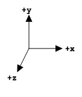

#############
👾 3 Graphics
#############

Select your platform, as the instructions are different depending on your selection.

.. raw:: html
	:file: platforms.html

The goal of this chapter is to build an application that creates and clears color and depth buffers within the scope of OpenXR render loop and to demonstrate its interaction with all the Graphics APIs.

***********************
3.1 Creating Swapchains
***********************

As with rendering graphics to a 2D display, OpenXR has the concept of swapchains. It's series of images that are used to present the rendered graphics to display/window/view. There are usually 2 or 3 images in the swapchain to allow the platform to present them smoothly to the user in order to create illusion of motion within the image.

All graphics APIs have this concept of a swapchain with differing levels of transparency to the programmer, but for an OpenXR application we don't use the API-specific swapchain, which can be tied closely the platform's windowing system. Instead, we use OpenXR's swapchain and the OpenXR compositor to present rendered graphics to the views. XR applications are unique in that often, but not always, have multiple views that need to be rendered to create the XR experience. Listed below are a few scenarios with differing view counts:

	* 1 view  - AR viewer on a mobile device.
	* 2 views - VR head mounted display.

Orthogonal to multiple views is the layering of multiple rendered images or camera feeds. You could, for a example, have a background that is a video pass-through of your environment, a stereo view of rendering graphics and quad overlay of a HUD or UI elements; all of of which could have different spatial orientations. This layering of views is handled by the XR compositor to composite correctly the layers for each view - that quad overlay might be behind the user, and thus shouldn't be rendered to the eye views.

Firstly, we will update the class to add the new methods and members.

.. code-block:: cpp

	class OpenXRTutorial {
	public:
		// [...]
	
		void Run() {
			CreateInstance();
			CreateDebugMessenger();
	
			GetInstanceProperties();
			GetSystemID();
	
			GetViewConfigurationViews();
	
			CreateSession();
			CreateSwapchain();
	
			while (applicationRunning) {
				PollSystemEvents();
				PollEvents();
				if (sessionRunning) {
					// Draw Frame.
				}
			}
	
			DestroySwapchain();
			DestroySession();
	
			DestroyDebugMessenger();
			DestroyInstance();
		}
	
		private:
		// [...]
		
		std::vector<XrViewConfigurationView> viewConfigurationViews;
		// [...]
		
		struct SwapchainAndDepthImage {
			XrSwapchain swapchain{};
			int64_t swapchainFormat = 0;
			void *depthImage = nullptr;
	
			std::vector<void *> colorImageViews;
			void *depthImageView;
		};
		std::vector<SwapchainAndDepthImage> swapchainAndDepthImages;
	}

3.1.1 XrViewConfigurationView
=============================

The first thing we need to do is get all of the views available to our view configuration. It is worth just parsing the name of this type: ``XrViewConfigurationView``. I break the typename up as follow "XrViewConfiguration" - "View", where it relates to one view in the view configuration, which may contain multiple views. We call ``xrEnumerateViewConfigurationViews()`` twice, first to get the count of the views in the view configuration, and second to fill in the data to the ``std::vector<XrViewConfigurationView>``.

.. literalinclude:: ../Chapter3/main.cpp
	:language: cpp
	:start-after: XR_DOCS_TAG_BEGIN_GetViewConfigurationViews
	:end-before: XR_DOCS_TAG_END_GetViewConfigurationViews
	:dedent: 4

3.1.2 xrEnumerateSwapchainFormats
=================================

Due to way that OpenXR and its composite operate, there are certain preferred image formats that should be used by the swapchain. When calling ``xrEnumerateSwapchainFormats()``, the ``XrSession`` and alongwith the Graphics API will return an array of API-specific formats ordered in preference. ``xrEnumerateSwapchainFormats()`` takes a pointer to the first element in an array of ``int64_t`` values. The use of ``int64_t`` is a simple type cast from a ``DXGI_FORMAT``, ``GLenum`` or a ``VkFormat``. The runtime "should support ``R8G8B8A8`` and ``R8G8B8A8 sRGB`` formats if possible" (`OpenXR Specification 10.1. Swapchain Image Management <https://registry.khronos.org/OpenXR/specs/1.0/html/xrspec.html#swapchain-image-management>`_).

Linear or sRGB color space? OpenXR's compositor performs all blend operations in a linear color space (i.e. the values have not been gamma encoded). Most gamma-encoding operations are algebraically non-linear, so you can't composite the values with simple addition or multiplication operations. If you wish to use an sRGB color format, you must use an API-specific sRGB color format such as ``DXGI_FORMAT_R8G8B8A8_UNORM_SRGB``, ``GL_SRGB8_ALPHA8`` or ``VK_FORMAT_R8G8B8A8_SRGB``. The OpenXR runtime will automatically do sRGB-to-linear color space conversions when reading the image. There are two issues with this: 

1. Runtime conversion of image data could be too slow and affect performance and comfort.
2. The conversion process may not use the same style of gamma encoding/decoding and there could be a loss in color accuracy.

If you'd like more information on color spaces and gamma in computer graphics, Guy Davidson from Creative Assembly has a fantastic video presentation from Meeting C++ 2021 on this topic `here <https://www.youtube.com/watch?v=_zQ_uBAHA4A>`_.

.. literalinclude:: ../Chapter3/main.cpp
	:language: cpp
	:start-after: XR_DOCS_TAG_BEGIN_EnumerateSwapchainFormats
	:end-before: XR_DOCS_TAG_END_EnumerateSwapchainFormats
	:dedent: 8

Next, we do some checks to confirm that the views in the view configuration are the same size and thus suitable for stereo rendering. With this check done, we can alias to views together when create our ``XrSwapchain``. We resize our ``SwapchainAndDepthImage`` structure and enter a for each loop to create all required resources.

3.1.3 xrCreateSwapchain
=======================

.. literalinclude:: ../Chapter3/main.cpp
	:language: cpp
	:start-after: XR_DOCS_TAG_BEGIN_CreateSwapchain
	:end-before: XR_DOCS_TAG_END_CreateSwapchain
	:dedent: 12

Here, we fill out the ``XrSwapchainCreateInfo`` structure. The ``sampleCount``, ``width`` and ``height`` members can be assigned from the ``XrViewConfigurationView``. We set the ``createFlags`` to 0 as we require no constraints or functionality. We set the ``usageFlags`` to ``XR_SWAPCHAIN_USAGE_SAMPLED_BIT | XR_SWAPCHAIN_USAGE_COLOR_ATTACHMENT_BIT`` requesting that the image are suitable to be read in a shader and to be used as a render output.

.. literalinclude:: ../build/openxr/include/openxr/openxr.h
	:language: cpp
	:start-at: // Flag bits for XrSwapchainUsageFlags
	:end-before: typedef XrFlags64 XrCompositionLayerFlags;

Below is a explanation of XrSwapchainUsageFlagBits match with the Graphics APIs.

.. container:: d3d11
	:name: d3d11-id-1

	.. rubric:: DirectX 11

	+-------------------------------------------------+------------------------------------+
	| XrSwapchainUsageFlagBits                        | Corresponding D3D11 bind flag bits |
	+-------------------------------------------------+------------------------------------+
	| XR_SWAPCHAIN_USAGE_COLOR_ATTACHMENT_BIT         | D3D11_BIND_RENDER_TARGET           |
	+-------------------------------------------------+------------------------------------+
	| XR_SWAPCHAIN_USAGE_DEPTH_STENCIL_ATTACHMENT_BIT | D3D11_BIND_DEPTH_STENCIL           |
	+-------------------------------------------------+------------------------------------+
	| XR_SWAPCHAIN_USAGE_UNORDERED_ACCESS_BIT         | D3D11_BIND_UNORDERED_ACCESS        |
	+-------------------------------------------------+------------------------------------+
	| XR_SWAPCHAIN_USAGE_TRANSFER_SRC_BIT             | ignored                            |
	+-------------------------------------------------+------------------------------------+
	| XR_SWAPCHAIN_USAGE_TRANSFER_DST_BIT             | ignored                            |
	+-------------------------------------------------+------------------------------------+
	| XR_SWAPCHAIN_USAGE_SAMPLED_BIT                  | D3D11_BIND_SHADER_RESOURCE         |
	+-------------------------------------------------+------------------------------------+
	| XR_SWAPCHAIN_USAGE_MUTABLE_FORMAT_BIT           | ignored                            |
	+-------------------------------------------------+------------------------------------+
	| XR_SWAPCHAIN_USAGE_INPUT_ATTACHMENT_BIT_KHR     | ignored                            |
	+-------------------------------------------------+------------------------------------+

.. container:: d3d12
	:name: d3d12-id-1

	.. rubric:: DirectX 12

	+-------------------------------------------------+--------------------------------------------+
	| XrSwapchainUsageFlagBits                        | Corresponding D3D12 resource flag bits     |
	+-------------------------------------------------+--------------------------------------------+
	| XR_SWAPCHAIN_USAGE_COLOR_ATTACHMENT_BIT         | D3D12_RESOURCE_FLAG_ALLOW_RENDER_TARGET    |
	+-------------------------------------------------+--------------------------------------------+
	| XR_SWAPCHAIN_USAGE_DEPTH_STENCIL_ATTACHMENT_BIT | D3D12_RESOURCE_FLAG_ALLOW_DEPTH_STENCIL    |
	+-------------------------------------------------+--------------------------------------------+
	| XR_SWAPCHAIN_USAGE_UNORDERED_ACCESS_BIT         | D3D12_RESOURCE_FLAG_ALLOW_UNORDERED_ACCESS |
	+-------------------------------------------------+--------------------------------------------+
	| XR_SWAPCHAIN_USAGE_TRANSFER_SRC_BIT             | ignored                                    |
	+-------------------------------------------------+--------------------------------------------+
	| XR_SWAPCHAIN_USAGE_TRANSFER_DST_BIT             | ignored                                    |
	+-------------------------------------------------+--------------------------------------------+
	| XR_SWAPCHAIN_USAGE_SAMPLED_BIT                  | D3D12_RESOURCE_FLAG_DENY_SHADER_RESOURCE   |
	+-------------------------------------------------+--------------------------------------------+
	| XR_SWAPCHAIN_USAGE_MUTABLE_FORMAT_BIT           | ignored                                    |
	+-------------------------------------------------+--------------------------------------------+
	| XR_SWAPCHAIN_USAGE_INPUT_ATTACHMENT_BIT_KHR     | ignored                                    |
	+-------------------------------------------------+--------------------------------------------+

.. container:: opengl
	:name: opengl-id-1

	.. rubric:: OpenGL

	All ``XrSwapchainUsageFlags`` are ignored as OpenGL can't specify usage of an image.

.. container:: opengles
	:name: opengles-id-1

	.. rubric:: OpenGL ES

	All ``XrSwapchainUsageFlags`` are ignored as OpenGL ES can't specify usage of an image.

.. container:: vulkan
	:name: vulkan-id-1

	.. rubric:: Vulkan

	+-------------------------------------------------+---------------------------------------------+
	| XrSwapchainUsageFlagBits                        | Corresponding Vulkan flag bit               |
	+-------------------------------------------------+---------------------------------------------+
	| XR_SWAPCHAIN_USAGE_COLOR_ATTACHMENT_BIT         | VK_IMAGE_USAGE_COLOR_ATTACHMENT_BIT         |
	+-------------------------------------------------+---------------------------------------------+
	| XR_SWAPCHAIN_USAGE_DEPTH_STENCIL_ATTACHMENT_BIT | VK_IMAGE_USAGE_DEPTH_STENCIL_ATTACHMENT_BIT |
	+-------------------------------------------------+---------------------------------------------+
	| XR_SWAPCHAIN_USAGE_UNORDERED_ACCESS_BIT         | VK_IMAGE_USAGE_STORAGE_BIT                  |
	+-------------------------------------------------+---------------------------------------------+
	| XR_SWAPCHAIN_USAGE_TRANSFER_SRC_BIT             | VK_IMAGE_USAGE_TRANSFER_SRC_BIT             |
	+-------------------------------------------------+---------------------------------------------+
	| XR_SWAPCHAIN_USAGE_TRANSFER_DST_BIT             | VK_IMAGE_USAGE_TRANSFER_DST_BIT             |
	+-------------------------------------------------+---------------------------------------------+
	| XR_SWAPCHAIN_USAGE_SAMPLED_BIT                  | VK_IMAGE_USAGE_SAMPLED_BIT                  |
	+-------------------------------------------------+---------------------------------------------+
	| XR_SWAPCHAIN_USAGE_MUTABLE_FORMAT_BIT           | VK_IMAGE_CREATE_MUTABLE_FORMAT_BIT          |
	+-------------------------------------------------+---------------------------------------------+
	| XR_SWAPCHAIN_USAGE_INPUT_ATTACHMENT_BIT_KHR     | VK_IMAGE_USAGE_INPUT_ATTACHMENT_BIT         |
	+-------------------------------------------------+---------------------------------------------+

Next, we set the values for ``faceCount``, ``arraySize`` and ``mipCount``. ``faceCount`` describes the number of faces in the image and is used for creating cubemap textures. ``arraySize`` describes the number of layers in an image. Here, we use ``1``, as we have separate swapchain per view/eye, but for a stereo view you could pass ``2`` and have an image 2D array, which is suitable for multiview rendering. ``mipCount`` describes the number of mips levels, useful when using the swapchain image as a sampled image. Finally, we can set the format. Here, we ask our ``GraphicsAPIs`` class to pick a suitable format for the swapachain for the enumerated format we acquired early. Here is the code for ``GraphicsAPI::SelectSwapchainFormat()``:

.. literalinclude:: ../Common/GraphicsAPI.cpp
	:language: cpp
	:start-after: XR_DOCS_TAG_BEGIN_GraphicsAPI_SelectSwapchainFormat
	:end-before: XR_DOCS_TAG_END_GraphicsAPI_SelectSwapchainFormat

The function calls a pure virtual function called ``GraphicsAPI::GetSupportedSwapchainFormats()``, which each class implements. It returns an array of API-specific format us to use.

.. container:: d3d11
	:name: d3d11-id-1

	.. rubric:: DirectX 11

	.. literalinclude:: ../Common/GraphicsAPI_D3D11.cpp
		:language: cpp
		:start-after: XR_DOCS_TAG_BEGIN_GraphicsAPI_D3D11_GetSupportedSwapchainFormats
		:end-before: XR_DOCS_TAG_END_GraphicsAPI_D3D11_GetSupportedSwapchainFormats

.. container:: d3d12
	:name: d3d12-id-1

	.. rubric:: DirectX 12

	.. literalinclude:: ../Common/GraphicsAPI_D3D12.cpp
		:language: cpp
		:start-after: XR_DOCS_TAG_BEGIN_GraphicsAPI_D3D12_GetSupportedSwapchainFormats
		:end-before: XR_DOCS_TAG_END_GraphicsAPI_D3D12_GetSupportedSwapchainFormats

.. container:: opengl
	:name: opengl-id-1

	.. rubric:: OpenGL

	.. literalinclude:: ../Common/GraphicsAPI_OpenGL.cpp
		:language: cpp
		:start-after: XR_DOCS_TAG_BEGIN_GraphicsAPI_OpenGL_GetSupportedSwapchainFormats
		:end-before: XR_DOCS_TAG_END_GraphicsAPI_OpenGL_GetSupportedSwapchainFormats

.. container:: opengles
	:name: opengles-id-1

	.. rubric:: OpenGL ES

	.. literalinclude:: ../Common/GraphicsAPI_OpenGL_ES.cpp
		:language: cpp
		:start-after: XR_DOCS_TAG_BEGIN_GraphicsAPI_OpenGL_ES_GetSupportedSwapchainFormats
		:end-before: XR_DOCS_TAG_END_GraphicsAPI_OpenGL_ES_GetSupportedSwapchainFormats

.. container:: vulkan
	:name: vulkan-id-1

	.. rubric:: Vulkan

	.. literalinclude:: ../Common/GraphicsAPI_Vulkan.cpp
		:language: cpp
		:start-after: XR_DOCS_TAG_BEGIN_GraphicsAPI_Vulkan_GetSupportedSwapchainFormats
		:end-before: XR_DOCS_TAG_END_GraphicsAPI_Vulkan_GetSupportedSwapchainFormats

We call ``xrCreateSwapchain()`` to create our ``XrSwapchain``, which, if successful, will return ``XR_SUCCESS`` and the ``XrSwapchain`` will be non-null. We copy our swapchain format to our ``SwapchainAndDepthImage::swapchainFormat`` for later usage.

3.1.4 xrEnumerateSwapchainImages
================================

Now that we have created the ``XrSwapchain``, we need to get access to the all images in the swapchain. We first call ``xrEnumerateSwapchainImages()`` to get the count of the images in the ``XrSwapchain``. Next, we set up an array of structures to store the images from the ``XrSwapchain``. In this tutorial, this array of structures, which stores the swapchains images, are stored in the ``GraphicsAPI_...`` class. We do this, because OpenXR will return to the application an array of structures that contain the API-specific handles to the swapchain images. ``GraphicsAPI::AllocateSwapchainImageData()`` is a virtual method implemented by each graphics API, which resizes an API-specific ``std::vector<XrSwapchainImage...KHR>`` and returns a pointer to the first element in that array casting it to a ``XrSwapchainImageBaseHeader *``.

.. literalinclude:: ../Chapter3/main.cpp
	:language: cpp
	:start-after: XR_DOCS_TAG_BEGIN_EnumerateSwapchainImages
	:end-before: XR_DOCS_TAG_END_EnumerateSwapchainImages
	:dedent: 12
	:emphasize-lines: 3

.. container:: d3d11
	:name: d3d11-id-1

	.. rubric:: DirectX 11

	.. literalinclude:: ../Common/GraphicsAPI_D3D11.cpp
		:language: cpp
		:start-after: XR_DOCS_TAG_BEGIN_GraphicsAPI_D3D11_AllocateSwapchainImageData
		:end-before: XR_DOCS_TAG_END_GraphicsAPI_D3D11_AllocateSwapchainImageData

	``swapchainImages`` is of type ``std::vector<XrSwapchainImageD3D11KHR>``.
		
	.. literalinclude:: ../build/openxr/include/openxr/openxr_platform.h
		:language: cpp
		:start-at: typedef struct XrSwapchainImageD3D11KHR {
		:end-at: } XrSwapchainImageD3D11KHR;

	The structure contains a ``ID3D11Texture2D *`` member that is the handle to one of the images in the swapchain.

.. container:: d3d12
	:name: d3d12-id-1

	.. rubric:: DirectX 12

	.. literalinclude:: ../Common/GraphicsAPI_D3D12.cpp
		:language: cpp
		:start-after: XR_DOCS_TAG_BEGIN_GraphicsAPI_D3D12_AllocateSwapchainImageData
		:end-before: XR_DOCS_TAG_END_GraphicsAPI_D3D12_AllocateSwapchainImageData
	
	``swapchainImages`` is of type ``std::vector<XrSwapchainImageD3D12KHR>``.

	.. literalinclude:: ../build/openxr/include/openxr/openxr_platform.h
		:language: cpp
		:start-at: typedef struct XrSwapchainImageD3D12KHR {
		:end-at: } XrSwapchainImageD3D12KHR;

	The structure contains a ``ID3D12Resource *`` member that is the handle to one of the images in the swapchain.

.. container:: opengl
	:name: opengl-id-1

	.. rubric:: OpenGL

	.. literalinclude:: ../Common/GraphicsAPI_OpenGL.cpp
		:language: cpp
		:start-after: XR_DOCS_TAG_BEGIN_GraphicsAPI_OpenGL_AllocateSwapchainImageData
		:end-before: XR_DOCS_TAG_END_GraphicsAPI_OpenGL_AllocateSwapchainImageData

	``swapchainImages`` is of type ``std::vector<XrSwapchainImageOpenGLKHR>``.

	.. literalinclude:: ../build/openxr/include/openxr/openxr_platform.h
		:language: cpp
		:start-at: typedef struct XrSwapchainImageOpenGLKHR {
		:end-at: } XrSwapchainImageOpenGLKHR;

	The structure contains a ``uint32_t`` member that is the handle to one of the images in the swapchain.

.. container:: opengles
	:name: opengles-id-1

	.. rubric:: OpenGL ES

	.. literalinclude:: ../Common/GraphicsAPI_OpenGL_ES.cpp
		:language: cpp
		:start-after: XR_DOCS_TAG_BEGIN_GraphicsAPI_OpenGL_ES_AllocateSwapchainImageData
		:end-before: XR_DOCS_TAG_END_GraphicsAPI_OpenGL_ES_AllocateSwapchainImageData

	``swapchainImages`` is of type ``std::vector<XrSwapchainImageOpenGLESKHR>``.

	.. literalinclude:: ../build/openxr/include/openxr/openxr_platform.h
		:language: cpp
		:start-at: typedef struct XrSwapchainImageOpenGLESKHR {
		:end-at: } XrSwapchainImageOpenGLESKHR;

	The structure contains a ``uint32_t`` member that is the handle to one of the images in the swapchain.

.. container:: vulkan
	:name: vulkan-id-1

	.. rubric:: Vulkan

	.. literalinclude:: ../Common/GraphicsAPI_Vulkan.cpp
		:language: cpp
		:start-after: XR_DOCS_TAG_BEGIN_GraphicsAPI_Vulkan_AllocateSwapchainImageData
		:end-before: XR_DOCS_TAG_END_GraphicsAPI_Vulkan_AllocateSwapchainImageData

	``swapchainImages`` is of type ``std::vector<XrSwapchainImageVulkanKHR>``.

	.. literalinclude:: ../build/openxr/include/openxr/openxr_platform.h
		:language: cpp
		:start-at: typedef struct XrSwapchainImageVulkanKHR {
		:end-at: } XrSwapchainImageVulkanKHR;

	The structure contains a ``VkImage`` member that is the handle to one of the images in the swapchain.

3.1.5 Create Depth Image And Image Views
========================================

Next, we create a depth image so that we can correctly render 3D perspective graphics to the view. In this tutorial, we have a ``GraphicsAPI::ImageCreateInfo`` structure and virtual method ``GraphicsAPI::CreateImage()`` that creates the API-specific objects. 

.. literalinclude:: ../Chapter3/main.cpp
	:language: cpp
	:start-after: XR_DOCS_TAG_BEGIN_CreateDepthImage
	:end-before: XR_DOCS_TAG_END_CreateDepthImage
	:dedent: 12
	:emphasize-lines: 9

Each graphics API overrides the virtual function ``GraphicsAPI::GetDepthFormat()``, which return a API-specific image format of type ``D32_F``.

.. container:: d3d11
	:name: d3d11-id-1

	.. rubric:: DirectX 11

	.. literalinclude:: ../Common/GraphicsAPI_D3D11.h
		:language: cpp
		:start-at: virtual int64_t GetDepthFormat() override
		:end-at: }

.. container:: d3d12
	:name: d3d12-id-1

	.. rubric:: DirectX 12

	.. literalinclude:: ../Common/GraphicsAPI_D3D12.h
		:language: cpp
		:start-at: virtual int64_t GetDepthFormat() override
		:end-at: }

.. container:: opengl
	:name: opengl-id-1

	.. rubric:: OpenGL

	.. literalinclude:: ../Common/GraphicsAPI_OpenGL.h
		:language: cpp
		:start-at: virtual int64_t GetDepthFormat() override
		:end-at: }

.. container:: opengles
	:name: opengles-id-1

	.. rubric:: OpenGL ES

	.. literalinclude:: ../Common/GraphicsAPI_OpenGL_ES.h
		:language: cpp
		:start-at: virtual int64_t GetDepthFormat() override
		:end-at: }

.. container:: vulkan
	:name: vulkan-id-1

	.. rubric:: Vulkan

	.. literalinclude:: ../Common/GraphicsAPI_Vulkan.h
		:language: cpp
		:start-at: virtual int64_t GetDepthFormat() override
		:end-at: }

We store our newly created depth image in ``SwapchainAndDepthImage::depthImage`` for later usage when rendering. 

Now, we create the image views: one per image in the ``XrSwapchain`` and an additional one for the depth image. Again in this tutorial, we have a ``GraphicsAPI::ImageViewCreateInfo`` structure and virtual method ``GraphicsAPI::CreateImageView()`` that creates the API-specific objects. 

.. literalinclude:: ../Chapter3/main.cpp
	:language: cpp
	:start-after: XR_DOCS_TAG_BEGIN_CreateImageViews
	:end-before: XR_DOCS_TAG_END_CreateImageViews
	:dedent: 12
	:emphasize-lines: 3, 6, 16, 19

Each graphics API overrides the virtual function ``GraphicsAPI::GetSwapchainImage()``, which return a API-specific handle to the image, which is cast to a ``void *``.

.. container:: d3d11
	:name: d3d11-id-1

	.. rubric:: DirectX 11

	.. literalinclude:: ../Common/GraphicsAPI_D3D11.h
		:language: cpp
		:start-at: virtual void* GetSwapchainImage(uint32_t index) override
		:end-at: }

.. container:: d3d12
	:name: d3d12-id-1

	.. rubric:: DirectX 12

	.. literalinclude:: ../Common/GraphicsAPI_D3D12.h
		:language: cpp
		:start-at: virtual void* GetSwapchainImage(uint32_t index) override
		:end-at: }

.. container:: opengl
	:name: opengl-id-1

	.. rubric:: OpenGL

	.. literalinclude:: ../Common/GraphicsAPI_OpenGL.h
		:language: cpp
		:start-at: virtual void* GetSwapchainImage(uint32_t index) override
		:end-at: }

.. container:: opengles
	:name: opengles-id-1

	.. rubric:: OpenGL ES

	.. literalinclude:: ../Common/GraphicsAPI_OpenGL_ES.h
		:language: cpp
		:start-at: virtual void* GetSwapchainImage(uint32_t index) override
		:end-at: }

.. container:: vulkan
	:name: vulkan-id-1

	.. rubric:: Vulkan

	.. literalinclude:: ../Common/GraphicsAPI_Vulkan.h
		:language: cpp
		:start-at: virtual void* GetSwapchainImage(uint32_t index) override
		:end-at: }

For the color image views, we use the previously stored color image format, that we used when creating the swapchain, and for the depth image view, we use the previously created depth image and the same depth format from the graphics API.
We store our newly created color image views for the swapchain in ``SwapchainAndDepthImage::colorImageViews`` and the depth image view in ``SwapchainAndDepthImage::depthImageView`` for later usage when rendering. 

3.1.6 xrDestroySwapchain
========================

When the main render loop has finished and the application is shutting down, we need to destroy our created ``XrSwapchain``. This is done by calling ``xrDestroySwapchain()`` with the ``XrSwapchain`` and it will return ``XR_SUCCESS`` if successful. At the same time, we destroy the associated depth image and all of the views that the graphics API created. In this tutorial, we use ``GraphicsAPI::DestroyImage()`` and ``GraphicsAPI::DestroyImageView()`` to destroy those objects.

.. literalinclude:: ../Chapter3/main.cpp
	:language: cpp
	:start-after: XR_DOCS_TAG_BEGIN_DestroySwapchain
	:end-before: XR_DOCS_TAG_END_DestroySwapchain
	:dedent: 4

We now have ``XrSwapchain`` s and a depth images, ready for rendering. Next, we setup the render loop for OpenXR!

*************************
3.2 Building a RenderLoop
*************************

With the most of the OpenXR objects now set up, we can now turn our attention to rendering graphics. You will likely have your own rendering solution in place with things hooked up to OpenXR and ready to get going. There are two further OpenXR object that need to render; pertaining to where the user is and what the user sees of the external environment around them. Namely, these are the 'environment blend mode' and the 'reference space'.

Then, with those final pieces in place, we can look to the ``RenderFrame()`` and ``RenderLoop()`` code to invoke graphics work on the GPU and present it back to OpenXR and its compositor through the use of composition layers and within the scope of an XR Frame.

3.2.1 xrEnumerateEnvironmentBlendModes
======================================

Environment blend is done at the final stage after the compositor has flatten and blended all the compositing layer passed to OpenXR at the ``xrEndFrame()``. The enum describes how OpenXR should blend the rendering view with the external environment behind the screen(s). The most common usages are as follows:

	* VR: ``XR_ENVIRONMENT_BLEND_MODE_OPAQUE`` is the most common as not all VR HMD have pass through functional either through cameras or optics. VR HMD that do have pass through can suppt other blend modes.
	* AR: ``XR_ENVIRONMENT_BLEND_MODE_ADDITIVE`` or ``XR_ENVIRONMENT_BLEND_MODE_ALPHA_BLEND`` are most common to composite rendering rendered image with external environment.

+---------------------------------------+-------------------------------------------------------------------------------------------------------------------------------+
| XrEnvironmentBlendMode                | Description                                                                                                                   |
+---------------------------------------+-------------------------------------------------------------------------------------------------------------------------------+
| XR_ENVIRONMENT_BLEND_MODE_OPAQUE      | The composition layers will be displayed with no view of the physical world behind them.                                      |
|                                       | The composited image will be interpreted as an RGB image, ignoring the composited alpha channel.                              |
+---------------------------------------+-------------------------------------------------------------------------------------------------------------------------------+
| XR_ENVIRONMENT_BLEND_MODE_ADDITIVE    | The composition layers will be additively blended with the real world behind the display.                                     |
|                                       | The composited image will be interpreted as an RGB image, ignoring the composited alpha channel during the additive blending. |
|                                       | This will cause black composited pixels to appear transparent.                                                                |
+---------------------------------------+-------------------------------------------------------------------------------------------------------------------------------+
| XR_ENVIRONMENT_BLEND_MODE_ALPHA_BLEND | The composition layers will be alpha-blended with the real world behind the display.                                          |
|                                       | The composited image will be interpreted as an RGBA image, with the composited alpha channel determining each pixel’s         |
|                                       | level of blending with the real world behind the display.                                                                     |
+---------------------------------------+-------------------------------------------------------------------------------------------------------------------------------+
`XrEnvironmentBlendMode - Enumerant Descriptions <https://registry.khronos.org/OpenXR/specs/1.0/html/xrspec.html#compositing>`_.

.. literalinclude:: ../build/openxr/include/openxr/openxr.h
	:language: cpp
	:start-at: typedef enum XrEnvironmentBlendMode {
	:end-at: } XrEnvironmentBlendMode;

.. literalinclude:: ../Chapter3/main.cpp
	:language: cpp
	:start-after: XR_DOCS_TAG_BEGIN_GetEnvironmentBlendModes
	:end-before: XR_DOCS_TAG_END_GetEnvironmentBlendModes
	:dedent: 4

We enumerate the environment blend modes as shown above. This function take a pointer to the first element in an array of ``XrEnvironmentBlendMode`` s as multiple environment blend modes could be available to the system. The runtime will return the array ordered by its preference for the system. After we enumerate all the ``XrEnvironmentBlendMode`` s, we pick the first one as an absolute default, then we loop through all our ``m_environmentBlendModes`` to try and find it in ``m_environmentBlendModes``, which was just filled by OpenXR.

3.2.2 xrCreateReferenceSpace
============================

Now that OpenXR know what the user should see, we need to tell OpenXR from where should the user by seeing. This is where the reference space comes in.

.. literalinclude:: ../build/openxr/include/openxr/openxr.h
	:language: cpp
	:start-at: typedef enum XrReferenceSpaceType {
	:end-at: } XrReferenceSpaceType;

.. literalinclude:: ../Chapter3/main.cpp
	:language: cpp
	:start-after: XR_DOCS_TAG_BEGIN_CreateReferenceSpace
	:end-before: XR_DOCS_TAG_END_CreateReferenceSpace
	:dedent: 4

First, we fill out a ``XrReferenceSpaceCreateInfo`` structure. The first member is of type ``XrReferenceSpaceType``

.. list-table:: OpenXR Reference Spaces
	:widths: 1 3 1
	:class: longtable
	:header-rows: 1

	* - XrReferenceSpaceType
	  - Diagram
	  - Description
	* - XR_REFERENCE_SPACE_TYPE_VIEW
	  - .. figure:: OpenXR-ReferenceSpace-View.png
			:alt: OpenXR Reference Space View
			:align: center
	  - The View Reference Space uses the view origin (or the centroid of the views in the case of stereo) as the origin of the sapce. +Y is up, +X is to the right, and -Z is forward. The space is aligned in front of the viewer and it is not gravity aligned. It is most often used for rendering small head-locked content like a HUD.

	* -	XR_REFERENCE_SPACE_TYPE_LOCAL
	  - .. figure:: OpenXR-ReferenceSpace-Local.png
			:alt: OpenXR Reference Space Local
			:align: center
	  - The Local Reference Space uses an initial location to establish a world-locked, gravity aligned point as the origin of the sapce. +Y is up, +X is to the right, and -Z is forward. The origin is also locked for pitch(x) and roll(z). The initial position may be established at application start up or from a calibreated origin point. It is most often used for rendering seated-scale experiences such as car racing or aircraft cockpits, where a physical floor is not required. When recentering, the runtime will queue ``XrEventDataReferenceSpaceChangePending`` structure for the application to respond to.

	* - XR_REFERENCE_SPACE_TYPE_STAGE
	  - .. figure:: OpenXR-ReferenceSpace-Stage.png
			:alt: OpenXR Reference Space Stage
			:align: center
	  - The Stage Reference Space defines a rectangular area that is flat and devoid of obstructions. The origin is define to be on the floor and at the center of the rectangular area. +Y is up, +X is to the right, and -Z is forward. The origin is also axis aligned to the XZ plane. It is most often used for rendering standing-scale experiences (no bounds) or room-scale experiences (with bounds) where a physical floor is required. When the user is redefining the origin or bounds of the area, the runtime will queue ``XrEventDataReferenceSpaceChangePending`` structure for the application to respond to.

`7.1. Reference Spaces <https://registry.khronos.org/OpenXR/specs/1.0/html/xrspec.html#reference-spaces>`_.

The default coordinate system in OpenXR is right-handed with +Y up, +X to the right, and -Z forward.

You may wish to call ``xrEnumerateReferenceSpaces()`` to get all ``XrReferenceSpaceType`` s available to the system, before choosing one that is suitable for your application and the user's environment.

3.2.3 RenderFrame
=================

In the ``OpenXRTutorial`` class, add the ``RenderFrame()`` and ``RenderLayer()`` methods.

.. code-block:: cpp

	class OpenXRTutorial {
	public:
		// [...]
	
		void Run() {
			// [...]
	
			while (applicationRunning) {
				PollSystemEvents();
				PollEvents();
				if (sessionRunning) {
					RenderFrame();
				}
			}
	
			// [...]
		}
		// [...]

	private:
		RenderLayer();
		// [...]
	}

Below is the code needed for rendering a frame in OpenXR. Each frame, we sequence through the three primary functions ``xrWaitFrame()``, ``xrBeginFrame()`` and ``xrEndFrame()``. These functions wrap around our rendering code and communicate to the OpenXR rumtime that we are rendering and that we need to synchronize with the XR compositor's frame hook.

.. literalinclude:: ../Chapter3/main.cpp
	:language: cpp
	:start-after: XR_DOCS_TAG_BEGIN_RenderFrame
	:end-before: XR_DOCS_TAG_END_RenderFrame
	:dedent: 4

The primary structure in use here is the ``XrFrameState``, which contains various helpful members such ``predictedDisplayTime``, which is the predicted time that the frame will be displayed to the user, and ``shouldRender``, which states whether the application should render any graphics. This could occurs when the application is transitioning into or out of a running sesssion or that the system UI is focused and covering the application.

.. literalinclude:: ../build/openxr/include/openxr/openxr.h
	:language: cpp
	:start-at: typedef struct XrFrameState {
	:end-at: } XrFrameState;

``xrBeginFrame()`` and ``xrEndFrame()`` should 'book-end' all the rendering code in the XR frame and should be called in pairs. ``xrBeginFrame()`` should be called just before excuting any GPU work for the frame. When calling ``xrEndFrame()``, we need to pass an ``XrFrameEndInfo`` structure to that function. We assign the ``displayTime``, which could have been adjusted from the ``XrFrameState::predictedDisplayTime`` and we assign our ``XrEnvironmentBlendMode``. We also assign a count and pointer to an array of ``XrCompositionLayerBaseHeader *`` s. These Composition Layers are used by the OpenXR compositor to create the final image for the views.

.. literalinclude:: ../build/openxr/include/openxr/openxr.h
	:language: cpp
	:start-at: typedef struct XrFrameEndInfo {
	:end-at: } XrFrameEndInfo;

.. literalinclude:: ../build/openxr/include/openxr/openxr.h
	:language: cpp
	:start-at: typedef struct XR_MAY_ALIAS XrCompositionLayerBaseHeader {
	:end-at: } XrCompositionLayerBaseHeader;

In this tutorial, we use the a single ``XrCompositionLayerProjection``, which describes an ``XrSpace`` and an array of ``XrCompositionLayerProjectionView``, which in turn descibe the ``XrPosef`` of the views relative to the reference space, the Field Of View of the views and which ``XrSwapchainSubImage`` the view relative to.

.. literalinclude:: ../build/openxr/include/openxr/openxr.h
	:language: cpp
	:start-at: typedef struct XrSwapchainSubImage {
	:end-at: } XrCompositionLayerProjection;

3.2.4 RenderLayer
=================

.. literalinclude:: ../Chapter3/main.cpp
	:language: cpp
	:start-after: XR_DOCS_TAG_BEGIN_RenderLayer
	:end-before: XR_DOCS_TAG_END_RenderLayer
	:dedent: 4
