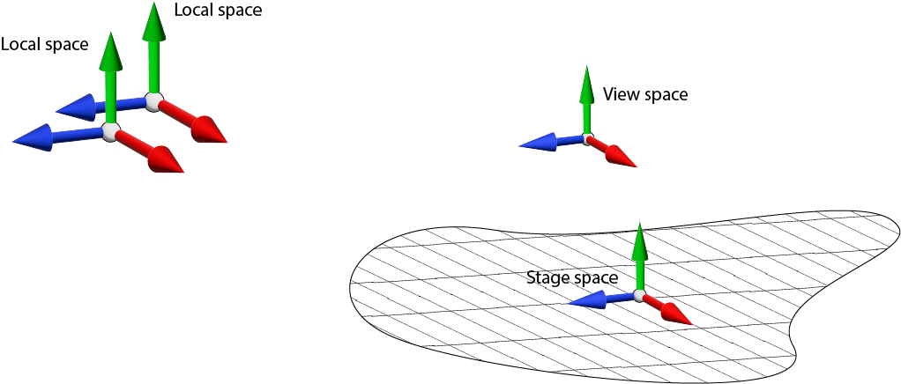

#################
🕹 4 Interactions
#################

An OpenXR application has interactions with the user which can be user input to the application, or haptic output back to the user. In this chapter, we will create some interactions and show how this system works. The interaction system uses three core concepts: spaces, actions, and bindings.

*****************
4.1. Using Spaces
*****************

Key to the interaction system is the concept of a *space*. A space is a frame of reference
defined not by its instantaneous values, but semantically, by its purpose and relationship to other spaces. For the actual, instantaneous position and orientation of a space, we call this a "pose".

In Section 3.2, we created a _reference_ space called ``localOrStageSpace`` which represents the stationary space within which the application runs. We needed this space to call ``xrLocateViews`` because this function generates a view matrix for each eye. Recall that a view matrix transforms from a "global" reference frame into one oriented with the eye or camera.

By using a local space - defined with ``XR_REFERENCE_SPACE_TYPE_LOCAL`` - we specify that the views are relative to the XR hardware's "local" space - either the headset's starting position or some other world-locked origin.

Some devices support stage space - ``XR_REFERENCE_SPACE_TYPE_STAGE`` - this implies a roomscale space with its origin on the floor.

	Reference Spaces in OpenXR

How these are actually interpreted is a matter for the OpenXR runtime.

When we created the reference space, we specified a pose (``poseInReferenceSpace``) of identity:

    ``referenceSpaceCI.poseInReferenceSpace = {{0.0f, 0.0f, 0.0f, 1.0f}, {0.0f, 0.0f, 0.0f}};``

i.e. an identity quaternion for the orientation, a position at the origin.

Had we specified a different pose, the origin of the reference space would have been offset from the runtime's default.

Another kind of reference space is view space (``XR_REFERENCE_SPACE_TYPE_VIEW``).
View space is oriented with the user's head, and is useful for user-interface and many
other purposes. We don't use it to generate view matrices for rendering, because those are often offset from the view space due to stereo rendering.

See https://registry.khronos.org/OpenXR/specs/1.0/man/html/XrReferenceSpaceType.html

************************************
4.2 Creating Actions and Action Sets
************************************

At the end of your application class, add this code:

.. literalinclude:: ../Chapter4/main.cpp
	:language: cpp
	:start-after: XR_DOCS_TAG_BEGIN_Actions
	:end-before: XR_DOCS_TAG_END_Actions
	:dedent: 0

Here, we have defined an Action Set: a group of related actions that are created together. The individual actions, such as selectAction and triggerAction, will belong to this set. For a pose action, we need an XrSpace, so leftGripPoseSpace has been declared. And we'll keep a copy of the pose itself, leftGripPose, which will change per-frame.

ActionSets are created before the session is initialized, so in Run(), after the call to GetSystemID(), add this line:

.. literalinclude:: ../Chapter4/main.cpp
	:language: cpp
	:start-after: XR_DOCS_TAG_BEGIN_CallCreateActionSet
	:end-before: XR_DOCS_TAG_END_CallCreateActionSet
	:dedent: 2

After the definition of GetSystemID(), we'll add these helper functions that convert a string into an XrPath, and vice-versa. Add:

.. literalinclude:: ../Chapter4/main.cpp
	:language: cpp
	:start-after: XR_DOCS_TAG_BEGIN_CreateXrPath
	:end-before: XR_DOCS_TAG_END_CreateXrPath
	:dedent: 0

Now we will define the `CreateActionSet` function:

.. literalinclude:: ../Chapter4/main.cpp
	:language: cpp
	:start-after: XR_DOCS_TAG_BEGIN_CreateActionSet
	:end-before: XR_DOCS_TAG_END_CreateActionSet
	:dedent: 0

An ActionSet is a group of actions that apply in a specific context. You might have an ActionSet for when your XR game is showing a pause menu or control panel, and a different ActionSet for in-game. There might even be different
ActionSets for different situations in an XR application: rowing in a boat, climbing a cliff, and so on.
So you can create multiple ActionSets, but we only need one for this example. The ActionSet is created with a name, and a localized string for its description. Now add:

.. literalinclude:: ../Chapter4/main.cpp
	:language: cpp
	:start-after: XR_DOCS_TAG_BEGIN_CreateActions
	:end-before: XR_DOCS_TAG_END_CreateActions
	:dedent: 0

Here we've created each action with a little local lambda function `CreateAction`. Each action has a name, a localized description, and the type of action it is. It also, optionally, has a list of sub-action paths. A sub-action is, essentially the same action on a different control device: left- or right-hand controllers for example.

Each Action and ActionSet has both a name, for internal use, and a localized description to show to the end-user. This is because the user may want to re-map actions from the default controls, so there must be a human-readable name to show them.

*************************************
4.3 Interaction Profiles and Bindings
*************************************

As OpenXR is an API for many different devices, it needs to provide a way for you as a developer to refer to the various buttons, joysticks, inputs and outputs that a device may have, without needing to know in advance which device or devices the user will have.

To do this, OpenXR defines the concept of *interaction profiles*. An interaction profile is a collection of interactions supported by a given device and runtime, and defined by means of textual paths.

The first element of the interaction profile is the Profile Path, of the form "/interaction_profiles/<vendor_name>/<type_name>". Then, each interaction is defined by a
path with three elements: the Profile Path, the User Path, and the Component Path. The User Path is a string identifying the controller device, e.g. "/user/hand/left", or "/user/gamepad". The Component Path is a string identifying the specific input or output, e.g. "/input/select/click" or "/output/haptic_left_trigger".

For example, the Khronos Simple Controller Profile has the path "/interaction_profiles/khr/simple_controller", and user paths "/user/hand/left" and "/user/hand/right". The component paths are "/input/select/click", "/input/menu/click", "/input/grip/pose", "/input/aim/pose", "/output/haptic". Putting the three parts together, we might identify the select button on the left hand controller as "/interaction_profiles/khr/simple_controller/user/hand/left/input/select/click".

We will now show how to suggest a these profiles are used in practice.

Binding Interactions
--------------------

We will set up bindings for the actions. A binding is a *suggested* correspondence between an action (which is app-defined), and the input/output on the
user's devices. 

XrPath is a 64-bit number that hopefully uniquely identifies any given forward-slash-delimited path string, allowing us to refer to paths without putting cumbersome string-handling in our runtime code. After the call to CreateActionSet() in Run(), add the line:

.. literalinclude:: ../Chapter4/main.cpp
	:language: cpp
	:start-after: XR_DOCS_TAG_BEGIN_CallSuggestBindings1
	:end-before: XR_DOCS_TAG_END_CallSuggestBindings1
	:dedent: 0

After the definition of CreateActionSet(), add:

.. literalinclude:: ../Chapter4/main.cpp
	:language: cpp
	:start-after: XR_DOCS_TAG_BEGIN_SuggestBindings1
	:end-before: XR_DOCS_TAG_END_SuggestBindings1
	:dedent: 0

By means of a lambda function `SuggestBindings`, we call into OpenXR with a given list of suggestions. Let's try this:

.. literalinclude:: ../Chapter4/main.cpp
	:language: cpp
	:start-after: XR_DOCS_TAG_BEGIN_SuggestBindings2
	:end-before: XR_DOCS_TAG_END_SuggestBindings2
	:dedent: 0

Here, we create a proposed match-up between our app-specific actions, and XrPaths which refer to specific controls as interpreted by the Runtime. We call `xrSuggestInteractionProfileBindings()`. If the user's device supports the given profile ( and "/interaction_profiles/khr/simple_controller" should *always* be supported in an OpenXR runtime), it will recognize these paths and can map them to its own controls. If the user's device does not support a profile, the bindings will be ignored.
The suggested bindings are not guaranteed to be used: that's up to the runtime. Some runtimes allow users to override the default bindings, and OpenXR expects this.

Theory and Best Practices for Interaction Profiles
--------------------------------------------------

To get the best results from your app on the end-user's device, it is important to understand the key principles behind the Interaction Profile system. These are laid out in the OpenXR Guide (https://github.com/KhronosGroup/OpenXR-Guide/blob/main/chapters/goals_design_philosophy.md) but in brief:

* An app written for OpenXR should work without modification on any device/runtime combination, even those created after the app has been written.
* A device and runtime that support OpenXR should work with any OpenXR-compatible application, even those written after the device has been built.

The way this is achieved is as follows: usually, each device will have its own "native" profile, and should also support "khr/simple_controller". As a developer, *you should test the devices and runtimes you have*, and you should *specify profile bindings for each device you have tested*. You should *not* implement profiles you have not tested or try to anticipate profiles or features that have not been implemented. It is the *runtime's responsibility* to support non-native runtimes where possible, 

A device can support any number of interaction profiles, either the nine profiles defined in the OpenXR standard, or an extension profile (see https://registry.khronos.org/OpenXR/specs/1.0/html/xrspec.html#_adding_input_sources_via_extensions).

See also https://registry.khronos.org/OpenXR/specs/1.0/html/xrspec.html#semantic-path-interaction-profiles.

****************************
4.4 Using Actions in the app
****************************

ActionSets and Suggested Bindings are created before the session is initialized. There is session-specific setup to be done for our actions also. After the call to CreateResources(), add:

.. literalinclude:: ../Chapter4/main.cpp
	:language: cpp
	:start-after: XR_DOCS_TAG_BEGIN_CallCreateActionPoses
	:end-before: XR_DOCS_TAG_END_CallCreateActionPoses
	:dedent: 2

Now after the definition of SuggestBindings(), add:

.. literalinclude:: ../Chapter4/main.cpp
	:language: cpp
	:start-after: XR_DOCS_TAG_BEGIN_CreateActionPoses
	:end-before: XR_DOCS_TAG_END_CreateActionPoses
	:dedent: 0

For one pose, this didn't need to be a lambda, but it will make it easier to add more poses later. Here, we're creating the XrSpace that represents the left grip pose action. As with the reference space, we use an identity XrPosef to indicate that we'll take the pose as-is, without offsets.

For OpenXR hand controllers, we distinguish between a "grip pose", representing the orientation of the handle of the device, and an "aim pose" - which is oriented where the device "points". The relative orientations of these will vary between different controller configurations, so again, it's important to test with the devices you have. Let the runtime worry about adaptating to different devices that you haven't tested.

.. figure:: images/standard-poses.png
	:alt: OpenXR Standard Controller Poses
	:align: left

	Standard Grip and Aim poses for OpenXR Controllers.

Finally as far as action setup goes, we will attach the ActionSet to the session. Add this function:

.. literalinclude:: ../Chapter4/main.cpp
	:language: cpp
	:start-after: XR_DOCS_TAG_BEGIN_AttachActionSet
	:end-before: XR_DOCS_TAG_END_AttachActionSet
	:dedent: 0

As you can see, it's possible here to attach multiple Action Sets. But `xrAttachSessionActionSets` can only be called *once* per session. You have to know what Action Sets you will be using before the session can start - xrBeginSession() is called from PollEvents() once all setup is complete and the app is ready to proceed.

Now, we must poll the actions, once per-frame. Add this call in RenderFrame() just before the call to RenderLayer():

.. literalinclude:: ../Chapter4/main.cpp
	:language: cpp
	:start-after: XR_DOCS_TAG_BEGIN_CallPollActions
	:end-before: XR_DOCS_TAG_END_CallPollActions
	:dedent: 3

And add this function after the definition of PollEvents():

.. literalinclude:: ../Chapter4/main.cpp
	:language: cpp
	:start-after: XR_DOCS_TAG_BEGIN_PollActions
	:end-before: XR_DOCS_TAG_END_PollActions
	:dedent: 0

Here we enable the Action Set we're interested in (in our case we have only one), and tell OpenXR to prepare the actions' per-frame data with xrSyncActions().

.. literalinclude:: ../Chapter4/main.cpp
	:language: cpp
	:start-after: XR_DOCS_TAG_BEGIN_PollActions2
	:end-before: XR_DOCS_TAG_END_PollActions2
	:dedent: 0

Finally in this function, we'll poll the left Grip Pose:

.. literalinclude:: ../Chapter4/main.cpp
	:language: cpp
	:start-after: XR_DOCS_TAG_BEGIN_PollActions3
	:end-before: XR_DOCS_TAG_END_PollActions3
	:dedent: 0

If, and only if the action is active, we use `xrLocateSpace` to obtain the current pose of the controller. We specify that we want this relative to our reference space `localOrStageSpace`, because this is the global space we're using for rendering. We'll use `leftGripPose` in the next section to render the
controller's position.

*************************************
4.5 Rendering the Controller position
*************************************

We will now draw some geometry to represent the controller pose we've obtained as `leftGripPose`. Add this function after the definition of RenderLayer():

.. literalinclude:: ../Chapter4/main.cpp
	:language: cpp
	:start-after: XR_DOCS_TAG_BEGIN_include_linear_algebra
	:end-before: XR_DOCS_TAG_END_include_linear_algebra
	:dedent: 0

This provides a simple matrix and vector library for our render code. Now, after the code for DestroySession(), add the following:

.. literalinclude:: ../Chapter4/main.cpp
	:language: cpp
	:start-after: XR_DOCS_TAG_BEGIN_CreateResources1
	:end-before: XR_DOCS_TAG_END_CreateResources1
	:dedent: 0

We've created a struct to represent a small uniform buffer (constant buffer), CameraConstants, and defined an instance to store its values globally. We've defined the start of the function CreateResources(), with the vertices and indices for a cube, and we've created the corresponding buffers with our choice of graphics API.

We've also created a Uniform Buffer object, API-dependent, for CameraConstants.
	
.. container:: opengl

	For OpenGL, we will use GLSL version 4.5: add this code to define our vertex and pixel shaders, and to create a shader program:
	
.. container:: vulkan 

	For Vulkan, we will use GLSL version 4.5: add this code to define our vertex and pixel shaders:
	
.. container:: opengl vulkan

	.. literalinclude:: ../Chapter4/main.cpp
		:language: cpp
		:start-after: XR_DOCS_TAG_BEGIN_CreateResources2_OpenGL_Vulkan
		:end-before: XR_DOCS_TAG_END_CreateResources2_OpenGL_Vulkan
		:dedent: 0
		
.. container:: opengles

	For OpenGL ES, we will use GLSL version 3.1: add this code to define our vertex and pixel shaders:

	.. literalinclude:: ../Chapter4/main.cpp
		:language: cpp
		:start-after: XR_DOCS_TAG_BEGIN_CreateResources2_OpenGLES
		:end-before: XR_DOCS_TAG_END_CreateResources2_OpenGLES
		:dedent: 0
		
.. container:: d3d11 d3d12

	For Direct 3D, add this code to define our vertex and pixel shaders:

	.. literalinclude:: ../Chapter4/main.cpp
		:language: cpp
		:start-after: XR_DOCS_TAG_BEGIN_CreateResources2_D3D
		:end-before: XR_DOCS_TAG_END_CreateResources2_D3D
		:dedent: 0

Now we'll combine the shaders, the vertex input layout, and the rendering state for drawing a solid cube, into a pipeline object. Add:		

.. literalinclude:: ../Chapter4/main.cpp
	:language: cpp
	:start-after: XR_DOCS_TAG_BEGIN_CreateResources3
	:end-before: XR_DOCS_TAG_END_CreateResources3
	:dedent: 0

To destroy the resources when a session is ended, add:

.. literalinclude:: ../Chapter4/main.cpp
	:language: cpp
	:start-after: XR_DOCS_TAG_BEGIN_DestroyResources
	:end-before: XR_DOCS_TAG_END_DestroyResources
	:dedent: 0

We'll call this before the call to DestroySession() in the function Run(). So after this, add:

.. literalinclude:: ../Chapter4/main.cpp
	:language: cpp
	:start-after: XR_DOCS_TAG_BEGIN_CallDestroyResources
	:end-before: XR_DOCS_TAG_END_CallDestroyResources
	:dedent: 0

Recall that we've already inserted a call to PollActions() in the function RenderFrame(), so we're ready to render the controller position and input values. In RenderLayer, after the call to ClearDepth(), let's set up the rendering state:

.. literalinclude:: ../Chapter4/main.cpp
	:language: cpp
	:start-after: XR_DOCS_TAG_BEGIN_SetupFrameRendering
	:end-before: XR_DOCS_TAG_END_SetupFrameRendering
	:dedent: 3

We've attached the target colour and depth images, and set the viewport and scissors to be the whole renderable area. We've created a projection matrix and a view matrix. And we've combined these as the matrix viewProj within cameraConstants.

.. literalinclude:: ../Chapter4/main.cpp
	:language: cpp
	:start-after: XR_DOCS_TAG_BEGIN_CallRenderCuboid
	:end-before: XR_DOCS_TAG_END_CallRenderCuboid
	:dedent: 3

We draw two cuboids. The first is offset by our (arbitrary) view height, so as to represent a "floor". We scale it by 2 metres in the horizontal directions and 0.1m in the vertical, so it's flat. Then, if the left grip pose has been obtained, we draw a cuboid at this pose.

Let's implement RenderCuboid(). After the definition of DestroySwapchain(), add:

.. literalinclude:: ../Chapter4/main.cpp
	:language: cpp
	:start-after: XR_DOCS_TAG_BEGIN_RenderCuboid
	:end-before: XR_DOCS_TAG_END_RenderCuboid
	:dedent: 0

From the passed-in pose and scale, we create the _model_ matrix, and multiply that with cameraConstants.viewProj to obtain cameraConstants.modelViewProj, the matrix that transforms from vertices in our unit cube into positions in projection-space. We apply our "pipeline" - the shader and render states. We update two uniform buffers, one containing cameraConstants for the vertex shader, the other containing our six face colours for the cuboid pixel shader. We assign our vertex and index buffers and draw 36 indices.

**************************************
4.6 Checking for Connected Controllers
**************************************

Look again now at the function PollActions().

We specify which action to look at with the XrActionStateGetInfo struct. Then we use a type-specific call. For our boolean `selectAction`, we call `xrGetActionStateBoolean()` to retrieve an XrActionStateBoolean struct. This specifies whether the value of the boolean is true or false, and we can use this to determine whether the user is pressing the select button on the controller.
However, the struct `XrActionStateBoolean` also has a member called `isActive`, which is true if the state of the action is actually being read. If it's false, the value of `currentState` is irrelevant - the polling failed. 

Similarly, `XrActionStateFloat` has a floating-point `currentState` value, which is valid if `isActive` is true, it has `lastChangeTime` and `changedSinceLastSync`, and it has `isActive` and `lastChangeTime` and `changedSinceLastSync`.

The struct has `changedSinceLastSync`, which is true if the value changed between the previous and current calls to xrSync(). And it has `lastChangeTime`, which is the time at which the value last changed. This allows us to be very precise about when the user pressed the button, and how long they held it down for. This could be used to detect "long presses", or double-clicks.

Careful use of this polling metadata will help you to create apps that are responsive and intuitive to use. Bear in mind as well that multiple physical controls could be bound to the same action, and the user could be using more than one controller at once. See the OpenXR spec for more details:

https://registry.khronos.org/OpenXR/specs/1.0/html/xrspec.html#multiple_inputs
