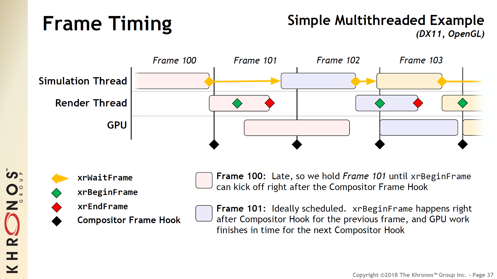
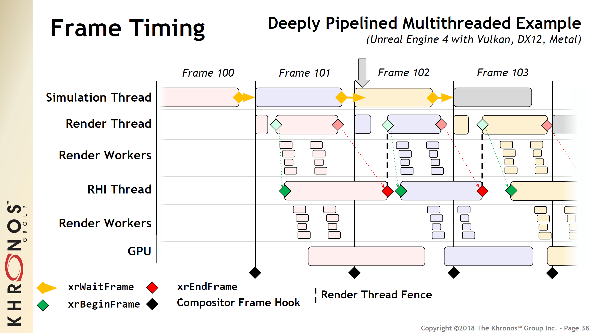

############
6 Next Steps
############

So far, you've learned how to create a basic OpenXR application: how to initialize and shut down an OpenXR instance and session, how to connect a graphics API to receive rendering events, and how to poll your runtime for interactions. The next steps are up to you but in these chapter you'll find a few suggestions.

***********************
6.1 Multiview rendering
***********************

Stereoscopic rendering usually involves drawing two very similar views of the same scene, with only a slight difference in perspective due to the separation of the left and right eye positions. Multiview rendering provides a great saving, particularly of CPU time, as we can use just one set of draw calls to render both views. The benefits can also extend to the GPU, depending on the implementation. In certain cases, it's possible that the Input Assembler only needs to be invoked once for all views, instead of repeating non-view dependent work redundantly.

.. container:: d3d11

	D3D11 supports rendering to a Texture2DArray RenderTarget, but requires the use of instanced rendering to render to multiple views in the same draw call.

.. container:: d3d12

	D3D12 supports rendering to both eye views with View Instancing - see `D3D12 View Instancing <https://microsoft.github.io/DirectX-Specs/d3d/ViewInstancing.html>`_.

.. container:: opengl opengles

	OpenGL and OpenGL ES support rendering to both eye views with multiview - see `OpenGL and OpenGL ES Multiview <https://registry.khronos.org/OpenGL/extensions/OVR/OVR_multiview.txt>`_.

.. container:: Vulkan

	Vulkan supports rendering to both eye views with multiview - see `Vulkan Multiview <https://registry.khronos.org/vulkan/specs/1.3-extensions/man/html/VK_KHR_multiview.html>`_.

Multiview or View Instancing can be used for stereo rendering by creating one :openxr_ref:`XrSwapchain` that contains two array images.

6.1.1 CMake and Downloads
=========================

This chapter is based on the code from chapter 4. So, Create a ``Chapter6`` folder in the *workspace* directory and copy across the contents of your ``Chapter4`` folder. 

In the *workspace* directory, update the ``CMakeLists.txt`` by adding the following CMake code to the end of the file:

.. code-block:: cmake

	add_subdirectory(Chapter6)

There are some changes in Chapter 6 to the implementation of ``GraphicsAPI``. Update the ``Common`` folder with the zip archive below.

.. container:: d3d11

	:git_release:`Chapter6_1_Multiview_Common_D3D11.zip`

.. container:: d3d12

	:git_release:`Chapter6_1_Multiview_Common_D3D12.zip`

.. container:: opengl

	:git_release:`Chapter6_1_Multiview_Common_OpenGL.zip`

.. container:: opengles

	:git_release:`Chapter6_1_Multiview_Common_OpenGL_ES.zip`

.. container:: vulkan

	:git_release:`Chapter6_1_Multiview_Common_Vulkan.zip`

.. container:: d3d12

	For Direct3D 12, you will need to an additional download. This goes into the ``cmake`` folder. This locates and allow CMake to use dxc for shader compilation.
	
	:download:`dxc_shader.cmake <../Chapter6_1_Multiview/cmake/dxc_shader.cmake>`.

For multiview there are some changes to the shaders. Create a new ``ShaderMultiview`` folder in the *workspace* directory and download the new shaders.

.. container:: d3d11

	* :download:`ShadersMultiview/VertexShader_DX11_MV.hlsl <../Chapter6_1_Multiview/ShadersMultiview/VertexShader_DX11_MV.hlsl>`
	* :download:`ShadersMultiview/PixelShader_DX11_MV.hlsl <../Chapter6_1_Multiview/ShadersMultiview/PixelShader_DX11_MV.hlsl>`

.. container:: d3d12

	* :download:`ShadersMultiview/VertexShader_DX12_MV.hlsl <../Chapter6_1_Multiview/ShadersMultiview/VertexShader_DX12_MV.hlsl>`
	* :download:`ShadersMultiview/PixelShader_DX12_MV.hlsl <../Chapter6_1_Multiview/ShadersMultiview/PixelShader_DX12_MV.hlsl>`

.. container:: opengl

	* :download:`ShadersMultiview/VertexShader_GL_MV.glsl <../Chapter6_1_Multiview/ShadersMultiview/VertexShader_GL_MV.glsl>`
	* :download:`ShadersMultiview/PixelShader_GL_MV.glsl <../Chapter6_1_Multiview/ShadersMultiview/PixelShader_GL_MV.glsl>`

.. container:: opengles

	* :download:`ShadersMultiview/VertexShader_GLES_MV.glsl <../Chapter6_1_Multiview/ShadersMultiview/VertexShader_GLES_MV.glsl>`
	* :download:`ShadersMultiview/PixelShader_GLES_MV.glsl <../Chapter6_1_Multiview/ShadersMultiview/PixelShader_GLES_MV.glsl>`

.. container:: vulkan

	* :download:`ShadersMultiview/VertexShader_VK_MV.glsl <../Chapter6_1_Multiview/ShadersMultiview/VertexShader_VK_MV.glsl>`
	* :download:`ShadersMultiview/PixelShader_VK_MV.glsl <../Chapter6_1_Multiview/ShadersMultiview/PixelShader_VK_MV.glsl>`

Update the ``Chapter6/CMakeLists.txt`` as follows. First, we update the project name:

.. literalinclude:: ../Chapter6_1_Multiview/Chapter6/CMakeLists.txt
	:language: cmake
	:start-after: XR_DOCS_TAG_BEGIN_SetProjectName6
	:end-before: XR_DOCS_TAG_END_SetProjectName6

Next, we update the shaders file paths:

.. container:: d3d11

	.. literalinclude:: ../Chapter6_1_Multiview/Chapter6/CMakeLists.txt
		:language: cmake
		:start-after: XR_DOCS_TAG_BEGIN_DX11_SHADERS
		:end-before: XR_DOCS_TAG_END_DX11_SHADERS

.. container:: d3d12

	.. literalinclude:: ../Chapter6_1_Multiview/Chapter6/CMakeLists.txt
		:language: cmake
		:start-after: XR_DOCS_TAG_BEGIN_DX12_SHADERS
		:end-before: XR_DOCS_TAG_END_DX12_SHADERS

.. container:: opengl

	.. literalinclude:: ../Chapter6_1_Multiview/Chapter6/CMakeLists.txt
		:language: cmake
		:start-after: XR_DOCS_TAG_BEGIN_GL_SHADERS
		:end-before: XR_DOCS_TAG_END_GL_SHADERS

.. container:: opengles
	
	.. literalinclude:: ../Chapter6_1_Multiview/Chapter6/CMakeLists.txt
		:language: cmake
		:start-after: XR_DOCS_TAG_BEGIN_ES_GLSL_SHADERS
		:end-before: XR_DOCS_TAG_END_ES_GLSL_SHADERS

.. container:: vulkan

	.. literalinclude:: ../Chapter6_1_Multiview/Chapter6/CMakeLists.txt
		:language: cmake
		:start-after: XR_DOCS_TAG_BEGIN_VK_SHADERS
		:end-before: XR_DOCS_TAG_END_VK_SHADERS

Just after where we link the ``openxr_loader``, we add in the ``XR_TUTORIAL_ENABLE_MULTIVIEW`` definition to enable multiview in ``GraphicsAPI`` class.

.. container:: windows linux

	.. literalinclude:: ../Chapter6_1_Multiview/Chapter6/CMakeLists.txt
		:language: cmake
		:start-after: XR_DOCS_TAG_BEGIN_WindowsLinuxEnableMultiview
		:end-before: XR_DOCS_TAG_END_WindowsLinuxEnableMultiview
		:dedent: 4

.. container:: android

	.. literalinclude:: ../Chapter6_1_Multiview/Chapter6/CMakeLists.txt
		:language: cmake
		:start-after: XR_DOCS_TAG_BEGIN_AndroidEnableMultiview
		:end-before: XR_DOCS_TAG_END_AndroidEnableMultiview
		:dedent: 4

Finally, we update the CMake section where we compile the shaders:

.. container:: d3d11

	.. literalinclude:: ../Chapter6_1_Multiview/Chapter6/CMakeLists.txt
		:language: cmake
		:start-after: D3D11: Using Shader Model 5.0
		:end-at: endforeach()
		:dedent: 8

.. container:: d3d12

	.. literalinclude:: ../Chapter6_1_Multiview/Chapter6/CMakeLists.txt
		:language: cmake
		:start-after: D3D12: Using Shader Model 6.1 for SV_ViewID
		:end-at: endforeach()
		:dedent: 8

.. container:: opengl

	.. literalinclude:: ../Chapter6_1_Multiview/Chapter6/CMakeLists.txt
		:language: cmake
		:start-after: XR_DOCS_TAG_BEGIN_BuildShadersOpenGLWindowsLinux
		:end-before: XR_DOCS_TAG_END_BuildShadersOpenGLWindowsLinux
		:dedent: 4

.. container:: opengles

	No changes needed for OpenGL ES!

.. container:: vulkan
	
	.. container:: windows linux
	
		.. literalinclude:: ../Chapter6_1_Multiview/Chapter6/CMakeLists.txt
			:language: cmake
			:start-after: XR_DOCS_TAG_BEGIN_BuildShadersVulkanWindowsLinux
			:end-before: XR_DOCS_TAG_END_BuildShadersVulkanWindowsLinux
			:dedent: 4

	.. container:: android

		.. literalinclude:: ../Chapter6_1_Multiview/Chapter6/CMakeLists.txt
			:language: cmake
			:start-after: XR_DOCS_TAG_BEGIN_CompileAndroidGLSLShaders
			:end-before: XR_DOCS_TAG_END_CompileAndroidGLSLShaders
			:dedent: 4

6.1.2 Update Main.cpp
=====================

First, we update the type of members for the color and depth swapchains to be just a single ``SwapchainInfo`` struct containing a single :openxr_ref:`XrSwapchain`.

.. literalinclude:: ../Chapter6_1_Multiview/Chapter6/main.cpp
	:language: cpp
	:start-after: XR_DOCS_TAG_BEGIN_SingleSwapchainInfo
	:end-before: XR_DOCS_TAG_END_SingleSwapchainInfo
	:dedent: 4

Now in the ``CreateSwapchains()`` method after enumerating the swapchain formats, we check that the two views for stereo rendering are coherent in size. This is vital as the swapchain image layer for each view must match. We also set up the ``viewCount`` variable, which just the number of view in the :openxr_ref:`XrViewConfigurationType`.

.. literalinclude:: ../Chapter6_1_Multiview/Chapter6/main.cpp
	:language: cpp
	:start-after: XR_DOCS_TAG_BEGIN_CreateViewConfigurationView
	:end-before: XR_DOCS_TAG_END_CreateViewConfigurationView
	:dedent: 8

Next, we remove the ``std::vector<>`` resizes and the loop and create a single color and single depth :openxr_ref:`XrSwapchain` for all the views. This is done by setting the ``arraySize`` of our :openxr_ref:`XrSwapchainCreateInfo` to ``viewCount``, which for stereo will be ``2``. Update your swapchain creation code.

.. literalinclude:: ../Chapter6_1_Multiview/Chapter6/main.cpp
	:language: cpp
	:start-after: XR_DOCS_TAG_BEGIN_CreateSwapchains
	:end-before: XR_DOCS_TAG_END_CreateSwapchains
	:dedent: 8
	:emphasize-lines: 12, 25

Update the calls to :openxr_ref:`xrEnumerateSwapchainImages` with new member names.

.. literalinclude:: ../Chapter6_1_Multiview/Chapter6/main.cpp
	:language: cpp
	:start-after: XR_DOCS_TAG_BEGIN_EnumerateSwapchainImages
	:end-before: XR_DOCS_TAG_END_EnumerateSwapchainImages
	:dedent: 8

We will now create image views that encompass the two subresources - one layer per eye view. We update the ``ImageViewCreateInfo::view`` to ``TYPE_2D_ARRAY`` and set the ``ImageViewCreateInfo::layerCount`` to ``viewCount``. Update your swapchain image view creation code.

.. literalinclude:: ../Chapter6_1_Multiview/Chapter6/main.cpp
	:language: cpp
	:start-after: XR_DOCS_TAG_BEGIN_CreateImageViews
	:end-before: XR_DOCS_TAG_END_CreateImageViews
	:dedent: 8
	:emphasize-lines: 6, 12, 19, 25

In the ``DestroySwapchains()``, we again remove the loop and update the member names used.

.. literalinclude:: ../Chapter6_1_Multiview/Chapter6/main.cpp
	:language: cpp
	:start-after: XR_DOCS_TAG_BEGIN_DestroySwapchains
	:end-before: XR_DOCS_TAG_END_DestroySwapchains
	:dedent: 8

With the swapchains correctly set up, we now need to update our resources for rendering. First, we update our ``CameraConstants`` struct to contain two ``viewProj`` and two ``modelViewProj`` matrices as arrays. The two matrices are unique to each eye view.

.. literalinclude:: ../Chapter6_1_Multiview/Chapter6/main.cpp
	:language: cpp
	:start-after: XR_DOCS_TAG_BEGIN_CreateResources1
	:end-before: XR_DOCS_TAG_END_CreateResources1
	:dedent: 4
	:emphasize-lines: 2, 3

Because of the larger size of the camera constant/uniform buffer, we need to align the size of the structure, so that it's compatibile with the graphics API. We use ``GraphicsAPI::AlignSizeForUniformBuffer()`` to align up the size when creating the buffer. 

.. literalinclude:: ../Chapter6_1_Multiview/Chapter6/main.cpp
	:language: cpp
	:start-after: XR_DOCS_TAG_END_Update_numberOfCuboids
	:end-before: XR_DOCS_TAG_END_CreateResources1_1
	:dedent: 4
	:emphasize-lines: 1

Next, we update the shader filepaths:

.. container:: d3d11

	.. literalinclude:: ../Chapter6_1_Multiview/Chapter6/main.cpp
		:language: cpp
		:start-after: XR_DOCS_TAG_BEGIN_CreateResources2_D3D11
		:end-before: XR_DOCS_TAG_END_CreateResources2_D3D11
		:dedent: 8
		:emphasize-lines: 2, 5

.. container:: d3d12

	.. literalinclude:: ../Chapter6_1_Multiview/Chapter6/main.cpp
		:language: cpp
		:start-after: XR_DOCS_TAG_BEGIN_CreateResources2_D3D12
		:end-before: XR_DOCS_TAG_END_CreateResources2_D3D12
		:dedent: 8
		:emphasize-lines: 2, 5

.. container:: opengl

	.. literalinclude:: ../Chapter6_1_Multiview/Chapter6/main.cpp
		:language: cpp
		:start-after: XR_DOCS_TAG_BEGIN_CreateResources2_OpenGL
		:end-before: XR_DOCS_TAG_END_CreateResources2_OpenGL
		:dedent: 8
		:emphasize-lines: 2, 5

.. container:: opengles

	.. literalinclude:: ../Chapter6_1_Multiview/Chapter6/main.cpp
		:language: cpp
		:start-after: XR_DOCS_TAG_BEGIN_CreateResources2_OpenGLES
		:end-before: XR_DOCS_TAG_END_CreateResources2_OpenGLES
		:dedent: 8
		:emphasize-lines: 2, 4

.. container:: vulkan

	.. container:: windows linux

		.. literalinclude:: ../Chapter6_1_Multiview/Chapter6/main.cpp
			:language: cpp
			:start-after: XR_DOCS_TAG_BEGIN_CreateResources2_VulkanWindowsLinux
			:end-before: XR_DOCS_TAG_END_CreateResources2_VulkanWindowsLinux
			:dedent: 8
			:emphasize-lines: 2, 5

	.. container:: android

		.. literalinclude:: ../Chapter6_1_Multiview/Chapter6/main.cpp
			:language: cpp
			:start-after: XR_DOCS_TAG_BEGIN_CreateResources2_VulkanAndroid
			:end-before: XR_DOCS_TAG_END_CreateResources2_VulkanAndroid
			:dedent: 8
			:emphasize-lines: 2, 4

Finally, we update the ``PipelineCreateInfo`` struct with the updated member names and assign a new member ``PipelineCreateInfo::viewMask`` the value ``0b11``, which is binary ``3``. This last member is used by some graphics APIs to set up the pipeline correctly. Each set bit refers to a single view that the shaders should write to. It's possible to mask off certain views for rendering i.e. ``0b0101`` would only render to the first and third views of a possible four view configuration.

.. literalinclude:: ../Chapter6_1_Multiview/Chapter6/main.cpp
	:language: cpp
	:start-after: XR_DOCS_TAG_BEGIN_CreateResources3
	:end-before: XR_DOCS_TAG_END_CreateResources3
	:dedent: 8
	:emphasize-lines: 10, 11, 15

After the swapchain and resource creation, we need to update our rendering code. In ``RenderCuboid()``, we do the same matrix multiplication for both eye views, and use ``GraphicsAPI::AlignSizeForUniformBuffer()`` to calculate the correct offset in to buffer containing the constant/uniform buffers. The ``DrawIndexed()`` call is modified so that for D3D11 only we do instance rendering.

.. literalinclude:: ../Chapter6_1_Multiview/Chapter6/main.cpp
	:language: cpp
	:start-after: XR_DOCS_TAG_BEGIN_RenderCuboid2
	:end-before: XR_DOCS_TAG_END_RenderCuboid2
	:dedent: 8
	:emphasize-lines: 3 - 6, 8, 20

In ``RenderLayer()``, there's no need to repeat the rendering code per eye view; instead, we call :openxr_ref:`xrAcquireSwapchainImage` and :openxr_ref:`xrWaitSwapchainImage` for both the color and depth swapchains to get the next 2D array image from them. We call :openxr_ref:`xrReleaseSwapchainImage` at the end of the XR frame for both the color and depth swapchains. These single color and depth swapchains neatly encapsulate the two eye views and simplified the rendering code by removing the 'per eye' loop.

We are still required to submit an :openxr_ref:`XrCompositionLayerProjectionView` structure for each view in the system, but in the :openxr_ref:`XrSwapchainSubImage` we can set the ``imageArrayIndex`` to specify which layer of the swapchain image we wish to associate with that view. So in the case of stereo rendering, it would be ``0`` for left and ``1`` for right eye views. We attach our 2D array image as a render target/color attachment for the pixel/fragment shader to write to. In a for loop, we iterate through each :openxr_ref:`XrView` and create unique view and projection matrices. Update the rendering code in ``RenderLayer()``.

.. literalinclude:: ../Chapter6_1_Multiview/Chapter6/main.cpp
	:language: cpp
	:start-after: XR_DOCS_TAG_BEGIN_RenderLayer1
	:end-before: XR_DOCS_TAG_END_RenderLayer2
	:dedent: 8
	:linenos: 
	:emphasize-lines: 22 - 31, 44 - 54, 76 - 85, 115 - 117

You can now debug and run your application using Multiview rendering.

6.1.3 GraphicsAPI and Multiview
===============================

In this section, we describe some of the background changes to the shaders and ``GraphicsAPI`` needed to support multiview rendering.

.. container:: d3d11
	
	Here, we use the vertex shader to write to the ``SV_RenderTargetArrayIndex`` System-Value Semantic, which specifies which index in the array within the render target we should emit the primitives data to. This System-Value Semantic must be matched in the pixel shader input. Note that this is only supported when ``D3D11_FEATURE_DATA_D3D11_OPTIONS3::VPAndRTArrayIndexFromAnyShaderFeedingRasterizer`` is set to true. Otherwise, you would need to use a geometry shader. `HLSL Semantics <https://learn.microsoft.com/en-us/windows/win32/direct3dhlsl/dx-graphics-hlsl-semantics>`_.
	Also see this example from Microsoft's `OpenXR-MixedReality GitHub repository <https://github.com/microsoft/OpenXR-MixedReality/blob/a46ea22a396a38725043fea91166c6d5b1a49dfc/samples/BasicXrApp/CubeGraphics.cpp>`_ and a reference page from Mixed Reality about `Rendering in DirectX <https://learn.microsoft.com/en-us/windows/mixed-reality/develop/native/rendering-in-directx>`_.

	Vertex Shader:

	.. literalinclude:: ../Chapter6_1_Multiview/ShadersMultiview/VertexShader_DX11_MV.hlsl
		:diff: ../Shaders/VertexShader.hlsl
		:language: hlsl

	Pixel Shader:

	.. literalinclude:: ../Chapter6_1_Multiview/ShadersMultiview/PixelShader_DX11_MV.hlsl
		:diff: ../Shaders/PixelShader.hlsl
		:language: hlsl

.. container:: d3d12

	First, you need to check that ``D3D12_FEATURE_DATA_D3D12_OPTIONS3::ViewInstancingTier`` is greater than ``D3D12_VIEW_INSTANCING_TIER_NOT_SUPPORTED``. Next, within the pipeline creation, set up the ``D3D12_VIEW_INSTANCING_DESC`` and a ``std::vector<D3D12_VIEW_INSTANCE_LOCATION>`` for pipeline creation. Here, we must use ``ID3D12Device2::CreatePipelineState()`` for ViewInstancing. Set the ``D3D12_VIEW_INSTANCE_LOCATION::RenderTargetArrayIndex`` to ``0`` for left and ``1`` for right eye views. This means that we don't need to write to ``SV_RenderTargetArrayIndex`` in the shader. We set ``D3D12_VIEW_INSTANCING_DESC::Flags`` to ``D3D12_VIEW_INSTANCING_FLAG_NONE``, though it's possible to set it to ``D3D12_VIEW_INSTANCING_FLAG_ENABLE_VIEW_INSTANCE_MASKING`` and use ``ID3D12CommandList2::SetViewInstanceMask()`` to control further which views will be rendered to.

	.. literalinclude:: ../Chapter6_1_Multiview/Common/GraphicsAPI_D3D12.cpp
		:language: cpp
		:start-at: if (pipelineCI.viewMask != 0) {
		:end-before: #else

	Modify the shader to use ``SV_ViewID`` and compile with shader model 6.1 to allow the vertex shader to use the new ``SV_ViewID`` System-Value Semantic. See `HLSL Semantics <https://learn.microsoft.com/en-us/windows/win32/direct3dhlsl/dx-graphics-hlsl-semantics>`_ for its usage.

	Vertex Shader:

	.. literalinclude:: ../Chapter6_1_Multiview/ShadersMultiview/VertexShader_DX12_MV.hlsl
		:diff: ../Shaders/VertexShader.hlsl
		:language: hlsl

.. container:: opengl

	Enusre you have support for ``GL_OVR_multiview`` by checking the extensions and that you have loaded the ``glFramebufferTextureMultiviewOVR()`` function pointer, if you need to do so. You will use this to create a framebuffer that supports rendering to multiple layers.
	See this example from ARM's OpenGL ES SDK for Android `here <https://arm-software.github.io/opengl-es-sdk-for-android/multiview.html>`_, which works for OpenGL too.

	Modify the shader to use ``gl_ViewIndex_OVR`` and the GL_OVR_multiview GLSL extension. The line ``layout(num_views = 2) in`` specifies the number of views the vertex shader a will broadcast to.

	.. literalinclude:: ../Chapter6_1_Multiview/ShadersMultiview/VertexShader_GL_MV.glsl
		:diff: ../Shaders/VertexShader.glsl
		:language: glsl

.. container:: opengles

	Enusre you have support for ``GL_OVR_multiview`` by checking the extensions and that you have loaded the ``glFramebufferTextureMultiviewOVR()`` function pointer, if you need to do so. You will use this to create a framebuffer that supports rendering to multiple layers.
	See this example from ARM's OpenGL ES SDK for Android `here <https://arm-software.github.io/opengl-es-sdk-for-android/multiview.html>`_.

	Modify the shader to use ``gl_ViewIndex_OVR`` and the GL_OVR_multiview GLSL extension. The line ``layout(num_views = 2) in`` specifies the number of views the vertex shader a will broadcast to.

	.. literalinclude:: ../Chapter6_1_Multiview/ShadersMultiview/VertexShader_GLES_MV.glsl
		:diff: ../Shaders/VertexShader_GLES.glsl
		:language: glsl

.. container:: vulkan

	First, add the ``VK_KHR_MULTIVIEW_EXTENSION_NAME`` or ``"VK_KHR_multiview"`` string to the device extensions list when creating the ``VkDevice``.

	At pipeline creation, chain via the next pointer a ``VkRenderPassMultiviewCreateInfo`` structure to the ``VkRenderPassCreateInfo`` structure when creating the ``VkRenderPass``. Note that there is similar functionality for ``VK_KHR_dynamic_rendering``. The ``viewMask`` member specifies the number of views the rasterizer will broadcast to.

	.. literalinclude:: ../Chapter6_1_Multiview/Common/GraphicsAPI_Vulkan.cpp
		:language: cpp
		:start-at: bool multiview = false;
		:end-at: VULKAN_CHECK(vkCreateRenderPass

	Modify the shader to use ``gl_ViewIndex`` and the GL_EXT_multiview GLSL extension.

	.. literalinclude:: ../Chapter6_1_Multiview/ShadersMultiview/VertexShader_VK_MV.glsl
		:diff: ../Shaders/VertexShader.glsl
		:language: glsl

****************
6.2 Graphics API
****************

.. rubric::  GraphicsAPI

Note: ``GraphicsAPI`` is by no means production-ready code or reflective of good practice with specific APIs. It is there solely to provide working samples in this tutorial, and demonstrate some basic rendering and interaction with OpenXR.

This tutorial uses polymorphic classes; ``GraphicsAPI_...`` derives from the base ``GraphicsAPI`` class. The derived class is based on your graphics API selection. Include both the header and cpp files for both ``GraphicsAPI`` and ``GraphicsAPI...``. ``GraphicsAPI.h`` includes the headers and macros needed to set up your platform and graphics API. Below are code snippets that show how to set up the ``XR_USE_PLATFORM_...`` and ``XR_USE_GRAPHICS_API_...`` macros for your platform along with any relevant headers. In the first code block, there's also a reference to ``XR_TUTORIAL_USE_...`` which we set up the ``CMakeLists.txt`` . This tutorial demonstrates all five graphics APIs.

The code below is an example of how you might implement the inclusion and definition of the relevant graphics API header along with the ``XR_USE_PLATFORM_...`` and ``XR_USE_GRAPHICS_API_...`` macros.

.. literalinclude:: ../Common/GraphicsAPI.h
	:language: cpp
	:start-at: #include <HelperFunctions
	:end-at: .h>

.. container:: windows

	.. container:: d3d11

		.. literalinclude:: ../Common/GraphicsAPI.h
			:language: cpp
			:start-at: #if defined(_WIN32)
			:end-at: #endif  // _WIN32
			:emphasize-lines: 6, 8-10

	.. container:: d3d12

		.. literalinclude:: ../Common/GraphicsAPI.h
			:language: cpp
			:start-at: #if defined(_WIN32)
			:end-at: #endif  // _WIN32
			:emphasize-lines: 6, 11-13

	.. container:: opengl

		.. literalinclude:: ../Common/GraphicsAPI.h
			:language: cpp
			:start-at: #if defined(_WIN32)
			:end-at: #endif  // _WIN32
			:emphasize-lines: 6, 14-16

	.. container:: vulkan

		.. literalinclude:: ../Common/GraphicsAPI.h
			:language: cpp
			:start-at: #if defined(_WIN32)
			:end-at: #endif  // _WIN32
			:emphasize-lines: 6, 17-19

.. container:: linux

	.. container:: opengl

		.. literalinclude:: ../Common/GraphicsAPI.h
			:language: cpp
			:start-at: #if defined(__linux__)
			:end-at: #endif  // __linux__
			:emphasize-lines: 2-13, 15-17

	.. container:: vulkan

		.. literalinclude:: ../Common/GraphicsAPI.h
			:language: cpp
			:start-at: #if defined(__linux__)
			:end-at: #endif  // __linux__
			:emphasize-lines: 2-13, 18-20

.. container:: android

	.. container:: opengles

		.. literalinclude:: ../Common/GraphicsAPI.h
			:language: cpp
			:start-at: #if defined(__ANDROID__)
			:end-at: endif  // __ANDROID__
			:emphasize-lines: 3, 5-7

	.. container:: vulkan

		.. literalinclude:: ../Common/GraphicsAPI.h
			:language: cpp
			:start-at: #if defined(__ANDROID__)
			:end-at: endif  // __ANDROID__
			:emphasize-lines: 3, 8-10

.. container:: d3d11

	.. literalinclude:: ../Common/GraphicsAPI.h
		:language: cpp
		:start-at: #if defined(XR_USE_GRAPHICS_API_D3D11)
		:end-at: #endif

.. container:: d3d12

	.. literalinclude:: ../Common/GraphicsAPI.h
		:language: cpp
		:start-at: #if defined(XR_USE_GRAPHICS_API_D3D12)
		:end-at: #endif

.. container:: opengl

	.. literalinclude:: ../Common/GraphicsAPI.h
		:language: cpp
		:start-at: #if defined(XR_USE_GRAPHICS_API_OPENGL)
		:end-at: #endif

.. container:: opengles

	.. literalinclude:: ../Common/GraphicsAPI.h
		:language: cpp
		:start-at: #if defined(XR_USE_GRAPHICS_API_OPENGL_ES)
		:end-at: #endif

.. container:: vulkan

	.. literalinclude:: ../Common/GraphicsAPI.h
		:language: cpp
		:start-at: #if defined(XR_USE_GRAPHICS_API_VULKAN)
		:end-at: #endif

.. literalinclude:: ../Common/GraphicsAPI.h
	:language: cpp
	:start-at: // OpenXR Helper
	:end-at: #include <OpenXRHelper.h>

When setting up the graphics API core objects, there are things that we need to know from OpenXR in order to create the objects correctly. These could include the version of the graphics API required, referencing a specific GPU, required instance and/or device extension etc. Below are code examples showing how to set up your graphics for OpenXR.

.. container:: d3d11

	.. literalinclude:: ../Common/GraphicsAPI_D3D11.cpp
		:language: cpp
		:start-after: // XR_DOCS_TAG_BEGIN_GraphicsAPI_D3D11
		:end-before: // XR_DOCS_TAG_END_GraphicsAPI_D3D11

.. container:: d3d12

	.. literalinclude:: ../Common/GraphicsAPI_D3D12.cpp
		:language: cpp
		:start-after: // XR_DOCS_TAG_BEGIN_GraphicsAPI_D3D12
		:end-before: // XR_DOCS_TAG_END_GraphicsAPI_D3D12

.. container:: opengl

	.. literalinclude:: ../Common/GraphicsAPI_OpenGL.cpp
		:language: cpp
		:start-after: // XR_DOCS_TAG_BEGIN_GraphicsAPI_OpenGL
		:end-before: // XR_DOCS_TAG_END_GraphicsAPI_OpenGL

.. container:: opengles

	.. literalinclude:: ../Common/GraphicsAPI_OpenGL_ES.cpp
		:language: cpp
		:start-after: // XR_DOCS_TAG_BEGIN_GraphicsAPI_OpenGL_ES
		:end-before: // XR_DOCS_TAG_END_GraphicsAPI_OpenGL_ES

.. container:: vulkan

	.. literalinclude:: ../Common/GraphicsAPI_Vulkan.cpp
		:language: cpp
		:start-after: // XR_DOCS_TAG_BEGIN_GraphicsAPI_Vulkan
		:end-before: // XR_DOCS_TAG_END_GraphicsAPI_Vulkan

	.. literalinclude:: ../Common/GraphicsAPI_Vulkan.cpp
		:language: cpp
		:start-after: // XR_DOCS_TAG_BEGIN_GraphicsAPI_Vulkan_LoadPFN_XrFunctions
		:end-before: // XR_DOCS_TAG_END_GraphicsAPI_Vulkan_LoadPFN_XrFunctions

	.. literalinclude:: ../Common/GraphicsAPI_Vulkan.cpp
		:language: cpp
		:start-after: // XR_DOCS_TAG_BEGIN_GraphicsAPI_Vulkan_GetInstanceExtensionsForOpenXR
		:end-before: // XR_DOCS_TAG_END_GraphicsAPI_Vulkan_GetInstanceExtensionsForOpenXR

	.. literalinclude:: ../Common/GraphicsAPI_Vulkan.cpp
		:language: cpp
		:start-after: // XR_DOCS_TAG_BEGIN_GraphicsAPI_Vulkan_GetDeviceExtensionsForOpenXR
		:end-before: // XR_DOCS_TAG_END_GraphicsAPI_Vulkan_GetDeviceExtensionsForOpenXR
	

*********************
6.3 OpenXR API Layers
*********************

The OpenXR loader has a layer system that allows OpenXR API calls to pass through a number of optional layers, that add some functionality for the application. These are extremely useful for debugging.

The OpenXR SDK provides two API layers for us to use:
In the table below are the layer names and their associated libraries and .json files.

+------------------------------------+-----------------------------------------------+-------------------------------------+
| XR_APILAYER_LUNARG_api_dump        | ``XrApiLayer_api_dump.dll`` or ``.so``        | ``XrApiLayer_api_dump.json``        |
+------------------------------------+-----------------------------------------------+-------------------------------------+
| XR_APILAYER_LUNARG_core_validation | ``XrApiLayer_core_validation.dll`` or ``.so`` | ``XrApiLayer_core_validation.json`` |
+------------------------------------+-----------------------------------------------+-------------------------------------+

XR_APILAYER_LUNARG_api_dump simply logs extra/verbose information to the output describing in more detail what has happened during that API call. XR_APILAYER_LUNARG_core_validation acts similarly to VK_LAYER_KHRONOS_validation in Vulkan, where the layer intercepts the API call and performs validation to ensure conformance with the specification.

Other runtimes and hardware vendors may provide layers that are useful for debugging your XR system and/or application.

Firstly, ensure that you are building the OpenXR provided API layers from the `OpenXR-SDK-Source <https://github.com/KhronosGroup/OpenXR-SDK-Source>`_.

.. literalinclude:: ../Chapter2/CMakeLists.txt
	:language: cmake
	:start-after: XR_DOCS_TAG_BEGIN_FetchContent
	:end-before: XR_DOCS_TAG_END_FetchContent
	:emphasize-lines: 9 - 12

.. container:: windows linux

	To enable API layers, add the ``XR_API_LAYER_PATH=<path>`` environment variable to your project or your system. Something like this: ``XR_API_LAYER_PATH=<openxr_base>/<build_folder>/src/api_layers/;<another_path>``. In this tutorial, the API layer files are found in ``<cmake_source_folder>/build/_deps/openxr-build/src/api_layers/``.
	
	The method described above sets the ``XR_API_LAYER_PATH`` environment variable, which overrrides the Operating System's default API Layers Paths. See `OpenXR API Layers - Overriding the Default API Layer Paths <https://github.com/KhronosGroup/OpenXR-SDK-Source/blob/main/specification/loader/api_layer.adoc#overriding-the-default-api-layer-paths>`_. For more information on the default Desktop API Layer Discovery, see `OpenXR API Layers - Desktop API Layer Discovery <https://github.com/KhronosGroup/OpenXR-SDK-Source/blob/main/specification/loader/api_layer.adoc#desktop-api-layer-discovery>`_.

	The path must point to a folder containing a ``.json`` file similar to the one for XR_APILAYER_LUNARG_core_validation, shown below:

	.. code-block:: json

		{
			"file_format_version": "1.0.0",
			"api_layer": {
				"name": "XR_APILAYER_LUNARG_core_validation",
				"library_path": "./XrApiLayer_core_validation.dll",
				"api_version": "1.0",
				"implementation_version": "1",
				"description": "API Layer to perform validation of api calls and parameters as they occur"
			}
		}

	This file points to the library that the loader should use for this API layer.

.. container:: android

	The Android OpenXR Loader will find API Layers be reading all of the ``.json`` files in specific locations within the APK assets folder. The APK assest folder will be something like ``app/src/main/assets/``. Under that folder, the loader will check for implicit and explicit layers in these directories:
	
	.. code-block::

		openxr/<major_ver>/api_layers/implicit.d
		openxr/<major_ver>/api_layers/explicit.d

	See `OpenXR API Layers - Android API Layer Discovery <https://github.com/KhronosGroup/OpenXR-SDK-Source/blob/main/specification/loader/api_layer.adoc#android-api-layer-discovery>`_.

	The main difference between implicit and explicit API layers is that implicit API layers are automatically enabled, unless overridden, and explicit API layers must be manually enabled. (`OpenXR API Layers - API Layer Discovery <https://github.com/KhronosGroup/OpenXR-SDK-Source/blob/main/specification/loader/api_layer.adoc#api-layer-discovery>`_)

	Within either folder, there should be a ``.json`` file similar to the one for XR_APILAYER_LUNARG_core_validation, shown below:

	.. code-block:: json

		{
			"file_format_version" : "1.0.0",
			"api_layer": {
				"name": "XR_APILAYER_LUNARG_core_validation",
				"library_path": "libXrApiLayer_core_validation.so",
				"api_version" : "1.0",
				"implementation_version" : "1",
				"description" : "LunarG core validation API layer"
			}
		}

	This file states the library that the loader should use for this API layer. The library is automatically packaged inside the ``.apk`` at build time, and thus we need only reference the full name in the ``"library_path"`` entry.

	Calls to :openxr_ref:`xrEnumerateApiLayerProperties` should now return a pointer to an array of structs and the count of all API layers available to the application.

.. container:: windows linux

	To select which API layers we want to use, there are two ways to do this:
	 1. Add the ``XR_ENABLE_API_LAYERS=<layer_name>`` environment variable to your project or your system. Something like this: ``XR_ENABLE_API_LAYERS=XR_APILAYER_LUNARG_test1;XR_APILAYER_LUNARG_test2``.
	 2. When creating the :openxr_ref:`XrInstance`, specify the requested API layers in the :openxr_ref:`XrInstanceCreateInfo` structure.

.. container:: android

	To select which API layers we want to use, specify the requested API layers in the :openxr_ref:`XrInstanceCreateInfo` structure, when creating the :openxr_ref:`XrInstance`.

	For more details, please see `API Layers README <https://github.com/KhronosGroup/OpenXR-SDK-Source/blob/main/src/api_layers/README.md>`_ and see `OpenXR API Layers <https://registry.khronos.org/OpenXR/specs/1.0/loader.html#openxr-api-layers>`_.

*****************
6.4 Color Science
*****************

As OpenXR support both linear and sRGB color spaces for compositing. It is helpful to have a deeper knowledge of color science; especially if you are planning to use sRGB formats and have the OpenXR runtime/compositor do automatic conversions for you.

For more information on color spaces and gamma encoding, see J. Guy Davidson's `video presentation <https://www.youtube.com/watch?v=_zQ_uBAHA4A>`_ on the subject.

***************************
6.5 Multithreaded Rendering
***************************

Multithreaded rendering with OpenXR is supported and it allows for simple and complex cases ranging from stand-alone application to game/rendering engines. In this tutorial, we have used a single thread to simulate and render our XR application, but modern desktops and mobile devices have multiple cores and thus threads for us to use. Effective use of multiple CPU threads in combination with parallel GPU work can deliver higher performance for the application.

The way to allow OpenXR to interact with multiple threads is to split up the three ``xr...Frame`` calls. Currently, :openxr_ref:`xrWaitFrame`, :openxr_ref:`xrBeginFrame` and :openxr_ref:`xrEndFrame` are all called on a single thread. In the multithreaded case, :openxr_ref:`xrWaitFrame` stays on the 'simulation' thread, whilst :openxr_ref:`xrBeginFrame` and :openxr_ref:`xrEndFrame` move to a 'render' thread. Below are examples of how thread interact with the three ``xr...Frame`` calls and the XR compositor frame hook.

Simple:

Complex:

Here's a link to the PDF to download and a link to the video recording of the presentation.

* `Standardizing All the Realities: A Look at OpenXR by Kaye Mason for SIGGRAPH, August 2018 pp.37-38 <https://www.khronos.org/assets/uploads/developers/library/2018-siggraph/04-OpenXR-SIGGRAPH_Aug2018.pdf>`_.
* `SIGGRAPH 2018 Khronos BOF Sessions <https://www.youtube.com/live/FCAM-3aAzXg?si=wK9yaPTocxS6quOh&t=16409>`_.

Note: This talk was given before the release of the OpenXR 1.0 Specification; therefore details may vary or be inaccurate.

**************
6.6 Conclusion
**************

In this chapter, we discussed a few of the possible next steps in your OpenXR journey. Be sure to refer back to the `OpenXR Specification <https://registry.khronos.org/OpenXR/specs/1.0>`_ and look out for updates, both there and here, as the specification develops.

The text of the OpenXR Tutorial is by Roderick Kennedy and Andrew Richards of Simul Software Ltd. The design of the site is by Calland Creative Ltd. The site is overseen by the Khronos OpenXR Working Group. Thanks to all volunteers who tested the site through its development.

