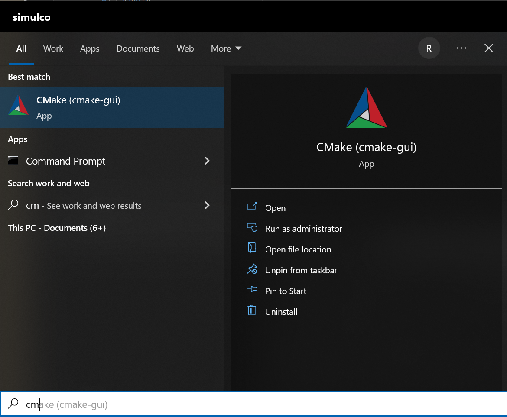
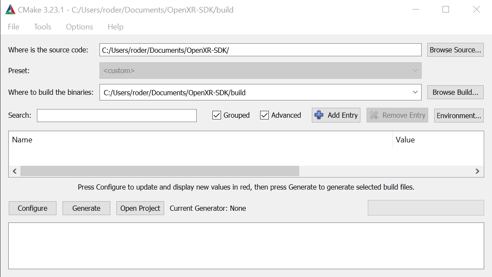
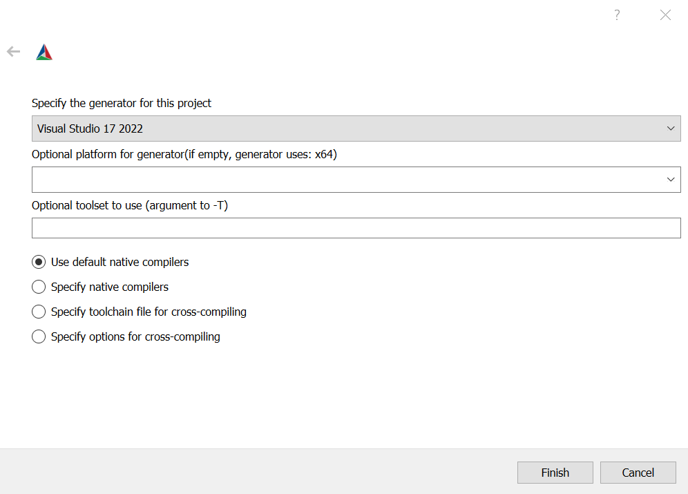
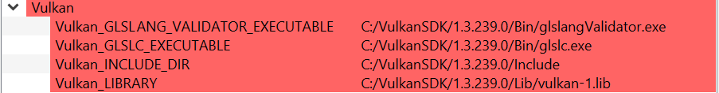
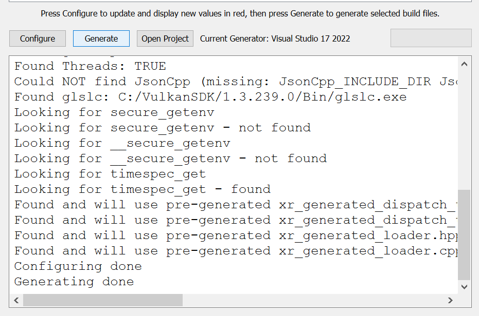
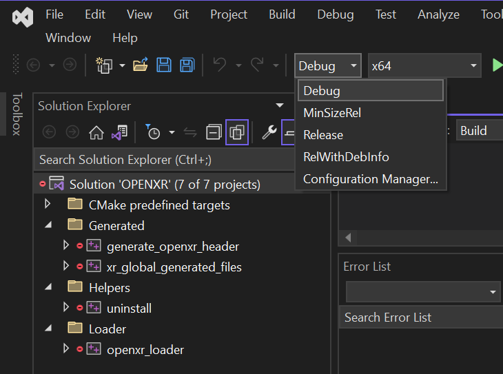
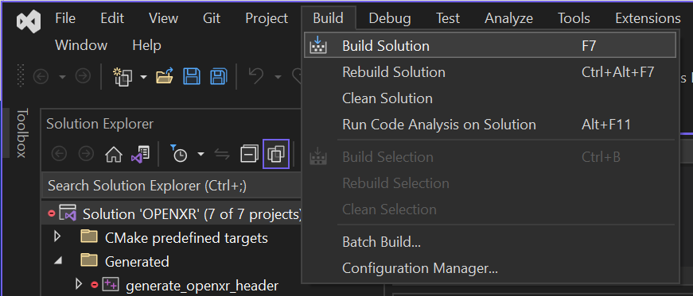
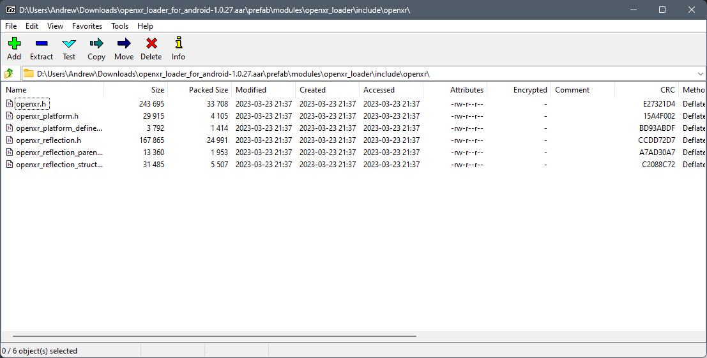
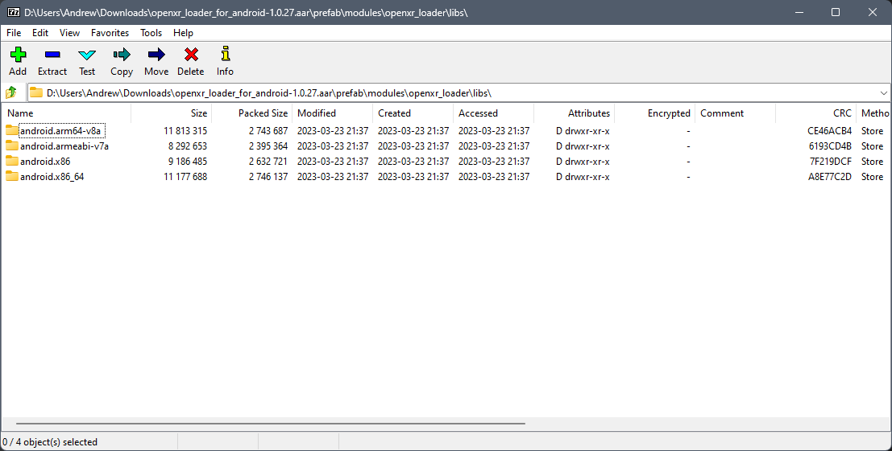
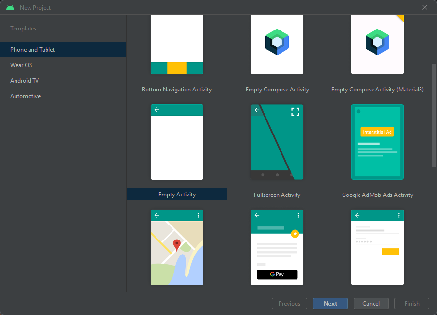

############
Introduction
############

1. INTRO (understanding & dev env)

**************
Goal of OpenXR
**************

What is the goal of OpenXR?

********
Overview
********

1.2. High Level overview of the components of OpenXR (Application - Loader - API
layers - Runtime - Graphics - Input System)

**********
Setting Up
**********

This section will help you set up a development environment.
( Visual Studio & Android Studio & Monado for people without HMDs )

PCVR: Windows
~~~~~~~~~~~~~
.. rubric:: Visual Studio
If you'll be building an OpenXR project for PC-based devices, we'll assume you'll be using Microsoft Visual Studio.
The free Community edition of Visual Studio is available `here <https://visualstudio.microsoft.com/vs/community/>`_.

.. rubric:: Direct3D
Next you'll want to choose which Graphics API you'll be using. Direct3D 11 and 12 are built into the Windows SDK's.
If you're using Direct3D, I recommend D3D12, because it supports indexed views: essentially, you can draw both eye views in one call. Vulkan also
supports this.

Whether D3D11 or 12, download and install the latest `Windows SDK <https://developer.microsoft.com/en-us/windows/downloads/windows-sdk/>`_.

.. rubric:: Vulkan
If you'll be using Vulkan, download and install the latest `Vulkan SDK <https://www.lunarg.com/vulkan-sdk/>`_. Take a note of the installation location,
as this will be needed later.

.. rubric:: OpenXR SDK
You'll need a copy of the OpenXR SDK, which is distributed as a Git repository. If you're familiar with Git, you can use your preferred command-line or GUI Git tool to get
the SDK from *git@github.com:KhronosGroup/OpenXR-SDK.git*.
Alternatively, you can download it as a .zip file from `github.com/KhronosGroup/OpenXR-SDK <https://github.com/KhronosGroup/OpenXR-SDK>`_.

.. rubric:: CMake
The OpenXR SDK is distributed as source code, and you'll need to build it, using CMake.
CMake is a program that generates project files, such as the .vcxproj and .sln files
that Visual Studio needs.
Install the latest `CMake <https://cmake.org/download/>`_.

Once CMake is installed, click the Windows button, and type "cmake" to find the application Cmake GUI.

In the CMake Gui, enter the location of the OpenXR SDK in the top text box, marked "Where is the source code". Below, in the box marked "Where to
build the binaries", enter a subdirectory of that folder, called "build".

Click the button below marked "Configure". A popup will ask if CMake should create the "build" directory. Click "Yes".
Now a box will appear where you can select a "Generator". This should default to the version of
Visual Studio you've just installed. Click Finish.
Cmake will now configure the project, and a list of variables will appear in red.

You shouldn't have to change any of these variables, but you can if you want. CMake should have
automatically found the installation of the Vulkan SDK that you created previously, and used it to fill in the variables
Vulkan_INCLUDE_DIR, Vulkan_LIBRARY and so on. If not, you can modify these variables
by clicking on the "Value" entries. The values should look like this:

Obviously, the precise directory will depend on which version of the Vulkan SDK you installed.

Now, we're going to "Generate" the project files for the OpenXR SDK. Click "Generate", and CMake GUI should
now read "Generating done" in the output log at the bottom.

Now we can build the SDK. Click "Open Project" in CMake GUI, or navigate to your "build" folder and double-click on
the file "OPENXR.sln", and Visual Studio will open the solution.

Select "Debug" from the Visual Studio "Solution Configurations" dropdown.

Go to the Build menu and select "Build Solution". The projects will be compiled, and the output
from openxr_loader.vcxproj should be a library called openxr_loaderd.lib.

Now repeat the process for the Release build. Select "Release" from the Configurations dropdown,
amd build the solution. This time, the library openxr_loader.lib will be built.

You can now close this solution, you're ready to start creating your first OpenXR project.

PCVR: Linux
~~~~~~~~~~~
.. rubric:: Visual Studio Code

...

.. rubric::  OpenXR SDK
You'll need a copy of the OpenXR SDK, which is distributed as a Git repository. If you're familiar with Git, you can use your preferred command-line or GUI Git tool to get
the SDK from *git@github.com:KhronosGroup/OpenXR-SDK.git*.

In the downloaded repo, you'll find a file called README.md, which contains up-to-date instructions
for building the libraries. So follow these instructions in the *Linux* section. In
general, you will first want to install the required packages, which at the time of writing were:

.. code-block:: bash

	sudo apt install build-essential
	sudo apt install cmake
	sudo apt install libgl1-mesa-dev
	sudo apt install libvulkan-dev
	sudo apt install libx11-xcb-dev
	sudo apt install libxcb-dri2-0-dev
	sudo apt install libxcb-glx0-dev
	sudo apt install libxcb-icccm4-dev
	sudo apt install libxcb-keysyms1-dev
	sudo apt install libxcb-randr0-dev
	sudo apt install libxrandr-dev
	sudo apt install libxxf86vm-dev
	sudo apt install mesa-common-dev

From the OpenXR-SDK directory,

.. code-block:: bash

	mkdir -p build/linux_debug
	cd build/linux_debug
	cmake -DCMAKE_BUILD_TYPE=Debug ../..
	make

Now return to the OpenXR-SDK directory, and build the release library:

.. code-block:: bash

	mkdir -p build/linux_release
	cd build/linux_release
	cmake -DCMAKE_BUILD_TYPE=Release ../..
	make

This builds libopenxr_loader.so, in Debug and Release flavours, in the directories:
OpenXR-SDK/build/linux_debug/src/loader and OpenXR-SDK/build/linux_release/src/loader.
Both files have the same name on Linux - the debug one is substantially larger however.
And both are *dynamic* libraries by default, which will be loaded at runtime.

Now you're ready to start creating your first OpenXR project.

Android VR
~~~~~~~~~~~
.. rubric:: Android Studio

Android Studio is available to download here: `https://developer.android.com/studio <https://developer.android.com/studio>`_.

.. rubric::  OpenXR SDK
For Android, you can download the OpenXR loader libraries from here: `https://github.com/KhronosGroup/OpenXR-SDK-Source/releases/release-1.0.27 <https://github.com/KhronosGroup/OpenXR-SDK-Source/releases/release-1.0.27>`_.
Using the .aar file and a program like 7-Zip, you can extract the header files and libraries. Under prefab/modules/openxr_loader/include/openxr, you'll find the headers, and under prefab/modules/openxr_loader/libs/, you'll find the libraries for arm64-v8a, armeabi-v7a, x86 and x86_64.

.. rubric:: Vulkan
I recommend using Vulkan for Android VR for its modern, low-level API and extension support for multiview. Vulkan is included as part of the NDK provided Google and is supported on Android 7.0 (Nougat), API level 24 or higher. `https://developer.android.com/ndk/guides/graphics <https://developer.android.com/ndk/guides/graphics>`_. OpenGL ES is also option for Android, but we will only be exploring Vulkan.

.. rubric:: Project Generation
Here, I'll show how to hand build an Android Studio project that runs a C++ Native Activity.
Open Android Studio, select New Project and choose an Empty Activity. Set the names and save location. The language can be ignored here as we are using C++, and we can set the Minimum SDK to API 24: Android 7.0(Nougat). Complete set up.

.. rubric:: CMake
With the Android Studio project now set up, we need to modify some of the files and folders so as to set up the project to support the C++ Native Activity.
Under the `app` folder, you can delete the `libs` folder, and under the `app/src` you can also delete the `androidTest` and `test` folders. Finally under `app/src/main`, delete the `java` folder and add a `cpp` folder. Under the `app/src/main/res`, delete the `values-night` and `xml` folders. Under the `values` modify colors.xml and theme.xml as shown.

.. code-block:: xml

	<!-- colors.xml -->
	<?xml version="1.0" encoding="utf-8"?>
	<resources>
	    <color name="colorPrimary">#008577</color>
	    <color name="colorPrimaryDark">#00574B</color>
	    <color name="colorAccent">#D81B60</color>
	</resources>

	<!-- theme.xml -->
	<resources>

	    <!-- Base application theme. -->
	    

	</resources>

Within the `app/src/main/cpp` folder, create a CMakeLists.txt. We will use this file to specific how our Native C++ code will be built. This CMakeList will be invoked by Android Studio's Gradle build system. 

.. code-block:: cmake 

	# For more information about using CMake with Android Studio, read the
	# documentation: https://d.android.com/studio/projects/add-native-code.html

	cmake_minimum_required(VERSION 3.22.1)
	project("openxrtutorialch2_1")

	# native_app_glue
	add_library(native_app_glue STATIC ${ANDROID_NDK}/sources/android/native_app_glue/android_native_app_glue.c)
	target_include_directories(native_app_glue PUBLIC ${ANDROID_NDK}/sources/android/native_app_glue)

	set(CMAKE_SHARED_LINKER_FLAGS "${CMAKE_SHARED_LINKER_FLAGS} -u ANativeActivity_onCreate") # export ANativeActivity_onCreate for java to call.
	add_library(openxrtutorialch2_1 SHARED ../../../../../Chapter2.1/main.cpp)

	# import openxr_loader
	add_library(openxr_loader SHARED IMPORTED)
	set_target_properties(openxr_loader PROPERTIES IMPORTED_LOCATION "../../../../../../thirdparty/openxr-sdk/android/libs/android.arm64-v8a/libopenxr_loader.so")
	target_include_directories(openxrtutorialch2_1 PUBLIC ../../../../../thirdparty/openxr-sdk/include)

	# vulkan - Found in the NDK
	find_library(vulkan-lib vulkan)
	target_include_directories(openxrtutorialch2_1 PUBLIC ${ANDROID_NDK}/sources/third_party/vulkan/src/include)

	# log - Found in the NDK
	find_library(log-lib log)

	target_link_libraries(openxrtutorialch2_1
	        android
	        native_app_glue
	        openxr_loader
	        ${vulkan-lib}
	        ${log-lib})

First, we set the minimum required cmake version, here we are using 3.22.1 and the project's name. Next, we need to add a static library called native_app_glue. The native_app_glue library is compiled from a single source file android_native_app_glue.c. This interfaces between the Java Virtual Machine and our C++ code. Ultimately, it allows us to use the `void android_main(struct android_app*)` entry point. We also include that directory as we need access to the android_native_app_glue.h header file. Next, we need to set the `CMAKE_SHARED_LINKER_FLAGS` so that `ANativeActivity_onCreate()` is exported for the Java Virtual Machine to call. Next, we add our shared library openxrtutorialch2_1 that houses our code. Here, I have a relative path to our single C++ file.

Now, we import the openxr_loader library. We need to do this, because it's external to the NDK library, and won't be automatically picked up. We call `set_target_properties()` to specific the location of libopenxr_loader.so. We also include the directory to the OpenXR headers. Next, we find the Vulkan library in the NDK and include the directory to the Android Vulkan headers. At this time, we also find the log library. Finally we link the android, native_app_glue, openxr_loader, vulkan and log libraries to our openxrtutorialch2_1 library. Our libopenxrtutorialch2_1.so will packageed inside our apk along with any shared libraries that we have linked.

.. rubric:: AndroidManifest.xml

.. code-block:: xml

	<?xml version="1.0" encoding="utf-8"?>
	<manifest xmlns:android="http://schemas.android.com/apk/res/android"
	    package="com.simul.openxrtutorialch2_1"
	    android:versionCode="1"
	    android:versionName="1.0">

	    <application
	        android:allowBackup="false"
	        android:fullBackupContent="false"
	        android:icon="@mipmap/ic_launcher"
	        android:label="@string/app_name"
	        android:hasCode="false">
	        <activity
	            android:name="android.app.NativeActivity"
	            android:configChanges="orientation|keyboardHidden"
	            android:debuggable="true">
	            <meta-data
	                android:name="android.app.lib_name"
	                android:value="openxrtutorialch2_1" />

	            <intent-filter>
	                <action android:name="android.intent.action.MAIN" />
	                <category android:name="android.intent.category.LAUNCHER" />
	            </intent-filter>
	        </activity>
	    </application>
	</manifest>

We now need to modify our AndroidManifest.xml file to tell Android to run a Native Activity. We set `android:name` to "android.app.NativeActivity" and update `android:configChanges` to "orientation|keyboardHidden" to not close the activity on those changes. Next under the meta-data section, we set these values: `android:name` to "android.app.lib_name" and `android:value` to "openxrtutorialch2_1", where `android:value` is name of the library we created in the CMakeLists, thus pointing our NativeActivity to the correct library.

.. rubric:: Gradle

.. code-block:: groovy

	apply plugin: 'com.android.application'

	android {
	    compileSdkVersion 29
	    ndkVersion '23.1.7779620'

	    defaultConfig {
	        applicationId "com.simul.openxrtutorialch2_1"
	        minSdkVersion 29
	        targetSdkVersion 29
	        versionCode 1
	        versionName "1.0"
	        ndk {
	            abiFilters 'arm64-v8a'
	        }
	    }
	    buildFeatures {
	        prefab true
	    }
	    buildTypes {
	        release {
	            minifyEnabled false
	            proguardFiles getDefaultProguardFile('proguard-android-optimize.txt'), 'proguard-rules.pro'
	        }
	        debug {
	            jniDebuggable true
	            debuggable true
	            renderscriptDebuggable true
	            minifyEnabled false
	        }
	    }
	    externalNativeBuild {
	        cmake {
	            version '3.22.1'
	            path 'src/main/cpp/CMakeLists.txt'
	        }
	    }
	}

	dependencies {
	    implementation fileTree(dir: 'libs', include: ['*.jar'])
	    implementation 'androidx.appcompat:appcompat:1.0.2'
	    implementation 'androidx.constraintlayout:constraintlayout:1.1.3'
	    implementation 'org.khronos.openxr:openxr_loader_for_android:1.0.27'
	}

Now, we can config our build.gradle file in the `app` folder. First remove any references to Java, Kotlin and to testing. Next add in the `externalNativeBuild` section specifying CMake, its version and the location of the CMakeLists.txt that we created earlier. Also specify under the `ndk` section the `abiFilters`. We will just be using arm64-v8a in this tutorial. `ndkVersion` should also be specified.

.. code-block:: groovy

	// Top-level build file where you can add configuration options common to all sub-projects/modules.
	buildscript {
	    repositories {
	       google()
	       mavenCentral()
	    }
	    dependencies {
	        classpath 'com.android.tools.build:gradle:4.2.2'
	    }
	}

	allprojects {
	    repositories {
	        google()
	        mavenCentral()
	    }
	}

	task clean(type: Delete) {
	    delete rootProject.buildDir
	}

Now, we can config our build.gradle file in the root folder of the project. This is a complete replacement the default one provided by Android Studio. This file stipulates the repositories and gradle version to be used.
The settings.gradle can be reduce to just: `include ':app'`, and in the gradle.properties we need to remove `kotlin.code.style=official` and `android.nonTransitiveRClass=true`.

With that completed, we should now be able to sync the Gradle file and build the project.