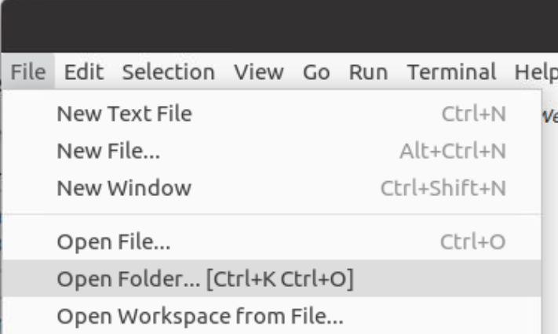
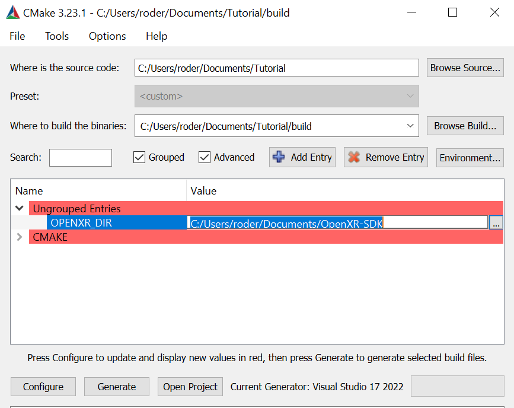
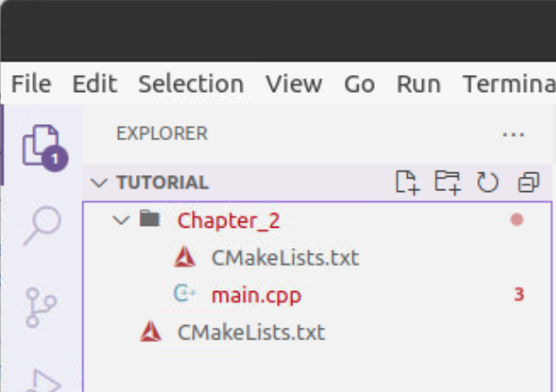
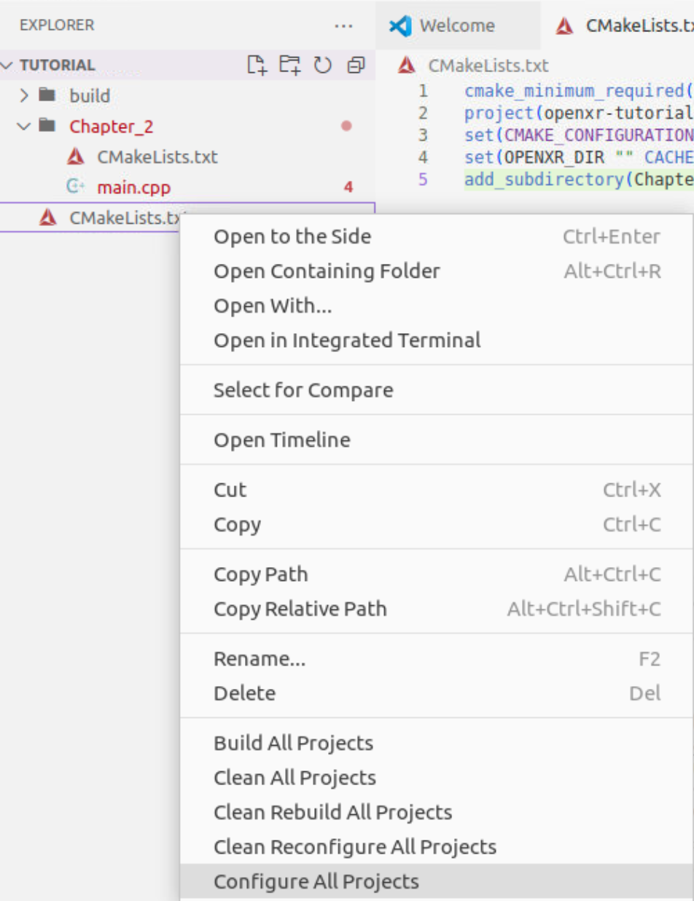
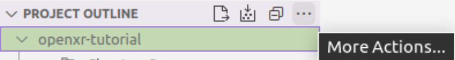
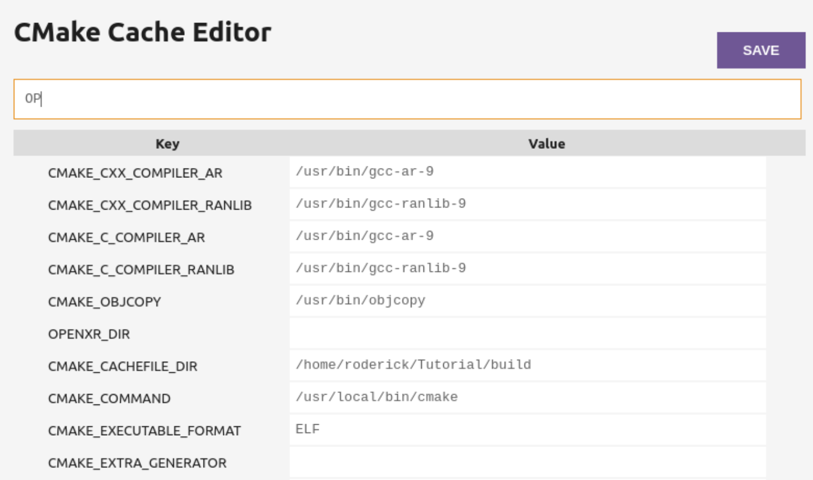

#####
Setup
#####

.. rubric:: Windows

For your Windows OpenXR project, we'll use CMake to create some project files for Visual Studio.
Create a directory where your code will go, we'll call this the *workspace* directory.

.. rubric:: Linux

For your Linux OpenXR project, we'll use CMake alongside Visual Studio Code to build your project.
Create a directory where your code will go, we'll call this the *workspace* directory. Open VS Code and from
the File menu, select "Open Folder..."

   
   The File menu of Visual Studio Code, with the command "Open Folder..." selected

Select your *workspace* folder, which is now empty.
Install the CMake extension for Visual Studio Code.

.. rubric:: Windows and Linux

Create a text file in the *workspace* folder called CMakeLists.txt.

In it, put the following:

.. highlight:: cmake
.. code-block:: cmake

	cmake_minimum_required(VERSION 3.15)
	project(openxr-tutorial)
	set(CMAKE_CONFIGURATION_TYPES "Debug;Release")
	set(OPENXR_DIR "" CACHE PATH "Location of OpenXR-SDK repository.")
	add_subdirectory(Chapter_2)

Now let's create a folder called Chapter_2, and in it put another CMakeLists.txt file,
this one containing:

.. code-block:: cmake

	file(GLOB SOURCES "main.cpp" )
	add_executable(Chapter_2 ${SOURCES})
	target_include_directories( Chapter_2 PUBLIC ${OPENXR_DIR}/include )
	target_link_directories( Chapter_2 PUBLIC ${OPENXR_DIR}/build/src/loader/Debug ${OPENXR_DIR}/build/src/loader/Release )
	target_link_libraries( Chapter_2 openxr_loader$<$<CONFIG:Debug>:d> )

That's all we need for CMake. Now we'll create our source file. Create a new text file called "main.cpp"
and put it in the Chapter2 directory. In this file, place the following code:

.. highlight:: cpp
.. code-block:: cpp

	#if defined(_WIN32)
	#define NO_MINMAX
	#define WIN32_LEAN_AND_MEAN
	#include <Windows.h>
	#elif(__ANDROID__)
	#include "android_native_app_glue.h"
	#endif

	// C++ Headers
	#include <iostream>

This is boilerplate for the various platforms. Now add the following:

.. code-block:: cpp
	:emphasize-lines: 9
	:name: xr-headers

	// OpenXR Headers
	#include "openxr/openxr.h"

	//#define XR_USE_GRAPHICS_API_D3D11
	//#define XR_USE_GRAPHICS_API_D3D12
	//#define XR_USE_GRAPHICS_API_OPENGL
	//#define XR_USE_GRAPHICS_API_OPENGL_ES
	//#define XR_USE_GRAPHICS_API_VULKAN
	#include "openxr/openxr_platform.h"

Here we include the main OpenXR header, openxr.h; and the platform header openxr_platform.h.
What the latter does, depends on which of the preceding XR_USE\_ macros we enable. We will enable
one of these only, depending on your choice of graphics API.
Now add the following:

.. code-block:: cpp

	//Debugbreak
	#if defined(_WIN32)
	#define DEBUG_BREAK __debugbreak()
	#else
	#include <signal.h>
	#define DEBUG_BREAK raise(SIGTRAP)
	#endif

This defines the macro DEBUG_BREAK, according to what platform we're building for. This macro will
stop execution of your program when an error occurs, so you can see where it happened and fix it.

Now we will define the main class of your application. It's just a stub for now, with an empty Run() method:

.. code-block:: cpp

	class OpenXRTutorial
	{
	public:
		OpenXRTutorial() = default;
		~OpenXRTutorial() = default;

		void Run() {
		}
	};

Finally, let's add the main function for your app. It looks slightly different, depending on your
choice of platform, but in each case, we define an instance of our OpenXRTutorial class, and call the Run()
method:

.. code-block:: cpp

	#if defined(_WIN32)
	int WINAPI wWinMain(_In_ HINSTANCE hInstance,
						 _In_opt_ HINSTANCE hPrevInstance,
						 _In_ LPWSTR    lpCmdLine,
						 _In_ int       nCmdShow) {
		OpenXRTutorial app;
		app.Run();
		return 0;
	}
	#elif(__ANDROID__)
	void android_main(struct android_app* app) {
		OpenXRTutorial app;
		app.Run();
	}
	#endif

.. rubric:: Windows
Now launch Cmake GUI, and point the "Where is the source code" box to your root solution (workspace) directory,
where your original CMakeLists.txt is located. Point the "Where to build the binaries" box to a subdirectory called "build",
click Configure, "Yes" to create the build folder, and "OK" to accept the default Generator.

Now we must tell the tutorial project where to find the OpenXR-SDK, which we built in Section 1.
Click on the variable OPENXR_DIR and type in or browse to the location of the OpenXR-SDK repository you downloaded
previously, the click "Generate". When the projects have been generated, open your new project, by clicking
"Open Project", or by finding the file Tutorial.sln in your build folder and double-clicking it.

.. rubric:: Linux
You now have three files, laid out as follow:

Having installed the CMake extension for VS Code, you can now right-click on the main CMakeLists.txt file (the one in the root *workspace* folder)
and select "Configure All Projects":

Now the CMake panel will be available by clicking its icon on the leftmost panel. Hover your mouse over the "Project Outline"
and click the three dots at the right. An option to "Edit CMake Cache" will appear, click this and you'll see the Cache Editor
page.

   

NOTE: It's possible to use CMake GUI in Linux, but using VS Code's integrated tools works better with VS Code.

In the CMake Cache editor, find OPENXR_DIR and enter the directory where you downloaded OpenXR-SDK in Chapter 1.
Now Configure and Build All.

.. rubric:: Windows

You can now build and run your program. It should compile and link with no errors or warnings.

.. rubric:: Linux

To enable debugging, select the Run/Debug panel in VS Code. You will now need to create a debugging configuration.
Click the "Gear" icon to edit the file launch.json, and enter the following:

.. code-block:: json

	{
		"version": "0.2.0",
		"configurations": [
			{
				"type": "cppdbg",
				"request": "launch",
				"name": "Chapter_2",
				"program": "${workspaceFolder}/build/Chapter_2/Chapter_2",
				"cwd":"${workspaceFolder}/Chapter_2",
				"externalConsole": true,
			}
		]
	}

2. SETUP (Basic structure ready)

Creating an XrInstance
----------------------
2.1. Creating an XrInstance / xrGetSystem (xrCreateInstance)

Creating an XrSession
---------------------

2.2. Creating an XrSession (xrCreateSession, OpenGL based for code brevity)

Polling the Event Loop
----------------------

2.3. 2.3. Polling the Event Loop (xrPollEvent and Session States)